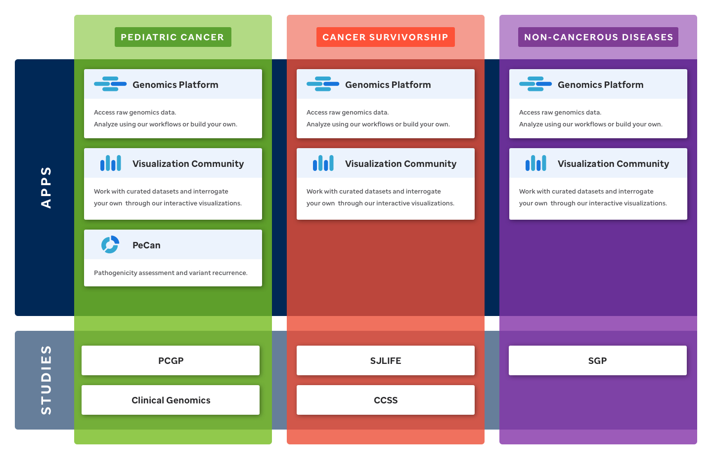

# About our Ecosystem

The St. Jude Cloud ecosystem has been designed with three main entry points, called Research Domains, to guide users along a path of content that will be most relevant to their research interests. Cards for these top-level Research Domains (Pediatric Cancer, Cancer Survivorship, and Non-Cancerous Diseases) are the first selections you will be presented with on [our homepage](https://stjude.cloud). 

The diagram below shows an abstraction of our ecosystem. Research Domains are presented as vertical panels which cascade down through the sets of Apps and Studies, the building blocks of content along the Research Domains.

Apps are interactive and facilitate data sharing and discovery. Studies are static pages of content that discuss how St. Jude has generated and used a particular dataset. Apps and Studies are disjoint ecosystem elements, yet they are distributed non-uniquely among the Research Domains in order to facilitate a focused sharing of content. For a complete list of Applications and Studies please visit the [Welcome to St. Jude](./index.md) documentation page.

!!! note
    St. Jude Cloud's original architecture of Data, Tools, and Visualizations has been retired. You will find what was Data and Tools primarily contained within our Genomics Platform application. What was Visualizations now lives within our Visualization Community application. We hope this redesigned ecosystem  will better facilitate data sharing, discovery, and community engagement.