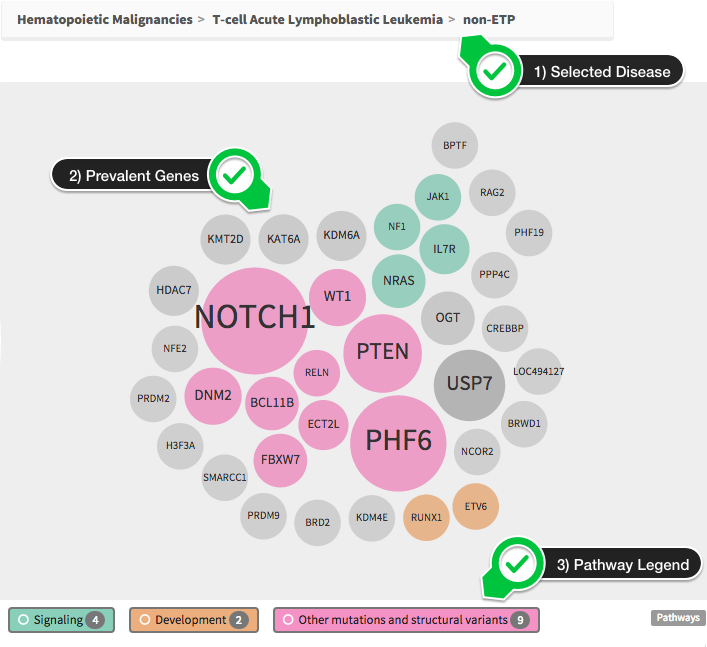

# PeCan 
PeCan provides interactive visualizations of pediatric cancer mutations across various projects at St. Jude Children's Research Hospital and its collaborating institutions.

## Homepage 
The [PeCan homepage](https://pecan.stjude.cloud/home) contains two main visualizations that work with each other to give a high level overview of the data being presented (SJ Cloud's [PCGP](../../genomics-platform/requesting-data/about-our-data.md#pediatric-cancer-genome-project-(pcgp)) dataset along with curated datasets from other institutions such as [TARGET](https://ocg.cancer.gov/programs/target), [dkfz](https://www.dkfz.de/en/index.html), and others).

### Donut Chart
The donut chart (shown below) gives an at-a-glance disease distribution and disease hierarchy. 

You can hover over the various donut slices to glance at the number (and %) of samples being represented by that disease. The diseases are categorized in two three main root categories: 1) HM -Hematopoietic Malignancies, 2) BT -Brain Tumor, 3) ST -Solid Tumor.

[Click here](../../genomics-platform/requesting-data/about-our-data.md#short-disease-code-mapping) for a full mapping of disease codes.

### Bubble Chart
Any slice (at any level) of the donut chart can be clicked on to select it, and reveal a bubble chart of related genes. 

Note that the dataset bar (shown below) on top of the bubble chart visualizes the distribution of selected data across the datasets used in this visualization. It will update dynamically as you interact with the donut chart and make different selections.

An example of the bubble chart is shown below.

You can see the selected disease shown at the top (1). The bubbles represent the most prevalent genes in the selected disease sample set. The size of the bubble corresponds to the number of mutations in the set with that gene.

For some disease sets (like the one shown above), we have identified the most important disease pathway for the gene and have categorized them as such. This information is represented here via the use of colors. The legend at the bottom allows you to view the pathway information being shown (including the number of genes that are attached to each pathway).

Hovering over a pathway in the legend will highlight all matching genes. Clicking a gene will open it's ProteinPaint.

## Requesting Raw Genomics through PeCan

1. Add samples to your cart by diagnosis.
<video controls="controls" width="640" height="400">
    <source src="https://pecan.stjude.cloud/assets/video/pecan-cart-by-disease.mp4" type="video/mp4">
</video>
2. Add samples to your cart by gene mutation.
<video controls="controls" width="640" height="400">
    <source src="https://pecan.stjude.cloud/assets/video/pecan-cart-by-gene-mutation.mp4" type="video/mp4">
</video>
3. Add samples to your cart by gene expression.
<video controls="controls" width="640" height="400" class="anything">
    <source src="https://pecan.stjude.cloud/assets/video/pecan-cart-by-gene-expression.mp4" type="video/mp4">
</video>

Clicking *Submit to SJCloud* from the PeCan checkout window will land you back in the Data Browser with your checked out data selected.
