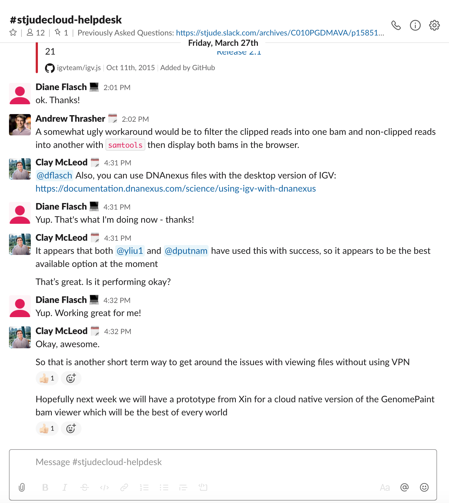
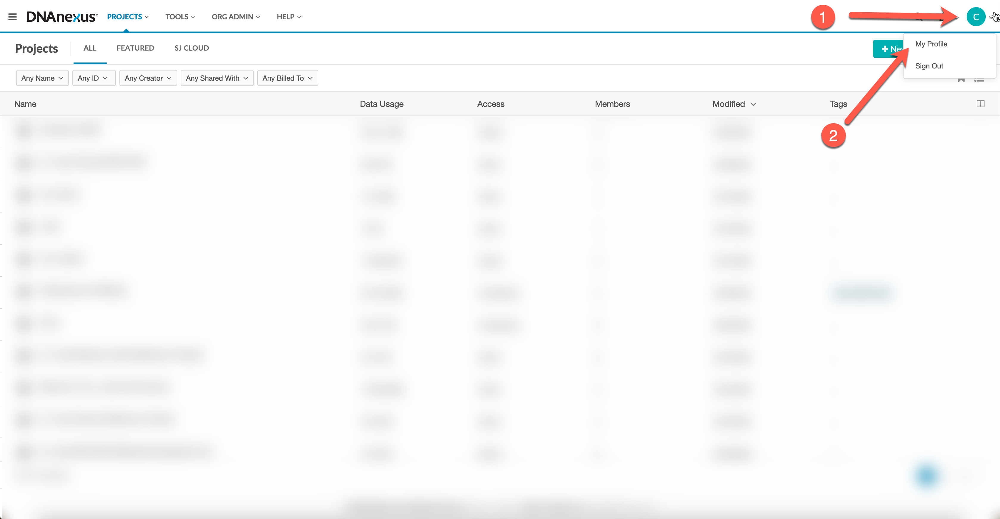
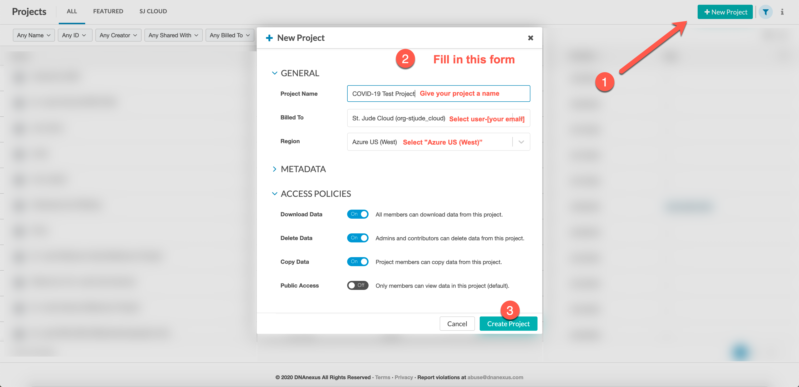

Please complete the following check-list to get started with using St. Jude Cloud:

- [x] If applicable, apply for COVID-19 Discovery Program ([link](#apply-for-covid-19-discovery-program)).
- [x] Join St. Jude Cloud helpdesk channel on Slack ([link](#joining-slack)).
- [x] Log in to your St. Jude Cloud account ([link](#login-to-st-jude-cloud)). 
- [x] Enable Microsoft Azure ([link](#enable-microsoft-azure)). 
- [x] Create your first project ([link](#create-your-first-project)).
- [x] Set up your billing account ([link](#set-up-your-billing-account)).

## Apply for COVID-19 Discovery Program

!!! todo
    
## Joining Slack

The St. Jude Cloud team uses [Slack][slack] to communicate on a day-to-day basis. When standing up a help desk, we decided to offer that functionality on Slack to allow our community to answer questions alongside our team. If you are an employee at SJCRH, you already have a Slack account (at no cost to you) — you might even like it so much, you decide to use it during this work from home period!

If you have any issues with the instructions below, you can email [helpdesk@stjude.org](mailto:helpdesk@stjude.org) or [support@stjude.cloud](mailto:support@stjude.cloud).

**Steps**

1. Navigate to [https://stjude.slack.com](https://stjude.slack.com), click "Sign in with your St. Jude Account", and enter your St. Jude credentials. Congrats! You're now on Slack.
2. Download the desktop app by visiting [https://slack.com/download](https://slack.com/download). The instructions differ depending on whether you are on a Windows/Mac/Linux machine. Once you install and start up the app, the sign-in process should look the same as step 1.
3. To join the `#stjudecloud-helpdesk` channel, you can click the word "Channels" in the left sidebar and search for `#stjudecloud-helpdesk`. If you have issues, please see [the official Slack guide](https://slack.com/help/articles/205239967-Join-a-channel) on joining a channel.

You should now see a screen similar to the one included below. You can type your questions into the chat box at the bottom. See you there!
   

## Login to St. Jude Cloud

Signing in to St. Jude Cloud is similarly easy — if you have a SJCRH account, you already have a St. Jude Cloud account.

**Steps**

1. Visit [https://cloud.stjude.org](https://cloud.stjude.org), log in with your St. Jude credentials, and fill in the basic profile page to your satisfaction if prompted. Congrats! You're now logged in to St. Jude Cloud. 

This should be sufficient for the purposes of this guide. For more detailed information, see our standard guide on [accounts and billing](../../account-and-billing.md).

!!! tip
    As you navigate around St. Jude Cloud, you can click the DNAnexus logo in the top left to go back to the home screen at any time.

## Enable Microsoft Azure

**Steps**

1. Change your preferences to pull cloud resources from Microsoft Azure instead of Amazon AWS by default. To do this, (i) click on your profile in the top right corner, (ii) select "My Profile", and (iii) ensure "Azure US (West)" is checked. See the pictures below for more detail.

## Create your first project

**Steps**

1. Select "New Project" in the upper left part of the screen, fill in the form as instructed in the image below, and click "Create Project". You should be redirected to your first DNAnexus project.
2. We highly recommend you read through [DNAnexus's dedicated guide](https://documentation.dnanexus.com/getting-started/key-concepts/projects#create-a-new-project) to learn about projects: how you can navigate them, how you can share them with collaborators, and how they are billed. 

## Set up your billing account

!!! todo
    Different based on your engagement level:

    * Describe how to get set up on a sponsored account for COVID-19 discovery labs.
    * Describe how to set up your own billing for non-discovery.
        * Though we will prioritize funds for discovery labs, we still want non-discovery labs to reach out to us to see what resources are available if they are in need.

[slack]: https://slack.com/