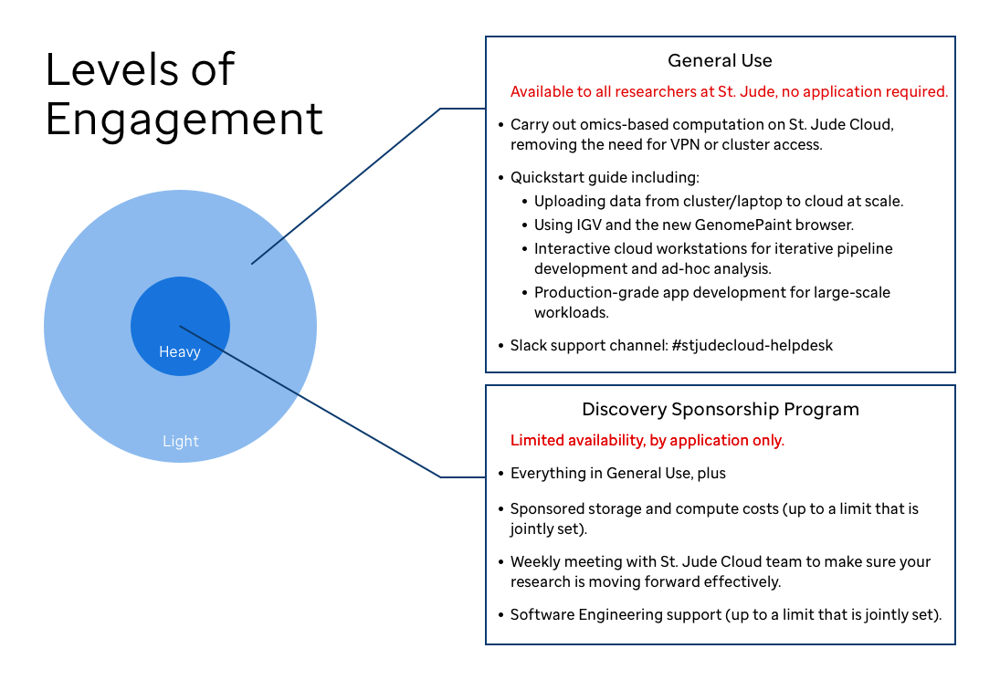

!!! info
    This section of the documentation is geared towards St. Jude Children's Research Hospital research staff affected by COVID-19, not to other users of St. Jude Cloud. Regardless, anyone may use these pages as a path to follow should they wish to try out St. Jude Cloud.

### Overview

* The sudden, fully remote operation of St. Jude research staff due to the COVID-19 pandemic has caused higher than normal demand on VPN and HPC cluster resources. 
* In response to these events, the St. Jude Cloud team has worked with Information Services to accelerate our plans for exposing a cloud-based computational environment that can support both production-grade pipelines and interactive, ad-hoc analysis.
* This page serves as a guide for quickly trying out St. Jude Cloud and exploring experimental offerings we have prototyped to ease your transition.
* Read below about the different levels of engagement we are offering during this time and decide which you are interested in. If you're interested in jumping in, you can skip to the guides in the [walkthrough section](#walkthrough).

!!! tip 
    Currently, this is guide is focused on omics-based data analysis. The DNAnexus ecosystem can be used for many other types of data analysis, and can serve as a secure cloud environment to easily do other types of research. If you are interested, please [contact us](mailto:support@stjude.cloud) and let us know — we'd be happy to help.

### Levels of Engagement

If you're interested in trying our platform, you'll need to pick one of the two levels of engagement we offer:

* **General Use.** Use the guides and resources provided to self-navigate using St. Jude Cloud. Anyone can independently leverage St. Jude Cloud to move computational workloads from the HPC without involvement from our team. If you have a St. Jude SSO account, then you already have a St. Jude Cloud account! You can navigate to the [walkthrough section](#walkthrough) to get started.
* **Discovery Sponsorship Program.** We are developing several experimental features, including a new, cloud-native BAM viewer and interactive nodes in the cloud, to help ease the transition. As such, we're looking for a small number of labs to collaborate much more closely with to develop out these features and ensure a successful transition to the cloud.

If you are interested in helping us shape the St. Jude Cloud experience for all users and getting sponsored compute + storage, we recommend you [apply for one of the limited discovery program slots](../../files/DSPApplicationForm.pdf). All other users can navigate to the [walkthrough section](#walkthrough) to get started.

You can see a more complete list of the differences between these two offerings in the figure below.

### Walkthrough
Please read the guides on the left in order to quickly get up to speed on how you can transition to using St. Jude Cloud. If you have any questions, please [contact us](mailto:support@stjude.cloud).