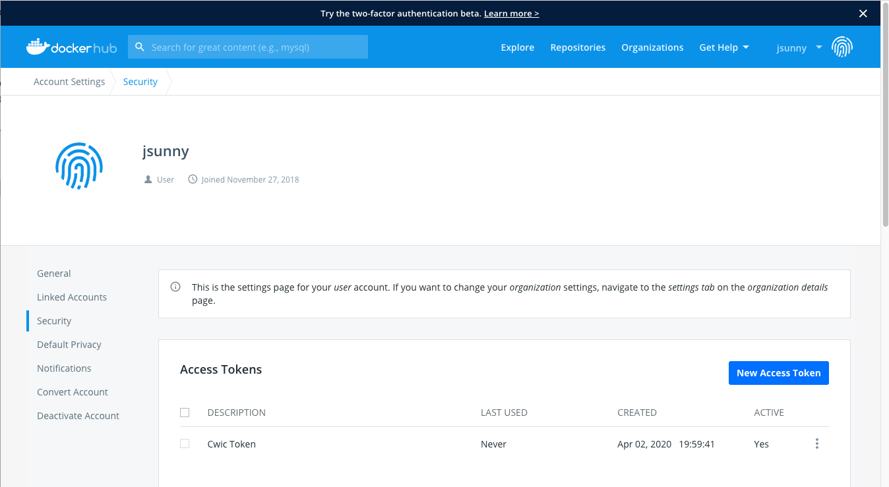
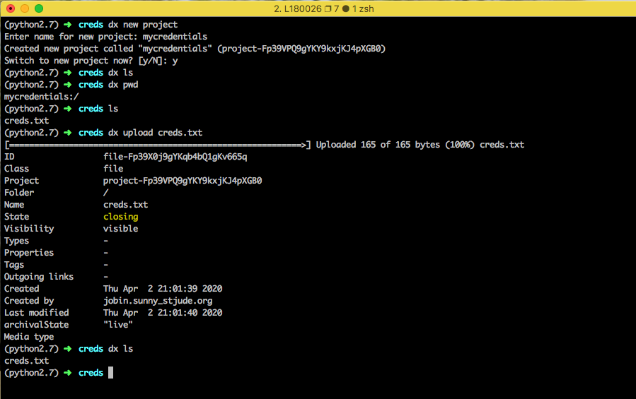

# Interactive Nodes in the Cloud

Apart from [creating and running cloud apps], you can request an interactive node in the cloud to use for iterative development. This can be particularly useful if you want to run some quick analyses on the cloud, want to run tools without creating an app, or want to submit jobs similar to `bsub` on the local St. Jude HPC.

This guide assumes that you have a DNAnexus account and have `dxpy` installed on your machine (view [the local data upload guide] for instructions on how to install `dxpy`).

!!! warning
    All instructions in this guide should be run from your local machine, _not_ the HPC cluster.

## Overview

There are two different experiences for doing interactive or ad-hoc analysis in the cloud:

* **Cloud Workstations**. Cloud workstations are a mature offering in the DNAnexus ecosystem, and you can use them in your production work. DNAnexus has [a full guide](https://documentation.dnanexus.com/developer/cloud-workstations) on how to use cloud workstations. Unfortunately, they do not fully replicate the experience of an interactive node on the cluster: each time you ssh into a new cloud workstation, you get a blank machine with no dependencies or data installed. Thus, you need to configure your environment, download data to the node using `dx`, and upload results back to DNAnexus using `dx`.
* **Interactive Nodes**. Interactive nodes were created very recently between a partnership with St. Jude and DNAnexus. They offer a more complete alternative to interactive nodes in the HPC cluster, but the experience is currently in **alpha** (meaning that there are likely to be bugs and it is not ready for production use). We are actively looking for labs to partner with us to develop out this experience, so [apply for the discovery sponsorship program] if you are interested!

In this guide, we will briefly mention how to use Cloud Workstations and then spend the rest of the guide explaining how to use our new Interactive Node experience.

[creating and running cloud apps]: ./creating-a-cloud-app-covid.md
[the local data upload guide]: ./upload-local.md
[apply for the discovery sponsorship program]: ./getting-started.md#apply-for-discovery-sponsorship-program

## Cloud Workstations

A Cloud Workstation is a fresh node on the cloud that can be used to run any command with access to data in your projects. You will be given root access to the node so you can download and install any tool you require. Since this is an interactive session, you will be charged for the duration of the session so it is important to terminate the session after use.

### Configuring SSH

Run `dx ssh_config` to configure your account to allow use of SSH connections to the node.

### Connecting to the workstation

To start an interactive workstation, first select the project you would like to start it in.

```bash
dx select "project-alpha"
```

or just `dx select` to select from a list of your projects interactively.

Next, run `dx run app-cloud_workstation --ssh`. You can set the maximum session length for this session or continue with the default options.

!!!tip
    The default node size for the cloud workstations are mem1_ssd1_x2. If you want to request a larger node size, you can specify it by adding the `--instance-type` option. Check the [advanced options section](./interactive-node/#advanced-options) at the bottom for more information.

### Setting up workspace

Once you are connected to the node, you will have access to download and install tools to the node and use them. The node is a clean linux environment with the `dx` command line tool already installed.

In order to upload and download files from your DNAnexus project, you must first run the following commands.

```bash
unset DX_WORKSPACE_ID
dx cd "project-alpha:/"
```

### Downloading files from your DNAnexus project

The node has access to the data in your projects. To download a file, `test.bam`, from your parent project, just run `dx download test.bam`. To download a file from any project you have access to, just specify the project and path to the file in your download command like `dx download project-name:/path/to/test.bam`.

Once you have all the tools and data you require, you can use the workstation as a general-purpose workstation to run analyses. Note that in the Cloud Workstation, all files you want to use have to fit onto the local hard disk.

### Uploading files back to your project

Since the node is transient and will be deleted after the session is terminated, it is important to upload any required files to your project. You can do that by running `dx upload output.bam` or `dx upload --path "$project-alpha:" output.bam` if you selected another project in the workstation.

### Terminating the session

By default, the session will end after the max session time set when the workstation was first started. You can terminate the session when you are done working by `exit`ing out of the terminal. You will be asked whether you want to terminate the job, enter 'y' to terminate. You can also terminate the job by going to the Monitor tab of your project in DNAnexus and terminate the running job from the website.

For more information about cloud workstations, please refer to the [DNAnexus documentation](https://documentation.dnanexus.com/developer/cloud-workstations).

## Interactive Nodes

!!! danger
    The interactive node in the cloud experience was created specifically in response to the fully remote working situation. The experience is currently an **alpha release** and is not suitable for production use. Additionally, this guide will be updated each time we improve the experience, so please come back regularly to see how we are changing things.

!!! info
    We are looking for labs across St. Jude to partner with us and tell us about their experience using the interactive node. If you are interested, please [apply for the discovery sponsorship program].

Cloud workstations are good for interactive work, but they require you to upload/download data from your projects. They also do not save your working environment so any tools you installed or changes you made to the machine will be lost when the session is terminated. The Interactive Node experience, sometimes referred to by its codename "CWIC" (cloud workstations in containers), solves these issues by saving your environment and letting you work with your data on the cloud without manually downloading it to the node.

To start an interactive node, you must first get access to the CWIC app and copy it to one of your projects. Since this is still in beta, it is not publicly available on DNAnexus yet. Please contact us in [the St. Jude Cloud Slack channel] to get access to the app.

Next, select the project containing the CWIC app on your command line using `dx select` on your machine.

[the St. Jude Cloud Slack channel]: ./getting-started.md#joining-slack

### Setting up your Docker Hub account

The workstation uses Docker images pushed to a Docker Hub repository to save your environment. To get started, go to [Docker Hub](hub.docker.com) and sign in or create an account. Every Docker Hub account is given one free private repository. It is highly recommended to use a private repository as this will be your working environment.

Once you have a Docker Hub account, go to your "Account Settings", then "Security" and create a new access token.


You can give it a descriptive name and copy the token.




The access token will be needed for the credentials file below.

### Creating a credentials file

Create a file with the template below and fill in your Docker Hub token and Docker Hub username in the appropriate places.

```json
{
  "docker_registry": {
    "token": "<YOUR_DOCKERHUB_TOKEN>",
    "repository": "<YOUR_DOCKERHUB_USERNAME>",
    "username": "<YOUR_DOCKERHUB_USERNAME>",
    "registry": "docker.io"
  }
}
```

!!! info
    If you would rather use a quay.io repository, you can use your quay credentials in the credentials file instead.

Once you have made your credentials file on your computer, make a new DNAnexus project to save your credentials using `dx new project`. Upload the credentials file to your project by running `dx upload creds.txt`. It is recommended to save your credentials in a separate, private DNAnexus project to ensure that others do not have access to it.



### Starting an interactive terminal session

The following command will run the app using the credentials you provided and will log you into the node after it boots up.

`dx run cwic -icredentials=mycredentials:creds.txt --allow-ssh --ssh -y`

or replace `mycredentials` with the name of the DNAnexus project with your credentials file. If you have SSH issues while trying to connect to the job, make sure your SSH keys are [configured properly](https://documentation.dnanexus.com/developer/apps/execution-environment/connecting-to-jobs).


### Working on the CWIC node

Once the node starts, you will be taken to the home directory of the CWIC node. This node is an ubuntu environment and you can install or run any commands you want.


For example, you can install `samtools` by running `sudo apt install samtools`.

There are two main directories to work with data:

* `/scratch/` - This is the directory local to the node. You can use this directory to save any intermediate or temporary results. You can run tools here but all the data in this directory will be deleted once the node is terminated.

* `/project/` - This directory contains your DNAnexus project and the data in it. If you copy or move files to this directory, it saves to your DNAnexus project, which is a persistent storage. You can go to `/project/<YOUR_DX_PROJECT_NAME>` and see the files in your DNAnexus project.


Upload some data to your project from a local machine for testing in the interactive node — here, we assume a BAM file uploaded from a laptop called `sample.bam`. Once data is uploaded to your DNAnexus project, you can access it on your CWIC node at `/project/<YOUR_DX_PROJECT_NAME>/test.bam`. For instance, when running `samtools index /project/<YOUR_DX_PROJECT_NAME>/test.bam`, you will find the index file samtools creates is saved to your cloud project.

#### Adding bioinformatics tools to your environment

We recommend installing [Anaconda](https://www.anaconda.com/distribution/) to manage any Python or R packages in your CWIC environment.

To install miniconda (a minimal installation of anaconda), run

```bash
curl -O https://repo.anaconda.com/miniconda/Miniconda3-latest-Linux-x86_64.sh
sh Miniconda3-latest-Linux-x86_64.sh
source ~/.bashrc
```

Follow the instructions and select 'yes' to install conda and initialize it. After installing conda, we recommend adding the bioconda channel, which provides many bioinformatics packages.

```bash
conda config --add channels defaults
conda config --add channels bioconda
conda config --add channels conda-forge
```

To install a package such as `bwa`, simply run

```bash
conda install bwa -y
```

You can also create a new environment with conda called `bio` and install available packages like so:

```bash
conda create -n bio bwa bowtie star -y
conda activate bio
bwa
```

#### Saving your environment

If you installed `samtools`, or any other tool to the node and want to save your environment, you can run `dx-save-cwic`. This will save the environment to your Docker Hub repository. Unfortunately, this is a manual step at the moment: in a future iteration, we plan to have this save your environment automatically.

The next time you launch a CWIC node in this project, it will put you in an node with your saved environment. Therefore you will not need to reinstall samtools or any other tool you had in your environment.

#### Running batch jobs

We can dispatch non-interactive jobs from the node to parallelize analyses similar to a `bsub` experience on the HPC.

First, you need to login to DNAnexus on the node.

`dx login --noprojects --token <dnanexus-user-token-from-ui>`

You can use samtools to split the bam by chromosome like below by specifying a command with the CWIC app. This will run the specified command with the saved environment and you can save the outputs to the `/project` directory which will save it in your DNAnexus project.

```bash
root@cwic:~# chromosomes=(1 2 3 4 5 6 7 8 9 10 11 12 13 14 15 16 17 18 19 20 21 22)
root@cwic:~# for chr in ${chromosomes[@]}; do
  echo $chr;
  dx run cwic  \
    -icredentials=<DX_PROJECT_WITH_CREDS>:creds.txt \
    -icmd="samtools view -b /project/<YOUR_DX_PROJECT_NAME>/test.bam ${chr} -o /project/<YOUR_DX_PROJECT_NAME>/bam_${chr}.bam;" \
    -y;
done
```

After your jobs have finished running. You can run `dx-reload-project` to refresh the `/project` directory and see the newly added chromosome slices.

#### Reloading project directory

You may not see the updated files in your `/project/<YOUR_PROJECT_NAME>` directory immediately after they are added. In order to reload the project directory on the CWIC node with the latest files from your DNAnexus project, run `dx-reload-project` and you will see any new files. Unfortunately, this is a manual step at the moment: in a future iteration, we plan to have this update your files automatically.

If you get a message such as `umount: /project: target is busy.`, `cd` into a directory other than `/project` and try reloading again.

#### Saving any project updates

Updates to any files in the `/project` directory only occur every 5 minutes. In order to propagate any recent updates, run `dx-save-project` to save the files to the DNAnexus project. In the future, we plan to have file syncing happen automatically whenever you update a file.

### Terminating the CWIC node

Since the CWIC node is an interactive job, it gets billed for the duration of the job. Therefore it is important to terminate the node once you are done working.

Save your work and environment, if needed, by running `dx-save-project` and `dx-save-cwic` respectively. To quit the node, type `exit` twice to get into the app execution environment. Press `Ctrl+c` to quit the CWIC app and type `exit` twice to get out of the terminal completely. You will be prompted to terminate the job, type 'y' to terminate the job. You can check if the node is still running by checking the Monitor tab in your project on the DNAnexus website. Alternatively, you can terminate the job from the Monitor tab.

## Advanced options

### Changing instance type

If you require more or less runtime requirements for your nodes, you can change the instance type by specifying the flag `--instance-type` with a valid instance type from [this list](https://documentation.dnanexus.com/developer/api/running-analyses/instance-types#summary-of-instance-types).

```bash
dx run app-cloud_workstation --instance-type azure:mem1_ssd1_x16 --ssh
```

or

```bash
dx run cwic -icredentials=<DX_PROJECT_NAME_WITH_CREDS>:creds.txt --instance-type mem1_ssd1_x4 --allow-ssh --ssh -y
```

This is useful when you want to run some non-interactive jobs that have different memory or storage requirements.

If you have any questions or suggestions on how we can improve this guide, please [file an issue](https://github.com/stjudecloud/docs/issues), contact us at [https://stjude.cloud/contact](https://stjude.cloud/contact), or email us at [support@stjude.cloud](mailto:support@stjude.cloud).
