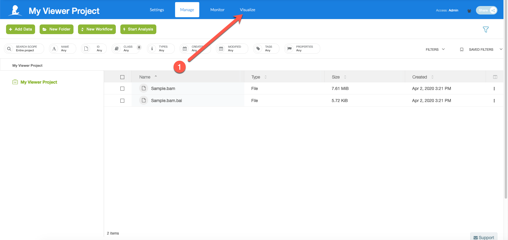
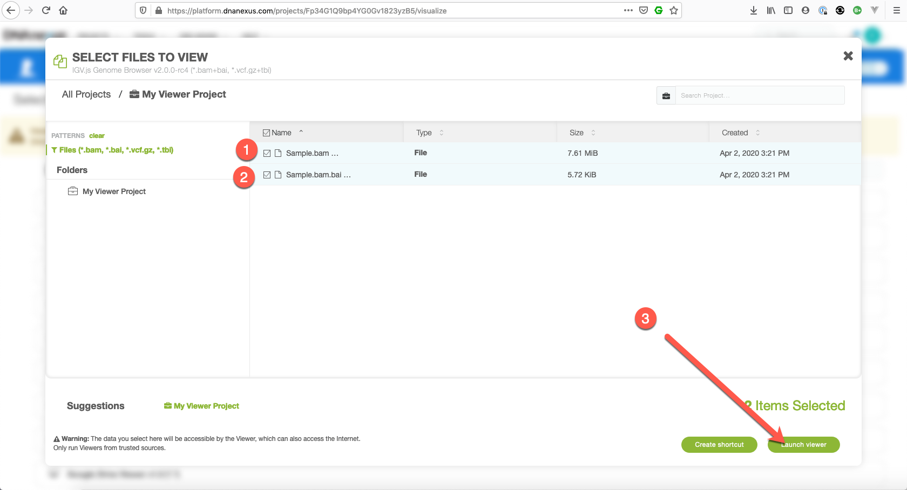

# Visualizing NGS Data

In the future, we will release an **alpha version** of the GenomePaint visualization tool on St. Jude Cloud. In the meantime, the best way to visualize NGS data on St. Jude Cloud is using IGV. You can use the desktop or web browser versions of IGV.

## Desktop IGV

DNAnexus has an existing guide on viewing files in DNAnexus using the desktop version of IGV. You can view the guide [here](https://documentation.dnanexus.com/science/using-igv-with-dnanexus).

## Web Browser IGV

Within any DNAnexus project, you can view the data in the IGV web browser by doing the following steps.

**Select "Visualize"**

**Select IGV v2.0.0**

**Select the files you want to view**

