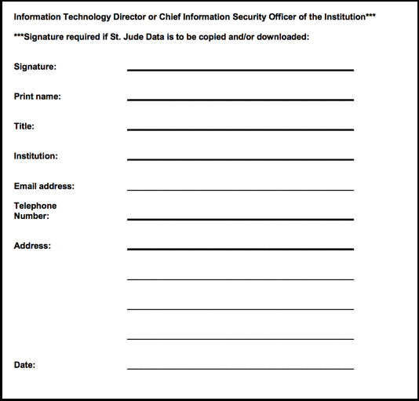

## Introduction

Creating a data request is the premier way to access raw St. Jude next 
generation sequencing data in the cloud. You can get a **free** copy of 
the data in a secure cloud environment powered by Microsoft Azure and 
DNAnexus, or you can elect to download the data to your local computing 
environment.

!!! note
    If you would like to download the data to local storage, there are
    extra steps you'll need to follow such as getting extra signatures
    on your data access form. We recommend that you work with the data
    in the cloud if it's feasible! The copy of the data is free, the 
    compute charges are extremely reasonable, and there is no need
    to bother with the long, error-prone downloading process. Porting 
    your tools to be run in the cloud is easy as well! We recommend 
    you follow [this guide](#run-your-tools) to get started.

## Navigating to the data browser

Navigate to the data browser by clicking Access Data and Explore
Data. If you would like to view the requests you have already made, you
can do so under Manage Data.

## Selecting a cohort

Next, select the cohort you are interested in requesting. You can
browse our data by different cohorts: disease, publication, dataset, or
you can use Pecan, our Pediatric Cancer portal to find samples
associated with specific genes, or mutations. 

!!! todo
    This screenshot needs updating.

## Select your files

Once you have selected the cohort you would like to study, you can chose what
type of files you would like to receive. This step is dynamic, and shows
you all of the file types we have available for the dataset you are
interested in.

## Submit your data request

If you are requesting access to a dataset you have not already been approved for, 
you will see a section called Controlled Data. Under this section, there is a bulleted list
that indicates the Data Access Units you need to request access to through our data
access agreement. Please use this list to fill in the Datasets section of the Data Request
Form as shown in the figure below. For more information on filling out this guide,
see [Filling out the DAA](#filling-out-the-daa).

Now, you have successfully submitted your data request. Your request
will be sent to the respective data access committees for evaluation.
You should expect to hear from us within a week or two on average. 

### Data access agreement

Broadly speaking, the data access agreement (DAA) is a legal document
binding the requestor and the requestor's institution to terms about
how our data may be used. We do not negotiate the terms of this document
unless terms are found to be in conflict with state law. Filling out the
Data Access Agreement carefully and completely is crucial to having your
request filled promptly.

#### Filling out the DAA

All Data Access Agreements require the following 5 items:

1. The Data Access Unit(s) you are applying for must be marked (on **page 5**).
    * These can be found in the section Controlled Data, above the Download Data Request
      Form button. This can be found on the third step of the data request
      process under the Controlled Data section. This is a dynamic feature
      that allows the user to see exactly which Data Access Units (datasets)
      they are requesting data from.

     

2. Signature and information of the Principal Investigator. This must be
signed by a Principal Investigator or a faculty-level supervisor on the
project (on **page 8**).

    

3. Signature and information of all other applicants. This should
include any person who will have access to this data. They are legally
bound to protecting and handling the data properly (on **page 9**).

    

4. Signature and information of Institutional or Administrative
Authority (on **page 10**).

    

5. Description of contemplated use of St. Jude data. Here, describe your
research question and it's biological significance. The Contemplated
Use will be evaluated by the Data Access Committees based on the
criteria listed in each of the [committee-protocols]{role="ref"} (on **page 12**).

#### Data download permission

Additionally, *if and only if* you would like to *download* the data,
you will also need to include the following:

* The applicant's initials in Part 2 (on **page 4**).

    

* Signature and information of the Information Technology Director or
Chief Information Security Officer (on **page 11**).

    

## Frequently asked questions

**Q. Why do I need to sign the DAA?**

A. Although the DAA serves many purposes, the terms included in the data access
agreement are ultimately in place to protect our patients. We take
patient security very seriously, and we require that requestors are
committed to protecting that privacy to the fullest extent.

**Q. Where can I find the latest version of the DAA?**

You can find this document on the last step of
[request-data]{role="ref"}, or you can download a copy
[here](https://platform.stjude.cloud/access_form).

**Q. Where do I submit the DAA??**

You can submit this completed document on the last step of
[request-data]{role="ref"}.
