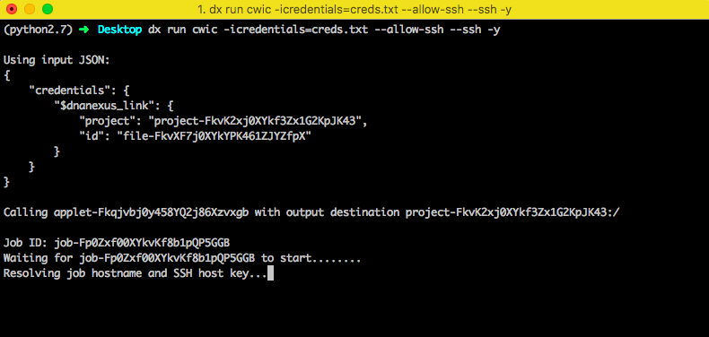

# Using Interactive Terminal (beta)

!!! warning
    This app is still in beta. There are improvements being made to the app and experience around it.

Apart from creating and running cloud apps, you can request an interactive node in the cloud to iteratively develop on. This can be particularly useful if you want to run some quick analyses on the cloud, want to run tools without creating an app, or want to run an app multiple times.

This is a guide on how to get setup with the "cwic" nodes on DNAnexus. This guide assumes that you have a DNAnexus account and have dx-toolkit installed on your machine.

## CWIC - Cloud Workstation In Container

This is an interactive node on the cloud that can save your environment to help you resume your work later. The cwic node is similar to an interactive node on a research cluster. To start a cwic node, you must first get access to the cwic app and copy it to one of your projects. Since this is still in beta, it is not publicly available on DNAnexus yet. Please [contact us](mailto:support@stjude.cloud) to get access to the app. Next, select the project with the cwic app on your command line using `dx select` on your machine.

## Setting up your Docker Hub account

The workstation uses a Docker Hub repository to save your environment. To get started, go to hub.docker.com and sign in or create an account. Every Docker Hub account is given one free private repository. It is highly recommended to use a private repository as this will be your working environment. Once you have made your Docker Hub account, go to your "Account Settings", then "Security" and create a new access token. Save this token as it will be needed for the cwic nodes.

## Creating a credentials file

Create a file with the template below and fill in your Docker Hub token and Docker Hub username in the appropriate places.

```json
{
  "docker_registry": {
    "token": "<YOUR_DOCKERHUB_TOKEN>",
    "repository": "<YOUR_DOCKERHUB_USERNAME>",
    "username": "<YOUR_DOCKERHUB_USERNAME>",
    "registry": "docker.io"
  }
}
```

Note: If you would rather use a quay.io repository, you can use your quay credentials in the credentials file instead.

Upload the credentials file to your project by running `dx upload creds.txt`. It is recommended to save your credentials in a separate, private DNAnexus project to ensure that others do not have access to it.

## Starting an interactive terminal session

The following command will run the app using the credentials you provided and will log you into the node after it boots up.

`dx run cwic -icredentials=<DX_PROJECT_NAME_WITH_CREDS>:creds.txt --allow-ssh -y`

where `YOUR_DX_PROJECT_NAME` is the name of the DNAnexus project with your credentials file. If you have SSH issues while trying to connect to the job, make sure your SSH keys are [configured properly](https://documentation.dnanexus.com/developer/apps/execution-environment/connecting-to-jobs).



## Working on the cwic node

Once the node starts, you will be taken to the home directory of the cwic node. This node is an ubuntu environment and you can install or run any commands you want.


For example, you can install samtools by running `sudo apt install samtools`.

There are two main directories to work with data:

`/scratch/` - This is the directory local to the node. You can use this directory to save any intermediate or temporary results. You can run tools here but all the data in this directory will be deleted once the node is terminated.

`/project/` - This directory contains your DNAnexus project and the data in it. If you copy or move files to this directory, it saves to your DNAnexus project, which is a persistent storage. You can go to `/project/<YOUR_DX_PROJECT_NAME>` and see the files in your DNAnexus project.


You can upload some data to your project using `dx upload test.bam`. Refer to this guide on how to upload your data to a project. Once you have data in your DNAnexus project, you can run `samtools index /project/<YOUR_DX_PROJECT_NAME>/test.bam` and find the index file saved to your project.

We recommend installing [Anaconda](https://www.anaconda.com/distribution/) to manage any python or R packages in your cwic environment.

### Saving your environment

If you installed samtools, or any other tool to the node and want to save your environment, you can run `dx-save-cwic`. This will save the environment to your Docker Hub repository. The next time you launch a cwic node in this project, it will put you in an node with your saved environment. Therefore you will not need to reinstall samtools or any other tool you had in your environment.

### Running batch jobs

We can dispatch non-interactive jobs from the node to parallelize analyses.

First, you need to login to DNAnexus on the node.

`dx login --noprojects --token <dnanexus-user-token-from-ui>`

You can use samtools to split the bam by chromosome like below by specifying a command with the cwic app. This will run the specified command with the saved environment and you can save the outputs to the `/project` directory which will save it in your DNAnexus project.

```bash
root@cwic:~# chromosomes=(1 2 3 4 5 6 7 8 9 10 11 12 13 14 15 16 17 18 19 20)
root@cwic:~# for chr in ${chromosomes[@]}; do
  echo $chr;
  dx run cwic  \
    -icredentials=<DX_PROJECT_WITH_CREDS>:creds.txt \
    -icmd="samtools view -b /project/interactive-terminal/test.bam ${chr} -o /project/proj_cwic/bam_${chr}.bam;" \
    -y;
done
```

After your jobs have finished running. You can run `dx-reload-project` to refresh the `/project` directory and see the newly added chromosome slices.

### Reloading project directory

You may not see the updated files in your `/project/<YOUR_PROJECT_NAME>` directory immediately after they are added. In order to reload the project directory on the cwic node with the latest files from your DNAnexus project, run `dx-reload-project` and you will see any new files.

If you get a message such as `umount: /project: target is busy.`, `cd` into a directory other than `/project` and try reloading again.

### Saving any project updates

Updates to any files in the `/project` directory only occur every 5 minutes. In order to propagate any recent updates, run `dx-save-project` to save the files to the DNAnexus project.

### Saving the environment

Run `dx-save-cwic` to save your latest environment so that you can resume your work easier the next time you use the interactive node.

## Terminating the cwic node

Since the cwic node is an interactive job, it gets billed for the duration of the job. Therefore it is important to terminate the node once you are done working.

Save your work and environment, if needed, by running `dx-save-project` and `dx-save-cwic` respectively. To quit the node, type `exit` twice to get into the app execution environment. Press `Ctrl+c` to quit the cwic app and type `exit` twice to get out of the terminal completely. You will be prompted to terminate the job, type 'y' to terminate the job. You can check if the node is still running by checking the Monitor tab in your project on the DNAnexus website. Alternatively, you can terminate the job from the Monitor tab.

If you have any questions or suggestions on how we can improve this guide, please [file an issue](https://github.com/stjudecloud/docs/issues), contact us at [https://stjude.cloud/contact](https://stjude.cloud/contact), or email us at [support@stjude.cloud](mailto:support@stjude.cloud).
