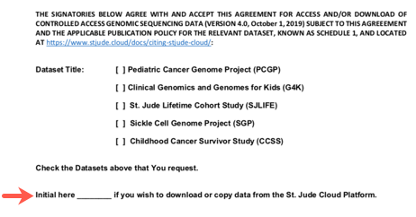
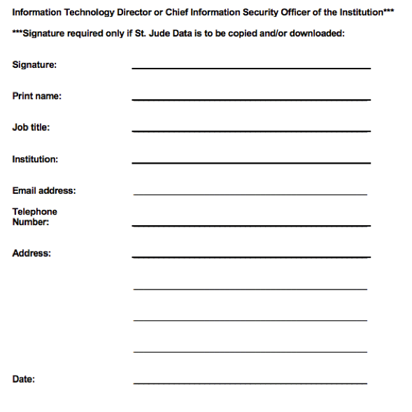

# Filling Out The Data Access Agreement 

The [Data Access Agreement (DAA)](../../glossary.md#data-access-agreement) is a legal document used by St. Jude Cloud to verify the identity and intent of those requesting to access St. Jude Children’s Research Hospital’s genomics data. The document binds you and your institution in agreement to protect, use and share the data appropriately. 

Upon selection of your desired data through the data browser or through the PeCan app and if you have not already been approved for access to the selected datasets, you will be prompted to complete a Data Access Agreement. In order to simplify the data access request process, an [electronic data access agreement](#the-electronic-data-access-agreement) is available for US residents only.

If you reside outside of the US, you must fill out the Data Access Agreement manually. You may click [here](../../files/DAA_v4_10-1-2019.pdf) to download the latest version of the DAA. Please read the first 6 pages carefully, which consist of terms and conditions that you and your institution must agree to in order to access any data on St. Jude Cloud. Then, follow the directions starting at [Data Access Units](#data-access-units) to ensure that you have correctly filled out the DAA. Please note that there are [2 additional required sections](#downloading-data) if you intend to download data.

### The Electronic Data Access Agreement
Users who live in the United States will be given the option to complete the DAA electronically or manually. If you elect to complete it electronically, the setup wizard will request information about you, your institution and your associates. You will also be asked to provide a detailed description of the research project with which the data you have requested will be used. 

After submitting the required information, the Data Access Agreement will be sent via email to each individual entered through the setup wizard. Each individual must follow the link in their email to sign the appropriate page of the agreement via DocuSign. If any individual rejects or declines to sign the agreement, you will need to start a new data request from the data browser. 

Once all signatures have been collected, your data access request will be submitted to St. Jude Cloud. A St. Jude Cloud administrator will forward your intended use to the appropriate [Data Access Committee(s)](../../glossary.md#data-access-committee) for approval. Upon approval from the DAC(s), you will be granted access to the datasets you selected. 

### Data Access Units

On page 7 of the DAA, you must mark all Data Access Units for which you are applying. The DAU(s) associated to the data you requested are listed in the Controlled Access Data section, directly above the Download Data Access Agreement button. This can be found on the Request Data webpage which immediately follows your selection of data from the data browser. 

If you mark the incorrect datasets, you will be required to resubmit your agreement with the correct datasets marked. When completing the DAA electronically using the setup wizard, the DAU options will be automatically preselected for you. 

#### Downloading Data

*If and only if* you wish to download the genomic data locally, you must (1) initial below the DAU selection, 
    
and  (2) have your institution’s Information Security Officer sign the agreement on page 13.
   

If filling out the DAA electronically, you must select the option to download within the setup wizard and input the contact information of your institution’s Information Security Officer. 

### Contemplated Use

On page 8 of the DAA, you must submit a description of your research project. Please specifically describe the intended role of St. Jude’s data in your research project. Your contemplated use can be anywhere from a paragraph to a few pages long, although a typical contemplated use is 1-2 paragraphs. Each [Data Access Committee](../../glossary.md#data-access-committee) will evaluate your contemplated use case and decide whether to approve or deny your application for data access based on their own set of protocols. Please [contact us](https://stjude.cloud/contact) if you have any questions regarding the protocols of the approval process.

#### Contemplated Use Example for SJLIFE and PCGP Access

Rare hereditary syndromes are associated with pediatric cancer predisposition.  The genes responsible, however, have not yet been fully defined.   The goal of our research is discover these genes and to apply this knowledge to develop guidelines for the clinic.   Candidate predisposition genes will be identified based on statistical modeling of rare variants from the SJLIFE data sets when contrasted against normal controls from public resources.
Further the discovery of cancer predisposition genes will be informed by identifying secondary somatic mutations in tumors and peripheral blood.  Whole genome sequences and whole exome sequences from PCGP samples from a spectrum of pediatric cancers will be surveyed for rare deleterious germline mutations that may support the development of cancer.

### Principal Investigator

On page 9 of the DAA, the Principal Investigator of the research project must input their information and sign the agreement. Typically the PI signee is the faculty-level supervisor on the project, but it is not a requirement.

**Who may qualify as a Principal Investigator (PI)?**  
The PI is designated by the grantee organization to direct the project or activity being supported by the grant. The PI is responsible and accountable to the grantee for the proper conduct of the project or activity. The role of the PI within the eRA Commons is to complete the grant process, either by completing the required forms via the eRA Commons or by delegating this responsibility to another individual. A PI can access information for any grant for which they are designated the PI. See eRA Commons Roles & Privileges Matrix. 
  

### Additional Applicants

Pages 10 and 11 of the DAA must be signed by any additional person(s) who will have access to the data. Additional applicants may include those working on your project, those working in your lab, or those who have access to where the data will be stored. These individuals will be legally bound to protecting and handling the data properly. Pages 10 and 11 may be duplicated and added to the agreement to accommodate for more than 8 additional applicants. When filling out the DAA electronically, you may only include up to 8 additional applicants on your agreement.

### Institutional Authority

Page 12 of the agreement must be filled out and signed by your Institutional or Administrative Authority. The institutional authority is an individual who has the authority to sign for a grant application. This individual cannot be the same as the Principal Investigator that signed on page 9, as this additional signature provides a second-party authority of the institution to ensure that the institution will uphold the terms of this agreement.
    

### Information Security Officer

On page 13 of the DAA, your institution’s Information Security Officer's signature is required *if and only if* you intend to [download](#downloading-data) a local copy of the data (note: you must also initial in the line below the DAU selection). This individual may go by varying job titles, such as Information Director or Chief Information Security Officer, but is the individual responsible for information security at your institution. This signature verifies that the data, once downloaded, will remain protected by your institution's data security protocols.
    

### Uploading A Revised DAA

If your DAA is incomplete (for example you missed a required signature or neglected to check the box next to a dataset for which you requested data), you will be contacted by a member of the St. Jude Cloud team. Once you have made the required edits, you can reupload a revised DAA through the [Manage Data page](https://platform.stjude.cloud/requests/manage) by clicking on the *Add a Form* button.

### Similar Topics

[Studies](../data/studies.md)  
[Making a Data Request](../data/data-request.md)  
[Renewing Your Data Access](../forms/how-to-fill-out-Extension.md)  
[Downloading Data](../data/working-with-our-data.md#using-our-data)
