!!! tip
    This guide is still being written! Check back often for updates.

## Introduction

GenomePaint officially hosts the pediatric cancer mutation and gene expression dataset, available for the human hg19 reference genome.

### Accessing GenomePaint

GenomePaint is accessible from [https://proteinpaint.stjude.org/genomepaint](https://proteinpaint.stjude.org/genomepaint).

This front page provides following contents:

1. Visualization of the pediatric cancer dataset over the hg19 reference genome

2. Custom track submission available for multiple species and genome assemblies.

3. Links to live Figures of the manuscript, this tutorial, and the user community on Google Group.

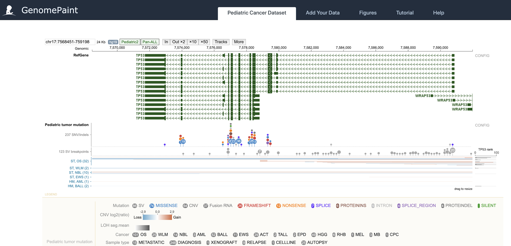

### Genome browser navigation

By default, the pediatric cancer dataset is shown in a ProteinPaint
genome browser. Following are instructions to navigate the genome
browser.

-   To pan left or right, drag on the middle part of the track.

-   To zoom in, drag on the genomic coordinate ruler on top, or click the "In" button.

-   To zoom out, click a zoom out button on top of the genome browser.

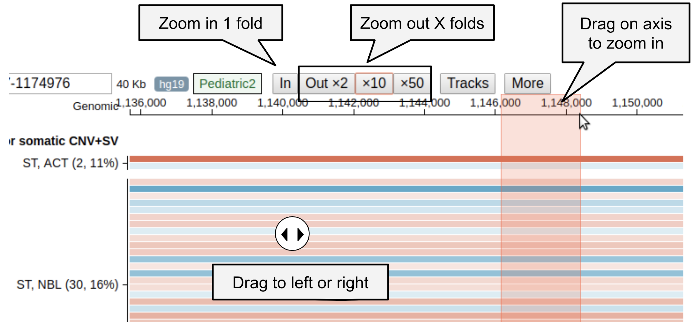

### From the protein view

To view the dataset in a protein view, go to [https://proteinpaint.stjude.org](https://proteinpaint.stjude.org). At the top search bar, type in the gene name and display the gene. Make sure "hg19" is selected at the drop down menu.


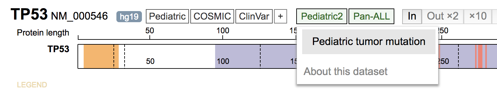

Then click "Pediatric2" on top, and select "Pediatric tumor mutation" to
show the dataset over the protein view of the gene.

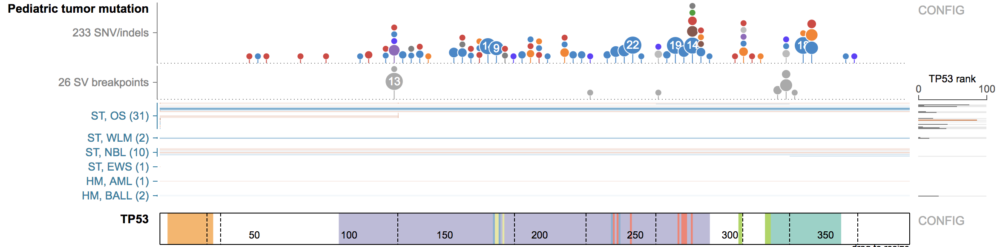

### Transitioning from genome view to protein view

When viewing a gene locus using the genome browser, ProteinPaint offers
to easily transition into protein view, so you can examine the
GenomePaint track or any other current set of tracks over the protein
view.

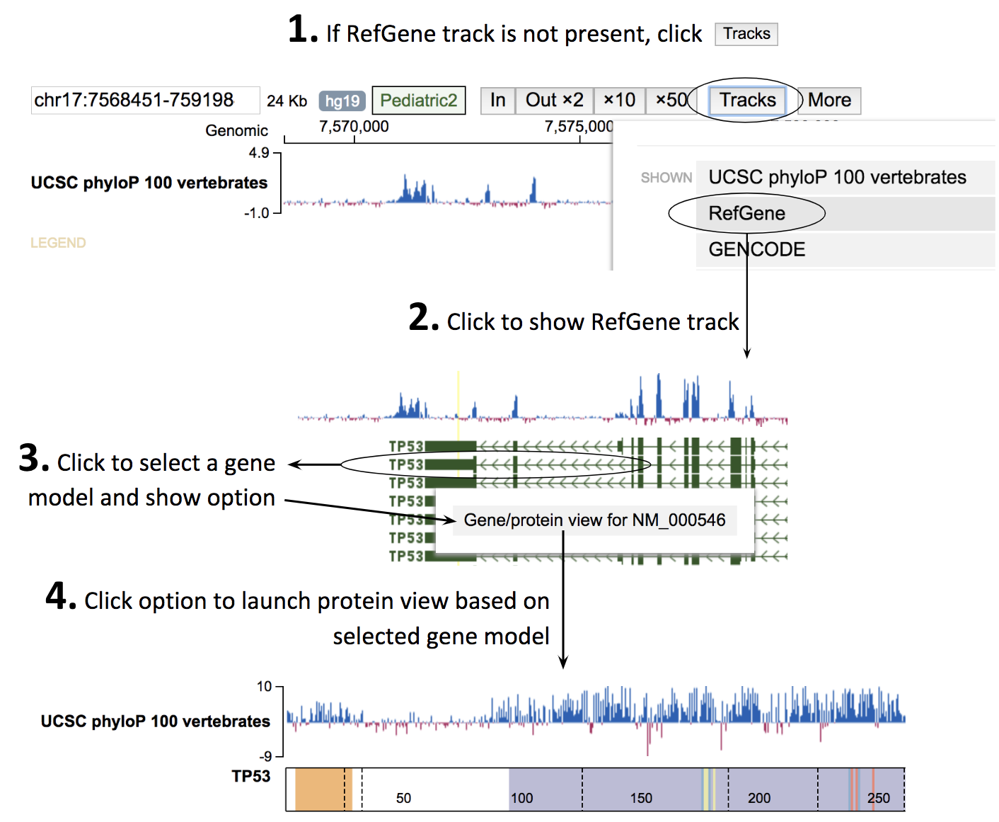

### Three viewpoints

GenomePaint offers **Cohort View**, **Sample View**, and **Matrix
View**, connected as below.

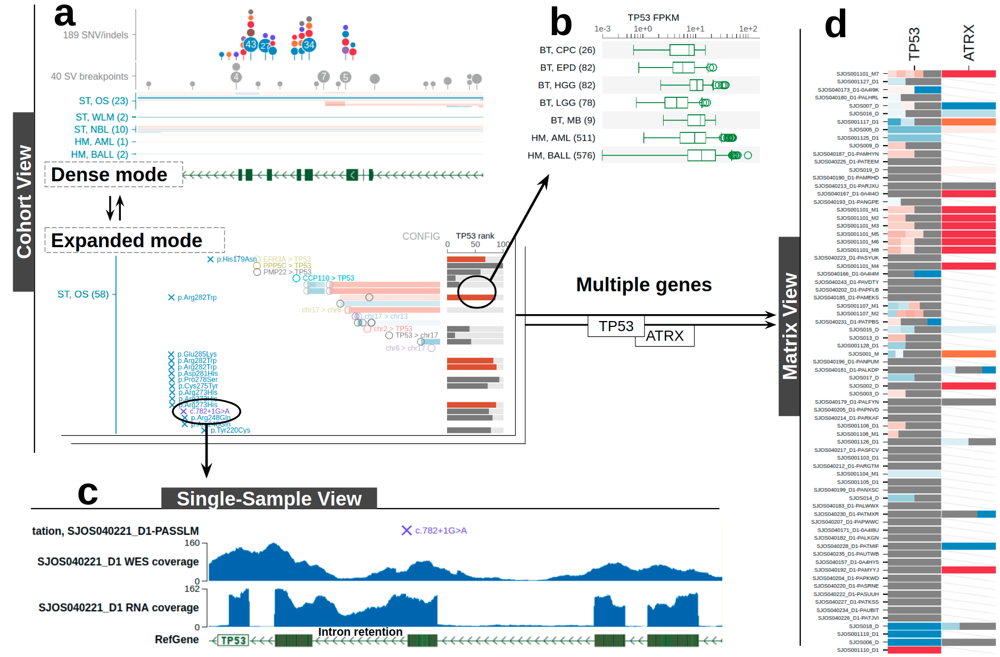

-   **Cohort View**: showing mutations from all samples over a genomic region, along with the gene expression ranks for each of the samples.

    -   **Dense mode**: a compact display showing density plots for SVs and SNV/indels

    -   **Expanded mode**: all types of mutations are aligned by samples, one row per sample

-   **Sample View**: showing mutations for one sample alone, along with any available genomic assay tracks.

-   **Matrix View**: combining the mutation profiles of multiple genomic regions in one view, in the form of a sample-by-region matrix.

## Cohort View

Cohort View connects DNA alterations with gene expression across a
cohort. It shows in either "dense" or "expanded" mode.

### Dense mode

By default, the "Pediatric tumor mutation" track displays the
cohort-view compactly in "dense" mode. This view is consisted of
following parts:

-   SNV/indel and SV/fusion breakpoint density plots on top;

-   Cancer group labels on left;

-   CNV and LOH segment plots in the center;

-   Gene expression ranking on right;

-   Legends at bottom.

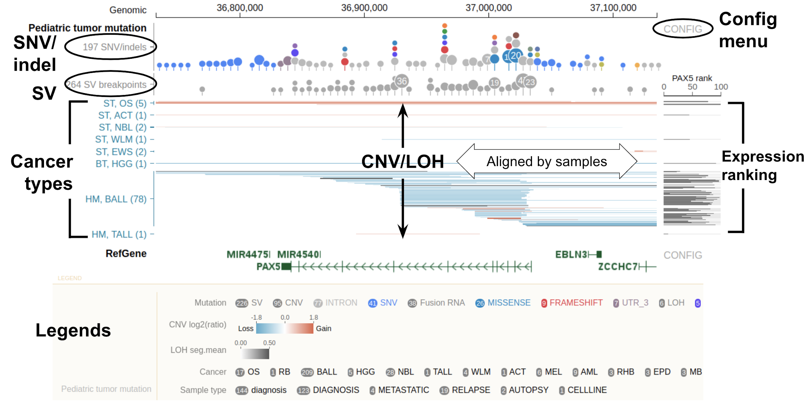

#### Mutation and breakpoint density plot in dense mode

At the top, dots indicate the density of SV breakpoints and SNV/indels
from every sample combined. Dot size represents the number of samples.
For SNV/indel, dot colors represent mutation classes. For SV, each dot
represents one or more samples from the same cancer type. Hover over a
dot for details:

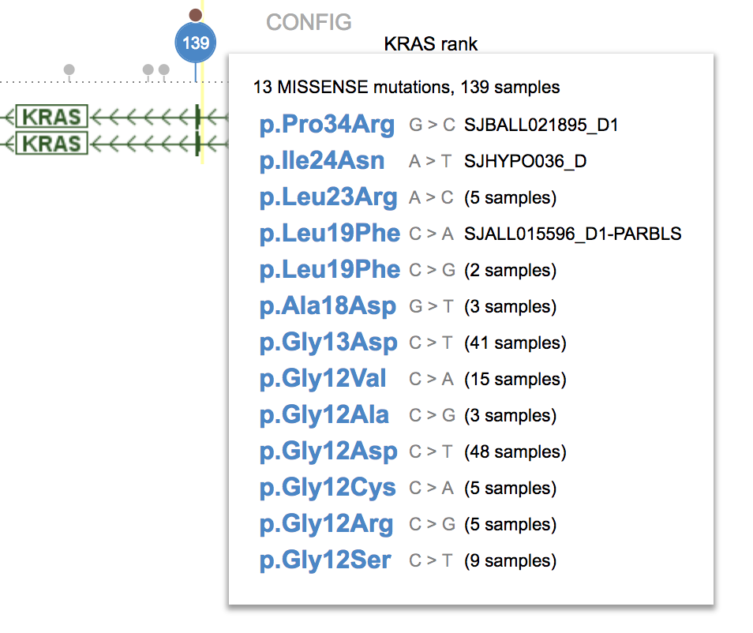

Above example shows KRAS gene locus at a low resolution and its exon as
a thin sliver. All missense mutations from that exon are represented by
one big dot. Zoom in on the exon and the large dot will break up to
smaller dots.


Zooming in at base-pair level, each dot now represents the collection of
all mutations at one base-pair; it's also positioned to that base-pair.


Clicking on a dot to show the actual list of mutations. From this panel,
hover over a sample to see sample-level information about this mutation.


#### dbSNP and ClinVar matching

At the bottom of the mutation tooltip shows if any dbSNP or ClinVar
entry matches with the mutation.

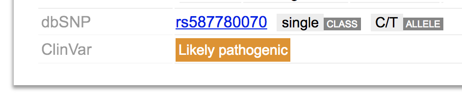

Either match will be shown as URL links to their respective databases.

(You can't click the link in a mouse-hover tooltip; simply click on the
mutation from GenomePaint to show the information panel with this
information, there you will be able to click the dbSNP or ClinVar link.
The panel will only go away if you choose to hide it)

This matching is conducted on-the-fly using GenomePaint's backend
databases, and is also available to a hg19 or hg38 custom GenomePaint
track which does not need to pre-annotate its variants with the dbSNP or
ClinVar.

#### CNV/LOH in dense mode

In this part, GenomePaint shows CNV/LOH and expression rank aligned by
rows, one row per sample. CNV and LOH events are shown as thin
horizontal lines, identified by color:

-   Red: copy number gain
-   Blue: copy number loss
-   Gray: LOH

In all cases, the color darkness represents the degree of the event, see
color scales in legend.

Samples are grouped by cancer type, as shown by the cancer type names on
the left. Each cancer type is labeled by abbreviations. Hover over the
label for details.


You can filter mutation data by cancer type. See section [Cancer type filter](#cancer-type-filter).

### Expanded mode

On the top right, click "CONFIG" to show the configuration menu, then
choose "Expanded" to go into expanded mode:


The expanded mode looks like below:


In expanded mode, all mutations for each sample are shown in the same
row. Circles represent SV/fusion breakpoints, and x marks represent
SNV/indels, all overlaying with CNV/LOH. SNV/indels and breakpoints are
always shown on top of CNV and LOH. Text labels can be shown for
SV/fusion/SNV/indel, if available.

#### CNV display and configuration

This section applies to both dense and expanded modes.

CNVs are horizontal bars, with red for gain and blue for loss, and
darkness by the log2(ratio). Hover over a CNV for details:


The log2(ratio) color scale from CNVs in the view range is shown in the
legend:


To prevent outlier log2(ratio) value from skewing the view, the cutoff
value is set by the upper whisker value of boxplot ( (3rd quartile) +
1.5*(interquartile range), if smaller than the maximum value).

A size limit may be used to show only focal events but not arm-level
events. By default, the size limit is 2 Mb, and CNV segments wider than
2 Mb will not be shown. Click the "CONFIG" label at the right of the
track to change this cutoff.

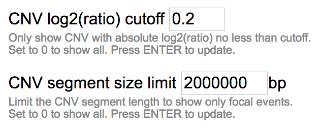

By setting the size limit to 0, the limit will be disabled and CNV of
all sizes will be shown.

Similarly, CNVs can be filtered by log2(ratio) value, where CNV with
absolute log2(ratio) lower than the cutoff will not be shown.

Click on a CNV segment to launch the Sample View, see the section on
[Sample View](#sample-view).

#### Copy-neutral LOH, display and configuration

Same as CNV, the copy-neutral LOH is displayed and configured the same
way in both dense and expanded modes.

Following example shows the somatic copy-neutral LOH of entire
chromosome 17 in adrenal cortical tumors (ACT), retaining the mutant
allele of the TP53 germline mutation R337H (blue x).

To arrive at this view, you need to disable the LOH segment size limit
by setting it to 0.

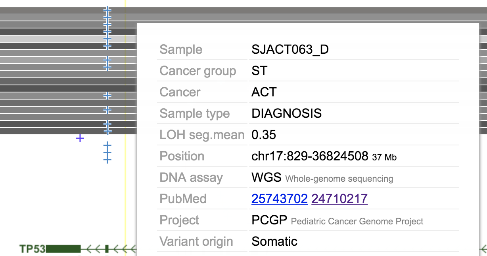

The degree of LOH is determined by the "seg.mean" value, see the color
scale in the legend:

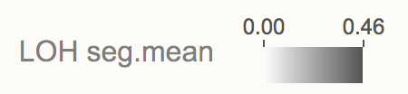

As in CNV, you can choose to show focal LOH using the segment size
filter. You can also set a minimum seg.mean value cutoff to drop
low-value items.

#### SV and fusion breakpoints in expanded mode

In expanded mode, SV and fusion breakpoints are indicated by circles. A
text label may be shown on the left or right of the circle. The
different colors represent translocating chromosomes, as indicated in
legend.

The occurrence of multiple breakpoints in a sample are indicated by
multiple circles in the same row.

Following example shows the translocation hotspot in *TCF3* in BALL. The
text labels are shown for RNA fusion transcripts, but not genomic SV.


Use the CONFIG menu to toggle the label visibility for SV and fusion
separately.

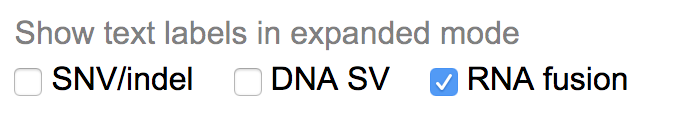

#### SNV/indel in expanded mode

Here SNV/indels are represented as cross marks, using "X" for somatic
mutations, and "+" for germline mutations. Colors correspond to mutation
class (mostly for coding mutations, see "Mutation" in legend). For genic
mutations, a HGVS styled label can be shown, as is generated by VEP.
Toggle label visibility in the CONFIG menu.


#### ITD in the expanded mode

ITD is represented as magenta bars over gene coding regions.


### Gene expression

A subset of the pediatric tumors have gene expression profiled by
RNA-seq. GenomePaint supports displaying following aspects of gene
expression data:

-   Gene expression rank based on FPKM values
-   Allele-specific expression status (ASE)
-   Outlier high expression status
-   RNA-seq coverage and splice junctions (in Sample View)

#### Expression rank

This shows the ranking of gene expression in each sample, amongst all
samples from the same cancer group:

-   Expression level from a neuroblastoma sample will be compared to expression of this gene in all neuroblastoma samples, but not expression from other cancers.

-   All neuroblastoma samples with available expression data will be used to evaluate the ranking.

Expression rankings are rendered as bar plots under the 0 to 100 scale,
0 for lowest among the group, 100 for highest. Hover over a bar to see
the actual rank, FPKM value, along with sample attributes.

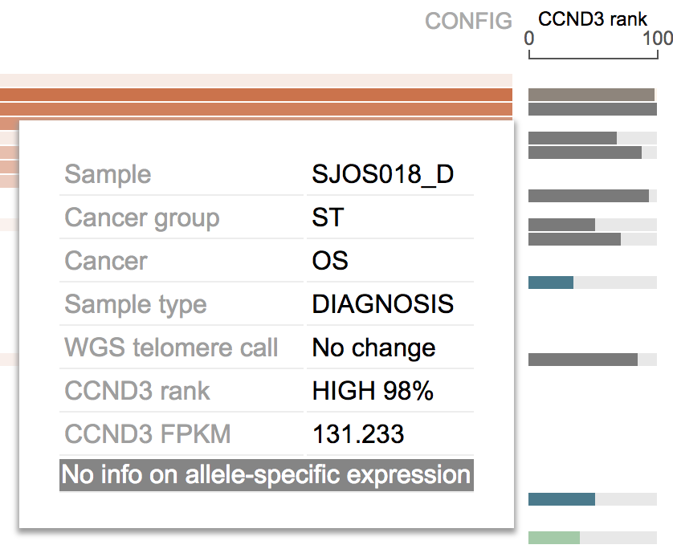

Blank row indicates either there is no expression data for selected gene
from that sample, or the sample has no expression data at all.

##### Expression rank for multiple genes

It is possible to show expression rank for multiple genes like below.
See the section on [Fixed genes](#fixed-genes).

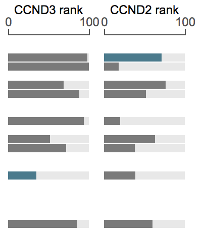

##### Find expression rank when there are no genes in view range

When there are no genes in view range, no expression ranking will be
shown. In its place, the "ADD GENE" phrase will be shown.

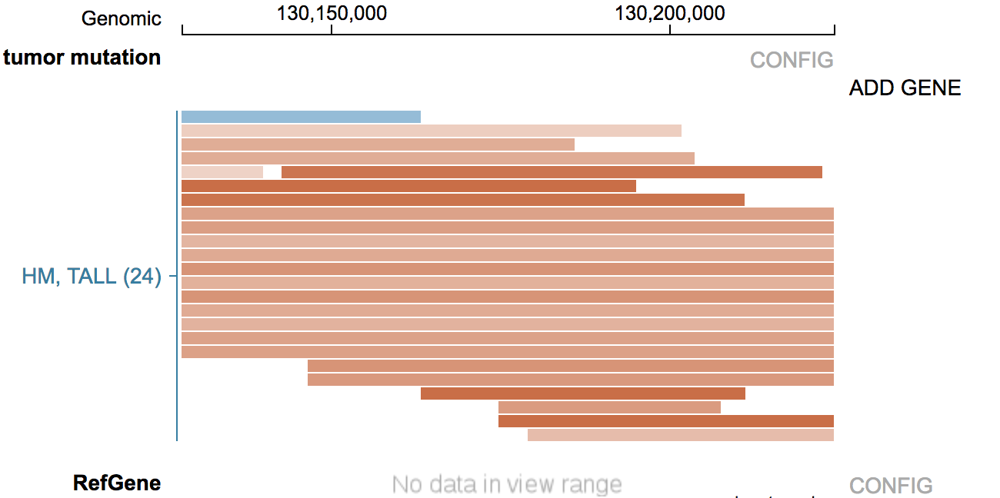

Clicking "ADD GENE" to show a search box; type in gene name to search
for a gene.


By selecting a gene from the list, the expression ranking of this gene
will be added.


See the section [Fixed genes](#fixed-genes) for details.

#### Allele-specific expression status (ASE)

The pediatric tumor gene expression is annotated with the ASE status.
This is indicated using bar colors:

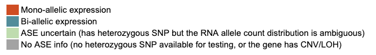

Hover over a bar to see details about the ASE status.

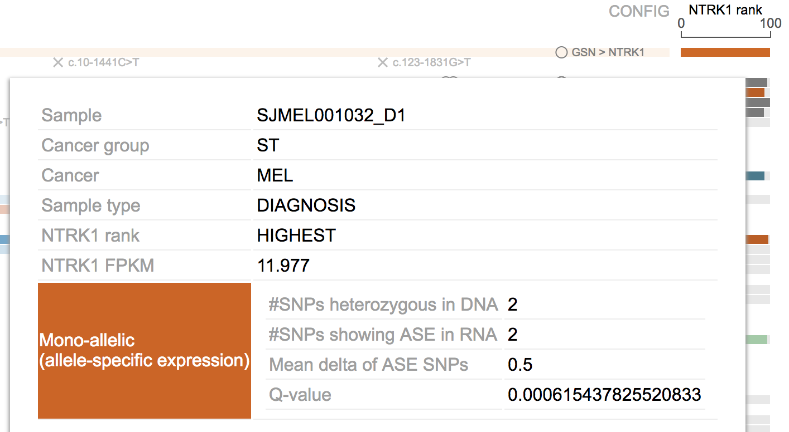

At the bottom of the tooltip, the ASE call is further explained with
four fields:

-   **#SNPs heterozygous in DNA**

    -   Total number of heterozygous SNPs in tumor genome over the gene body of this gene, as determined by tumor DNA sequencing

-   **#SNPs showing ASE in RNA**

    -   Number of such heterozygous markers showing mono-allelic
        expression. A binomial test with p-value cutoff is used to
        determine if one heterozygous SNP sufficiently deviates from
        50%, if so this SNP is "ASE". There should be 0 ASE SNPs for
        bi-allelic expressing genes, and >=1 for mono-allelic
        expressing genes.

-   **Mean delta of ASE SNPs**

    -   Mean value of (BAF-0.5) for all the markers. BAF: RNA B-allele
        frequency

-   **Q-value**

    -   First, the binomial p-values of all ASE SNPs for a gene are
        combined into one value using geometric mean; then, the
        combined p-values for all genes from a tumor are multiple-test
        corrected, to obtain this q-value for each gene.

GenomePaint uses a decision tree to determine the ASE status of a gene
in a sample (mono-allelic, bi-allelic, uncertain). To customize the
cutoff values, click the gene label and select "Customize ASE/OHE
parameters":


In the ASE decision tree, three cutoff values are customizable:

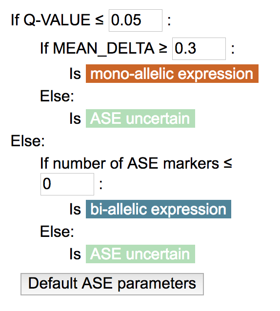

For ASE, values for number of heterozygous SNPs, number of ASE SNPs,
mean delta, and q-value are precomputed (Cis-X, Yu et. al., in
submission) and cannot be recomputed on-the-fly.

#### "Automatic" genes

While you pan and zoom the view range, genes update **automatically** on
the right in the expression column. It always shows the first gene in
the view range.

When you zoom out and there are multiple genes in the view range, you
may want to view some other gene rather than the default leftmost one.
Click on the gene label on top of the rank axis and find a list of gene
names from the view range. Choose a gene to change. By choosing a gene
here, whenever this gene is in the view range, it will always be shown
irrespective of its order of appearance.

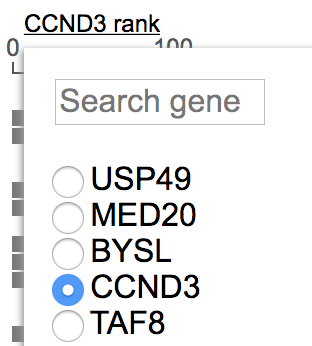

#### "Fixed" genes

GenomePaint allows you to show the expression of multiple genes
side-by-side:

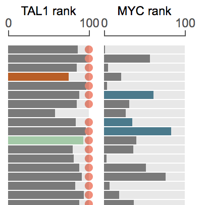

The gene on the left is "automatic". The gene on right is added by user,
and will be always shown irrespective of the view range, hence the
**fixed genes**.

To add a fixed gene, click the gene label on top of the automatic
expression rank axis to show the menu. Type into the search box on top
of the menu to find matching gene names:

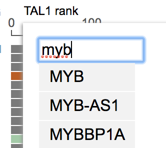

Select a gene from the list, and its expression rank will appear as a
new column. More than 1 fixed genes can be added. The samples are
aligned for both automatic and fixed genes.

To remove a fixed gene, click the gene label and select "Remove".


As an example, while browsing the recurrently duplicated NOTCH1 MYC
enhancer locus in TALL, the distal target gene MYC is not in view range,
thus its expression is not shown automatically.

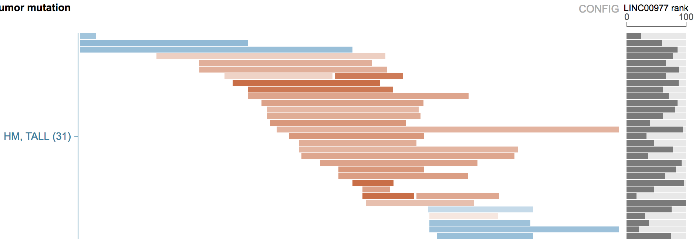

By adding MYC as a "fixed gene", its expression is shown for TALL tumors
with enhancer duplication:

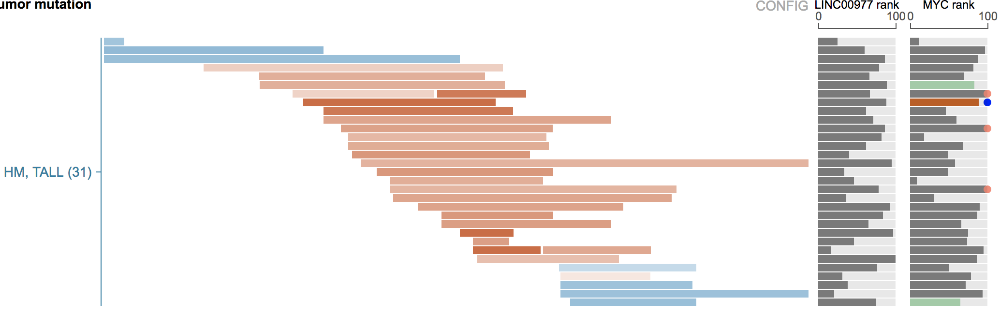

### Filters for samples and genomic variants

Here we introduce filters for samples and mutations in Cohort View. Some
of these filters can be found in the track legend at the bottom of the
page, where the filters are listed as legend entries. Some filters are
hidden by default, click "MORE" at bottom to show them:


#### Cancer type filter

In cohort view, one or more cancer types will be shown on the left of
the mutation data display. Click on a cancer name to show a menu:


Click "Hide" to hide samples of this cancer type; click "Show only" to
only show samples of this cancer type.

In the legend, hidden cancer types are indicated with a strikethrough;
click a striked label to turn it back on:


#### Other sample filters

You can filter samples by cancer group, sample type, gender, and race,
in the same way as cancer type.


#### Mutation class filter

Mutation class legend is shown as below. You can select a class and hide
it or show it only.

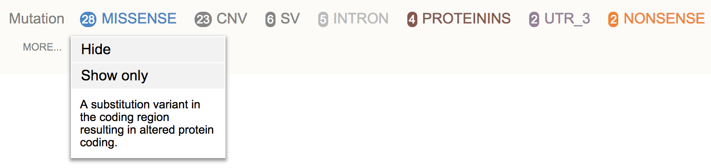

#### Mutation attribute filter

Following are attributes describing mutations in each particular sample.
Unlike mutation class which annotates a mutation no matter if it is
germline or somatic, these attributes are assigned to mutations in each
sample.

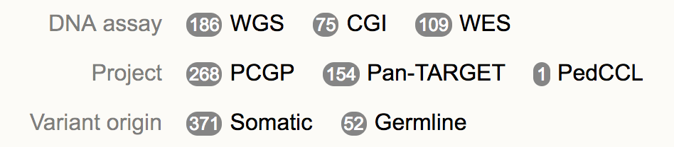

### Custom sample subsetting

In addition to grouping tumors with predefined cancer types, users can
choose to limit the Cohort View to a customly defined sample subset. To
do that, click CONFIG, then select the "Use a sample list" button.

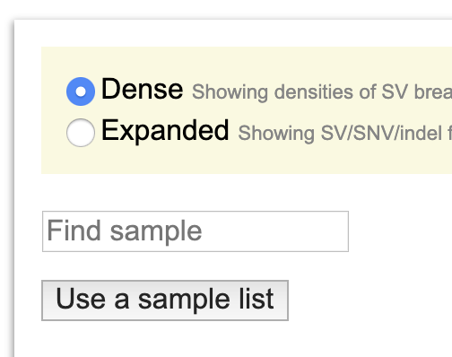

An input box is displayed prompting the user to enter the set of
samples.


For the moment, space character is reserved for dividing the sample and
group names, and cannot be used in either sample or group name.

As an example, use the following list of samples that are divided into
two groups.

```
SJTALL002030_D1-PARVHY T-ALLs
SJALL015249_D1-PARPHB T-ALLs
SJALL015260_D1-PARMKK T-ALLs
SJALL015268_D1-PASFHR T-ALLs
SJALL015278_D1-PARJPL T-ALLs
SJALL015280_D1-PARNMV T-ALLs
SJALL015285_D1-PASKTG T-ALLs
SJTALL002072_D1-PATHJF T-ALLs
SJALL015269_D1-PASFKA T-ALLs
SJBALL020492_D2-PANKGK B-ALLs
SJERG009_D B-ALLs
SJPHALL006_D B-ALLs
SJBALL020795_D2-PAPIRZ B-ALLs
SJETV088_D B-ALLs
SJHYPER143_D B-ALLs
SJETV059_D B-ALLs
SJETV069_D B-ALLs
SJHYPER052_D B-ALLs
SJBALL020469_D1 B-ALLs
SJHYPER013_D B-ALLs
```

The Cohort View will be transformed to showing only these samples in two
groups:

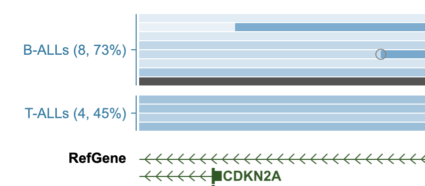

Click a group label to see options:

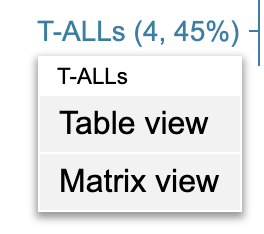

After submission, a sample set can be edited. To do that, inside the
CONFIG menu click on the "Edit" button following the "Restricted to xx
samples" phrase, and open the same input box allowing to edit the list
of samples.


Click on the "Remove" button to cancel the sample subsetting and go back
to full Cohort View.

Sample subsetting can be applied to custom track as well.

### Assay availability table

The Pediatric cancer dataset is equipped with a feature to show assay
availability information for each cancer type. This is important in
providing a precise total sample count based on assay type.

As an example, T-ALL displays 78 samples with alterations at the TAL1
locus. The "21%" percentage is imprecise and only servers as a rough
guide, as it doesn't account for assay availability.


The track legend shows two DNA assay types for these alterations: SNP6
and "amplicon sequencing". In addition there are also fusion events from
RNA-seq. Thus, to compute the percentage of T-ALLs with TAL1 locus
alteration, one needs the total number of T-ALLs with either SNP6,
amplicon sequencing, or RNA-seq. To get the actual total number, click
the "HM, TALL" label on the left and select "Assay summary" option.

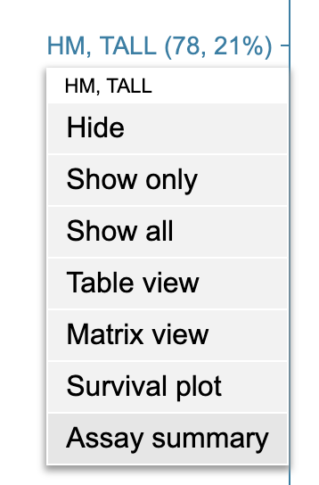

The assay availability for T-ALL is displayed as a map below.

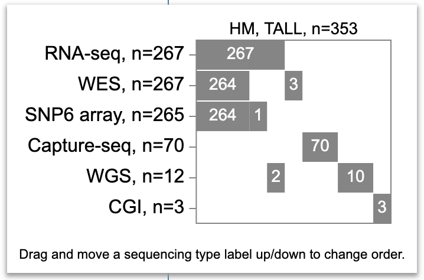

The map is an assay-by-sample matrix, with assays as rows and samples as
columns. All assays available for T-ALLs are included. By default, the
assays are arranged from top to bottom in descending order of sample
counts (RNA and WES being the most abundant). Inside the matrix, a gray
box indicates a set of samples having a particular assay type. The
number of samples are always printed out for each box.

The sample columns are sorted by their presence of each assay type, by
the order of assays from top to bottom. In the T-ALL case, the samples
are first sorted by RNA-seq, with 267 that have RNA-seq and 86 without
(number not printed). Next, WES availability is sorted separately for
the box and blank from the first row, resulting in two boxes and two
blanks. Next, the SNP6 availability is sorted separately in each box and
blank in the second row. So on for every other assay type. Importantly,
the width of the gray boxes are not scaled by the number of samples, but
rather symbolic representations of the cohort partitioning. Though not
to scale, the boxes are vertically aligned with columns being groups of
samples. Better than a Venn diagram, this assay availability map
solidifies a comprehensible view with as many as 6 assay types.

As the order of assay types is important for the map, users can adjust
the row order by dragging a label up or down. As below, the RNA-seq,
SNP6, and Capture-seq rows are moved to the top, yielding a total of 337
samples (267+70) for the samples with TAL1 locus alterations.

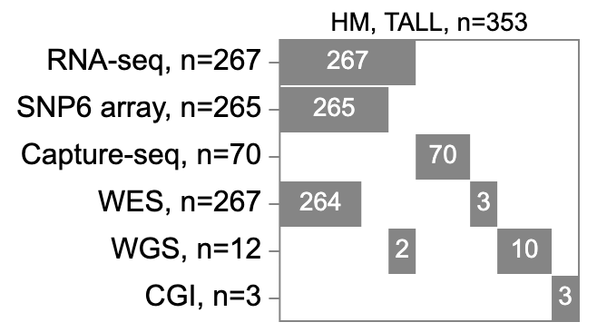

### Kaplan-Meier plot

Patient outcome (event-free and overall survival) information is
available for 1102 samples (6 histotypes) from the "Pan-TARGET" study
(Ma, X. et al. Nature 2018). GenomePaint provides following ways to
stratify this cohort using genomic alteration or gene expression, and to
perform the Kaplan-Meier analysis to assess what clinical outcome does
the genomic feature lead to. The analysis will compute the p value using
the G-rho family of tests (the "survdiff" function in R), as well as
plotting the survival curves.

Kaplan-Meier analysis is performed on each individual cancer type.

#### With genomic alterations

This usually applies to recurrent mutations/alterations, or frequently
mutated regions, as sufficient number of mutated samples may be required
for the analysis.

##### With a specific mutation/alteration

CDKN2A/2B is recurrently deleted in acute lymphoblastic leukemia. To see
how this deletion may impact clinical outcome, visit CDKN2A locus in
GenomePaint, and select a deletion spanning the locus to show a panel
(left). On top of this panel, select the "Survival plot". This will use
the range of this particular deletion to stratify tumors: samples with
deletions overlapping with this range will be separated from samples
that don't. As a result, a survival curve like below can be shown for
BALL.

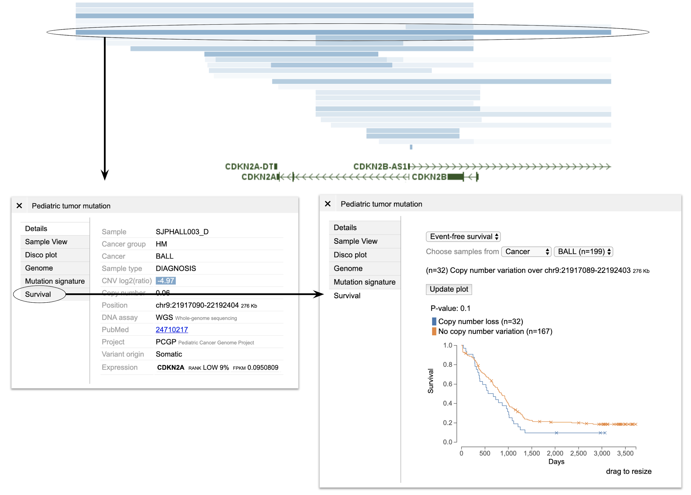

Such procedure can be applied to other types of mutation/alteration as
well. If a CNV is selected, samples may be divided to up to three groups
(gain, loss, no change). If any other type of alteration is selected,
samples will be divided into just two groups (with mutation, no
mutation).

##### With any alterations from a chosen genomic interval

MYB is subject to multiple types of genomic alterations in TALL,
including amplification, activating mutation, intragenic and intergenic
translocations. To collectively consider the effect of these alterations
on TALL patient outcome, view data in the range chr6:135482339-135674218
(hg19), a 190 Kb region around MYB, which will include coding mutations,
amplification, and intergenic translocations that have been found to
cause MYB activation. Then, click on the "HM, TALL" label on the left
and select the "Survival plot" option. This will select TALL patients
with any variant in the view range into the "mutated" group, for
comparing with the "no mutation" group in the Kaplan-Meier analysis.


CNV, LOH parameter settings and [mutation class filter](#mutation-class-filter) will be applied to filter
alteration events in the survival plot.

#### With FPKM values of a chosen gene

MDM2 overexpression may lead to shortened half-life of P53 protein, thus
may lead to worse outcome in cancer patients. To test this hypothesis,
show MDM2 in GenomePaint. On the right of gene expression rank plot,
click "MDM2" label, then select "Survival plot by MDM2 FPKM".

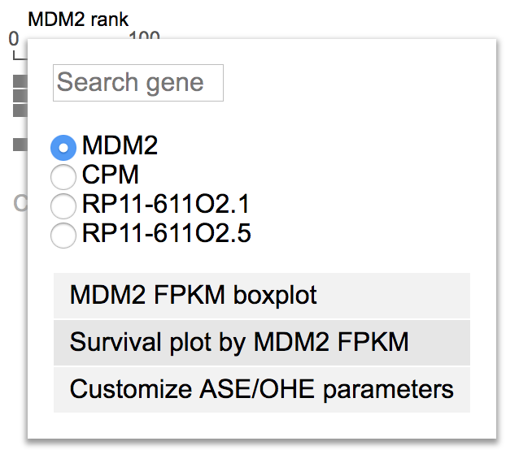

This will perform the analysis on BALL by default, using MDM2 median
expression as cutoff to divide the samples to two groups. Switch the
cancer type to AML, and median into quartile, to view the plot showing
high MDM2 expression is correlated with worse outcome in AML.


## Sample View

From Cohort View, click any type of mutation to show a panel; at the
left of this panel, click the "Sample View" button to show a new browser
view showing data tracks from this sample in a region surrounding the
mutation:

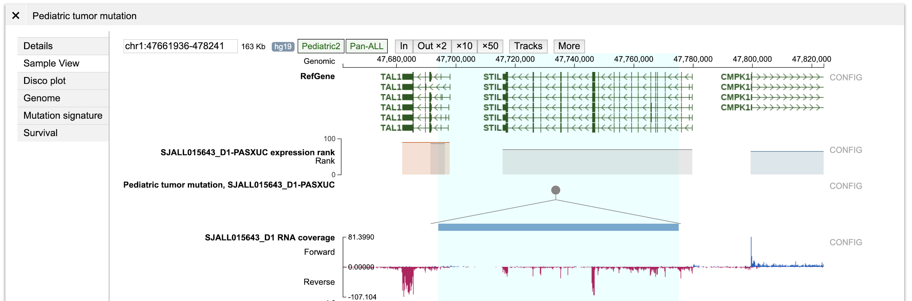

### Pediatric tumors in Sample View

#### Mutation data in Sample View

The Sample View shows a number of tracks, one of them is the mutations,
named "Pediatric tumor mutation, <name of this sample>". In the
example below, a Wilms' tumor shows 4 different types of mutations over
the MYCN gene, including copy number gain, LOH (not copy-neutral), SV
supporting this CNV, and a coding mutation in MYCN.


#### Mutation signature

In the above example, the missense mutation is colored in green because
of its mutation signature assignment in that sample.


Mutation signature is available for 915 tumors from the Pan-TARGET study
(Ma, X et al. Nature 2018). For such tumors, their mutations in Sample
View will be colored by assigned signatures. Users can also view the
mutation signature abundance for a sample by clicking the "Mutation
signature" button on top.

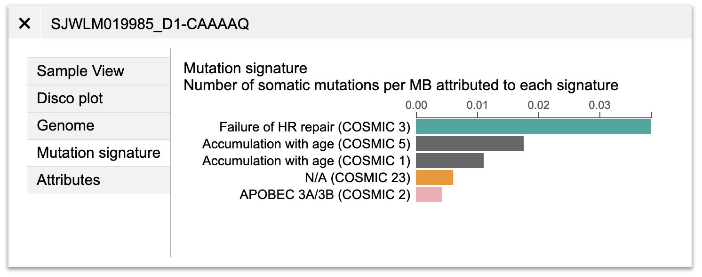

#### Multi-region display for inter-chromosomal SV

When a user clicks on an inter-chromosomal SV and launches Sample View,
the view will contain a pair of regions each containing one breakpoint,
from two chromosomes. Regions are spaced by a vertical gray bar. The
following example shows a pair of genomic regions upon clicking the
ETV6-ABL1 fusion transcript in a TALL sample; the left region with ETV6
is chr12, and the right-side region with ABL1 is chr9.


To zoom in on either region, drag on the coordinate ruler on top of one
region.

To zoom out on the left-side region, click the "zoom out" buttons.

To zoom out on the right-side region, instead of clicking on the "zoom
out" buttons, hover and show an option on top, click that option to zoom
the right-side region.


#### Sequencing coverage and allelic-imbalance tracks in single-sample view

GenomePaint aims to provide comprehensive genomics information to assist
in interpreting mutations from individual tumors. This includes
additional genomic assay tracks on individual tumors if they are
available to us. Following is a typical example:

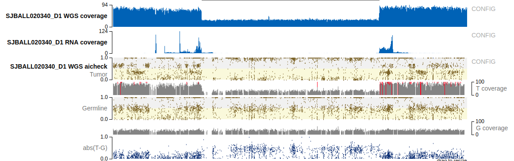

In the above example, it shows coverage of WGS and RNA-seq of tumor, and
the allelic-imbalance from the tumor-normal paired WGS results.

[Learn more about the allelic-imbalance track](https://docs.google.com/document/d/1dZIOoLLbQE-kmZ31Ia_5cud30d9UeRodP4hRCSw3HII/edit?usp=sharing).

### Hi-C data from pediatric cancer cell lines

GenomePaint provides the detailed genomic and epigenomic assaying
results of a set of pediatric cancer cell lines to supplement the
primary tumor mutation dataset. Currently there are six neuroblastoma
cell lines (SKNAS, NB69, Kelly, BE2C, NGP, SH-SY5Y) and one BALL cell
line (NALM6), all grouped with primary tumors of the same cancer type.
When a cell line appears in the genomic mutation data panel, it will be
marked by a black notch on left:


These cell lines all come with in-situ Hi-C data, in addition to the
histone modification ChIP-seq. These tracks will be shown in the
single-sample view of these cell lines.

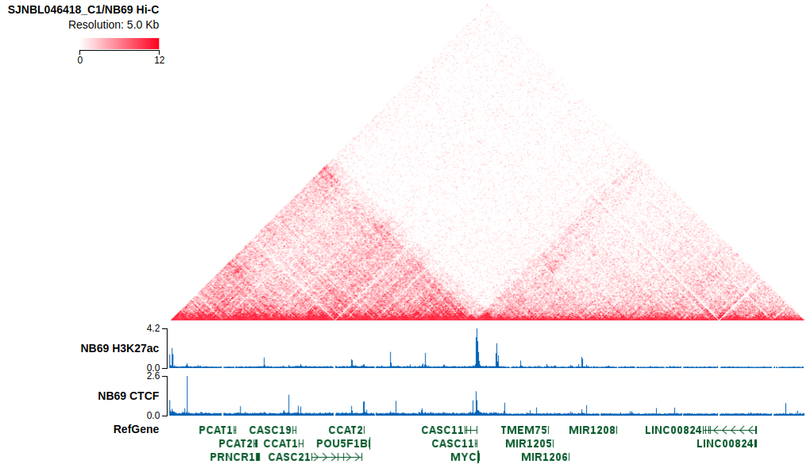

[Learn more about the Hi-C track](https://docs.google.com/document/d/1MQ0Z_AD5moDmaSx2tcn7DyVKGp49TS63pO0cceGL_Ns/edit?usp=sharing).

## Matrix View

Matrix View is a light-weight method for combining multiple genomic
regions into one view so as to compare their mutational profiles over a
group of samples, via a sample-by-region matrix:

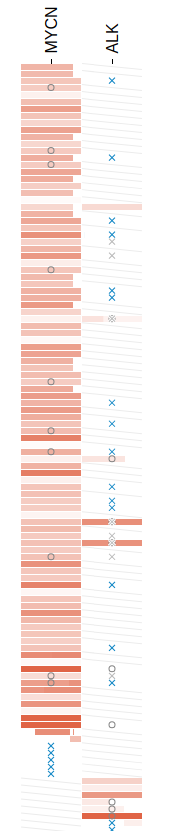

Such a matrix can be generated for samples from one cancer type.
Following demonstrates how to use the Matrix View to observe the
MYCN-ATRX mutual exclusivity in neuroblastoma.

First, show the NBL mutation profile at the MYCN locus.


By default MYCNOS gene is showing for the expression rank, change it to
MYCN. This can allow the region to be named as "MYCN" rather than
"MYCNOS" in the Matrix View.


Click on the "ST, NBL" label on left, and select "Matrix view".


This gathers the group of NBL tumors with mutations in MYCN into a
single-column matrix.


Back to the Cohort View. Type "atrx" into the coordinate box and press
ENTER.


Cohort View now shows ATRX mutations from NBL. Click the "ST, NBL" label
on the left, and select "Matrix View".


This will add ATRX as a new column alongside MYCN in the Matrix View. It
shows that the majority of NBL tumors only display alteration at one
gene.

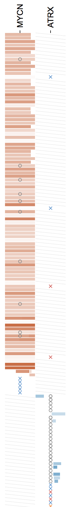

## Custom track

### Feature availability

Features available for custom track:

-   All types of mutations are supported, including SNV/indel, CNV, LOH,
    SV, fusion, ITD.

-   Gene expression FPKM values and ranking are supported, together with
    ASE status.

-   Customizing ASE parameters.

-   Cohort View:

    -   Showing mutation profile.

    -   Mutation annotation with user-defined attributes; this is for
        display only and cannot be used for filtering.

    -   Computing and displaying gene expression rank among all samples.

    -   Custom sample subsetting.

-   Sample View:

    -   Displaying mutation track, as well as multi-region view
        triggered by inter-chromosomal SV.

    -   Gene expression rank from all samples.

    -   Joining of SV breakpoint regions.

-   Matrix View.

-   Customizing CNV/LOH parameters (log2ratio, seg.mean, max size limit)
    and mutation class in all Views

-   Works for any supported genome assemblies, including hg19, hg38,
    mm9, mm10

Features _not available_ for custom track:

-   Predefined sample grouping and filtering by cancer types.

-   Mutation filtering.

-   Mutation signature.

-   Support of genomic assay tracks in Sample View.

-   Kaplan-Meier analysis.

### Example 

This URL shows the TCGA DLBC (diffuse large B-cell lymphoma) as a custom
track in the human hg38 genome.

[https://proteinpaint.stjude.org/?block=on&genome=hg38&position=chr9:21843776-22119276&svcnvfpkmurl=TCGA_DLBC,svcnv,https://pecan.stjude.cloud/static/hg38/tcga-gdc/DLBC/TCGA_DLBC.CNV.gz,fpkm,https://pecan.stjude.cloud/static/hg38/tcga-gdc/DLBC/TCGA_DLBC.fpkm.gz,vcf,https://pecan.stjude.cloud/static/hg38/tcga-gdc/DLBC/TCGA_DLBC.vcf.gz](https://proteinpaint.stjude.org/?block=on&genome=hg38&position=chr9:21843776-22119276&svcnvfpkmurl=TCGA_DLBC,svcnv,https://pecan.stjude.cloud/static/hg38/tcga-gdc/DLBC/TCGA_DLBC.CNV.gz,fpkm,https://pecan.stjude.cloud/static/hg38/tcga-gdc/DLBC/TCGA_DLBC.fpkm.gz,vcf,https://pecan.stjude.cloud/static/hg38/tcga-gdc/DLBC/TCGA_DLBC.vcf.gz)

It consists of SNV/indels (VCF format), SVCNV (tailored JSON-BED
format), and FPKM (tailored JSON-BED format). The URLs for each file:

-   SVCNV

    -   [https://pecan.stjude.cloud/static/hg38/tcga-gdc/DLBC/TCGA_DLBC.CNV.gz](https://pecan.stjude.cloud/static/hg38/tcga-gdc/DLBC/TCGA_DLBC.CNV.gz)

-   FPKM

    -   [https://pecan.stjude.cloud/static/hg38/tcga-gdc/DLBC/TCGA_DLBC.fpkm.gz](https://pecan.stjude.cloud/static/hg38/tcga-gdc/DLBC/TCGA_DLBC.fpkm.gz)

-   VCF

    -   [https://pecan.stjude.cloud/static/hg38/tcga-gdc/DLBC/TCGA_DLBC.vcf.gz](https://pecan.stjude.cloud/static/hg38/tcga-gdc/DLBC/TCGA_DLBC.vcf.gz)

Either SVCNV or VCF track is required to launch a custom track; FPKM
track is optional.

### Tools required

**bcftools**, 1.9
**tabix** and **bgzip**, 1.9
Download all from
[http://www.htslib.org/download/](http://www.htslib.org/download/)

### VCF file

The VCF file stores SNV/indel mutations for a group of samples.
GenomePaint requires VCF format version 4.2:
[https://samtools.github.io/hts-specs/VCFv4.2.pdf](https://samtools.github.io/hts-specs/VCFv4.2.pdf)

#### Functional annotation of variants using VEP

Functional annotation of variants is optional but helpful. VEP is
recommended. See details at
[https://useast.ensembl.org/info/docs/tools/vep/index.html](https://useast.ensembl.org/info/docs/tools/vep/index.html)

#### Preparing a VCF track file

The VCF text file needs to be sorted, then compressed and indexed to
make the track file.

```bash
bcftools sort FILE.vcf -o FILE.sorted.vcf
bgzip FILE.sorted.vcf
tabix -p vcf FILE.sorted.vcf.gz
```

The resulting files "FILE.sorted.vcf.gz" and "FILE.sorted.vcf.gz.tbi"
are the VCF track files. Put both under the same directory to be used as
custom tracks.

### SVCNV file

"SVCNV" is the nickname for the file storing all other types mutations
except SNV/indel, which are CNV, LOH, SV, fusion, ITD, for a group of
samples.

The file uses a uniform format to represent different mutation data,
which consists of 4 tab-separated columns. Each line represents one
variant in a sample. First three columns are genomic positions for
indexing (chr, start, stop, 0-based), the fourth column is a JSON
object.

CNV example:

```
chr1    10000   10927712        {"dt": 4, "sample": "SJMB015_D", "value": -0.45}
chr1    10000   151005400       {"dt": 4, "sample": "SJMB008_D", "value": 0.585}
chr1    10000   25392551        {"dt": 4, "sample": "SJRB003_D", "value": -0.4150}
```

-   "dt":4 identifies this item is a CNV
-   "value" is log2(ratio)

LOH example:

```
chr1    55976   185392845       {"dt":10,"sample":"SJCOGALL010918_D2-PAPJXI","segmean":0.068}
chr1    55976   249195965       {"dt":10,"sample":"SJAML040586_D1-PARFAL","segmean":0.068}
chr1    55976   249208343       {"dt":10,"sample":"SJAML040508_D1-PAKERZ","segmean":0.073}
```

-   "dt":10 identifies this item is LOH
-   "segmean" is the seg.mean value, range between 0 and 0.5
-   Your file can contain all the LOH segments, they don't need to be
    limited to copy-neutral ones; GenomePaint will always show
    copy-neutral LOH by on-the-fly comparison to CNV, in cohort view.

SV example:

```
chr12    12029972    12029972    {"chrB": "chr21", "dt": 5, "posB": 36417895, "sample": "SJETV039_D", "strandA": "+", "strandB": "-"}
chr21    36417895    36417895    {"chrA": "chr12", "dt": 5, "posA": 12029972, "sample": "SJETV039_D", "strandA": "+", "strandB": "-"}
```

-   "dt":5 identifies this item is structural variation in DNA (as
    opposed to RNA fusion)

-   Each SV has two breakpoints: chrA:posA → chrB:posB; it must be
    represented as two lines in the data file, no matter if chrA is
    the same as chrB or not.

-   Line 1

    -   chrA \t posA \t posA \t {"dt":5, "chrB":.., "posB":..., "strandA": "+", "strandB": "-", ... }

-   Line 2

    -   chrB \t posB \t posB \t {"dt":5, "chrA":.., "posA":..., "strandA": "+", "strandB": "-", ... }

Fusion example:

```
chr1    19157328        19157328        {"chrB": "chr13", "dt": 2, "geneA": "chr1", "geneB": "VWA8", "posB": 42278669, "sample": "SJRHB009_D", "strandA": "-", "strandB": "+"}
chr1    19157486        19157486        {"chrA": "chr13", "dt": 2, "geneA": "VWA8", "geneB": "chr1", "posA": 42278658, "sample": "SJRHB009_D", "strandA": "+", "strandB": "-"}
```

Fusion is the same as SV except dt is 2.

ITD example:

```
chr8    128752721    128753187    {"dt": 6, "gene": "MYC", "isoform": "NM_002467", "sample": "SJTALL002080_D1-PATHWV"}
chr8    128752763    128753183    {"dt": 6, "gene": "MYC", "isoform": "NM_002467", "sample": "SJERG029_D"}
chr8    128752802    128753109    {"dt": 6, "gene": "MYC", "isoform": "NM_002467", "sample": "SJAML040570_D1-PAPXRJ"}
chr8    128752821    128753186    {"dt": 6, "gene": "MYC", "isoform": "NM_002467", "sample": "SJCOGALL010220_D1-PANTSM"}
```

#### Preparing a SVCNV track file

For a group of samples, concatenate the 4-column text data of every type
of mutation into a single text file. Do the following to prepare the
track file.

```bash
sort -k1,1 -k2,2n FILE > FILE.sorted
bgzip FILE.sorted
tabix -p bed FILE.sorted.gz
```

The resulting files "FILE.sorted.gz" and "FILE.sorted.gz.tbi" are the
SVCNV track files. Put both under the same directory to be used as
custom tracks.

#### Annotating variants in SVCNV file

Variant annotation provides a useful way to record attributes pertinent
to each particular variant.

Suppose we want to process the CNV calls from a group of tumors. Some of
the tumors are analyzed by SNP array, others by sequencing, still others
by both. When browsing such CNV data, it may be useful to tell the
assaying type for a CNV. For that we can annotate the CNV in the
following way:

```
{"dt":4,"sample":"sample","value":0.5, "mattr":{"dna_assay":"snp6"} }
```

In the JSON object of this CNV, the "**mattr**" attribute points to a
key-value pair. Here "dna_assay" is used to indicate the assay type,
which will show up in the tooltip like below.

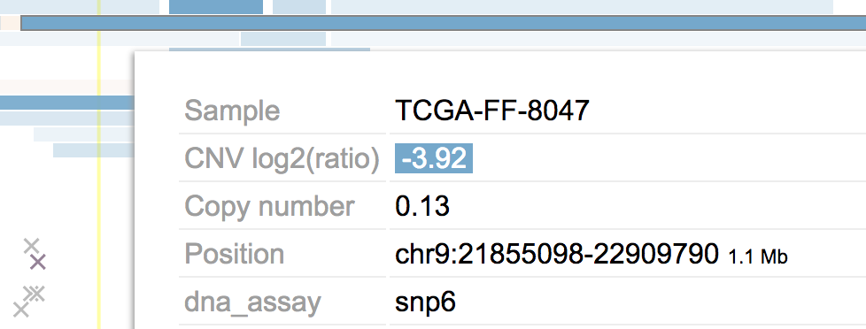

### FPKM gene expression

Gene expression value such as FPKM is optional in a GenomePaint track.
If provided, it should be encoded in a text format like below:

```
chr1    69090   70008   {"value":0.00109218,"sample":"SJBALL021486_D1","gene":"OR4F5"}
chr1    69090   70008   {"value":0.00109218,"sample":"SJHGG075_A","gene":"OR4F5"}
chr1    69090   70008   {"value":0.00109335,"sample":"SJRHB044_M","gene":"OR4F5"}
chr1    69090   70008   {"value":0.00109946,"sample":"SJEPD007_D","gene":"OR4F5"}
chr1    69090   70008   {"value":0.00110745,"sample":"SJHGG015_D","gene":"OR4F5"}
chr1    69090   70008   {"value":0.00111458,"sample":"SJHGG103_D","gene":"OR4F5"}
```

Each line represents the FPKM value of one gene in one sample. File has
4 columns, separated by tabs:

1. Chromosome name of the gene
2. Start position of the gene, 0-based
3. Stop position of the gene, non-inclusive
4. JSON object with keys:
-   "**value**": FLOAT
    -   FPKM value for this gene in this sample, positive real number
-   "**sample**": STR
    -   Sample name
-   "**gene**": STR
    -   Gene name

#### Preparing a FPKM track file

Use the same procedure as the SVCNV track.

#### Annotating gene expression with ASE/OHE status

ASE (allele-specific expression) status can be indicated using the
"**ase**" key in the JSON object of FPKM data:

```javascript
{
    "sample": "SJTALL002124_D1-PATWYL",
    "value": 17.2244,
    "gene": "TAL1",
    "ase": {
        "markers": 1,
        "ase_markers": 1,
        "mean_delta": 0.5,
        "qvalue": 0.00163916385535038
    }
}
```

See [Allele-specific expression status](#allele-specific-expression-status-ase) on how the ASE status is determined based on the constituent values from "ase".

OHE (outlier high expression) status can be indicated as below in the
JSON object of FPKM data.

```javascript
{
    "sample": "SJTALL022442_D2-PATFRM",
    "value": 3.8905,
    "gene": "TAL1",
    "outlier": {
        "test_entirecohort": {
            "size": 263,
            "pvalue": 0.353723919266382,
            "rank": 111
        },
        "test_whitelist": {
            "size": 166,
            "pvalue": 0.0810415523178093,
            "rank": 22
        }
    }
}
```

### Hosting custom track

SVCNV, VCF, and FPKM track files all have the .tbi index file; put each
pair of files inside the same folder on a web server. Obtain the URL to
each of the .gz file for submitting the custom track.

E.g. given this URL: [http://domain/path/to/file.gz](http://domain/path/to/file.gz)

The corresponding index file should be found at [http://domain/path/to/file.gz.tbi](http://domain/path/to/file.gz.tbi)

### Displaying custom track

URLs of the SVCNV, VCF, and FPKM .gz files can be submitted to
[https://proteinpaint.stjude.org](https://proteinpaint.stjude.org)
for display, provided that the hosting server is publicly accessible on
the Internet.

By showing your custom track, ProteinPaint server will download the
index files, which do not contain actual mutations or expression data
stored in the .gz files. ProteinPaint will not download the .gz files.

#### Via URL

The track URLs can be appended to the "svcnvfpkmurl" parameter like
below:

```
https://proteinpaint.stjude.org?block=on&genome=[GENOME]&svcnvfpkmurl=[TRACKNAME],svcnv,[svcnv_URL],vcf,[vcf_URL],fpkm,[fpkm_URL]
```

-   [GENOME]
    -   The name of a reference genome e.g. hg19 or hg38
-   [TRACKNAME]
    -   Track name, no comma
-   [svcnv_URL]
    -   URL to the SVCNV .gz file
-   [vcf_URL]
    -   URL to the VCF .gz file
-   [fpkm_URL]
    -   URL to the FPKM .gz file

-   There is no required order of precedence for "svcnv", "vcf", and
    "fpkm". However, each must be followed by the respective URL.

Example: [https://proteinpaint.stjude.org/?block=on&genome=hg38&position=chr9:21843776-22119276&svcnvfpkmurl=TCGA_DLBC,svcnv,https://pecan.stjude.cloud/static/hg38/tcga-gdc/DLBC/TCGA_DLBC.CNV.gz,fpkm,https://pecan.stjude.cloud/static/hg38/tcga-gdc/DLBC/TCGA_DLBC.fpkm.gz,vcf,https://pecan.stjude.cloud/static/hg38/tcga-gdc/DLBC/TCGA_DLBC.vcf.gz](https://proteinpaint.stjude.org/?block=on&genome=hg38&position=chr9:21843776-22119276&svcnvfpkmurl=TCGA_DLBC,svcnv,https://pecan.stjude.cloud/static/hg38/tcga-gdc/DLBC/TCGA_DLBC.CNV.gz,fpkm,https://pecan.stjude.cloud/static/hg38/tcga-gdc/DLBC/TCGA_DLBC.fpkm.gz,vcf,https://pecan.stjude.cloud/static/hg38/tcga-gdc/DLBC/TCGA_DLBC.vcf.gz)

Either svcnv_URL or vcf_URL is required; FPKM URL is optional.

E.g. a SVCNV track with FPKM but not VCF would be like:

```
https://proteinpaint.stjude.org?block=on&genome=[GENOME]&svcnvfpkmurl=[TRACKNAME],svcnv,[svcnv_URL],fpkm,[fpkm_URL]
```

Such URLs can be bookmarked, emailed, shared, or tweeted.

More on the [ProteinPaint URL parameters](https://docs.google.com/document/d/1e0JVdcf1yQDZst3j77Xeoj_hDN72B6XZ1bo_cAd2rss/edit?usp=sharing).

#### Via embedding API

This API allows the visualization to be customized and embedded into
another web page.

Example:

```html
<!DOCTYPE html>
<html>
<head>
     <meta charset="utf-8">
</head>
<body>

<script src="https://proteinpaint.stjude.org/bin/proteinpaint.js" charset="utf-8"></script>

<div id=aaa style="margin:10px"></div>

<script>
runproteinpaint({
  host:'https://proteinpaint.stjude.org',
  holder:document.getElementById('aaa'),
  genome:'hg38',
  block:1,
  position:'chr9:21953975-22009075',
  tracks:[
    {
      type:'mdssvcnv',
      name:'TCGA DLBC',
      url:'https://pecan.stjude.cloud/static/hg38/tcga-gdc/DLBC/TCGA_DLBC.CNV.gz',
      checkexpressionrank:{
        datatype:'FPKM',
        url:'https://pecan.stjude.cloud/static/hg38/tcga-gdc/DLBC/TCGA_DLBC.fpkm.gz'
      },
      checkvcf:{
        url:'https://pecan.stjude.cloud/static/hg38/tcga-gdc/DLBC/TCGA_DLBC.vcf.gz'
      },
      mutationAttribute:{
        attributes:{
          dna_assay:{
            label:'DNA assay',
            values:{
              snp6:{
                name:'SNP 6.0',
                label:'genotyping array'
              }
            }
          }
        }
      }
    }
  ],
  nativetracks:'RefGene',
  noheader:true,
  nobox:true
})
</script>
</body>
</html>
```

Save above contents to an HTML file (as a text file, not MS Word). Open
the HTML file in a web browser and the track should load up.

Substitute the example URLs with your actual ones to show your data.

More on the [ProteinPaint embedding API](https://docs.google.com/document/d/1KNx4pVCKd4wgoHI4pjknBRTLrzYp6AL_D-j6MjcQSvQ/edit?usp=sharing).

### Hosting and launching custom GenomePaint track from DNAnexus

DNAnexus provides a secure way to host unpublished/sensitive genomics
data to be used as custom GenomePaint track. In doing so, randomized
URLs are produced to point to your files hosted in the DNAnexus
platform, expiring in 24 hours. Through the [FileViewer mechanism](https://wiki.dnanexus.com/ui/visualize#Using-File-Viewers),
GenomePaint accesses these URLs and launches the track. Only the index
portions of your files will be downloaded to the GenomePaint server, but
not any actual genomics data. The index files do not contain actual
genomics data.

To begin, you need to sign up on DNAnexus at
[https://www.dnanexus.com/](https://www.dnanexus.com/).

Next, store your track files on the platform by uploading them to a
"project folder".

For example, following files "TCGA_DLBC.*" have been stored in the
folder.


Follow the instructions in the next section to obtain the **GenomePaint
FileViewer**.

Once obtained, the FileViewer looks like below in your account.


Click the FileViewer to open up the file selection interface.


Select the necessary track files.


Click the button "Launch viewer" at bottom right. The Viewer will start
up by prompting you to select the correct genome build for your data.


By selecting a genome build, GenomePaint will launch and show your
custom track.

### Obtaining the GenomePaint FileViewer on DNAnexus

Install the "dx-toolkit" on your computer by following instructions on
[https://documentation.dnanexus.com/downloads](https://documentation.dnanexus.com/downloads)

Once installed, you will be able to run the "dx" command on your
computer.

Next, login at the dx-toolkit with your token. To obtain a token, at a
web browser, log yourself in at
[https://platform.dnanexus.com/](https://platform.dnanexus.com/).
Click the top-right user icon and select "My Profile".


Then, click the "API Tokens" tab. Then click the "+ New Token" button.

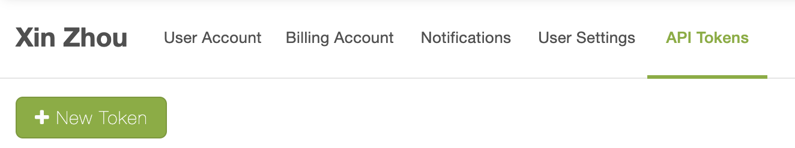

At the prompt, enter a label and click "Generate Token".

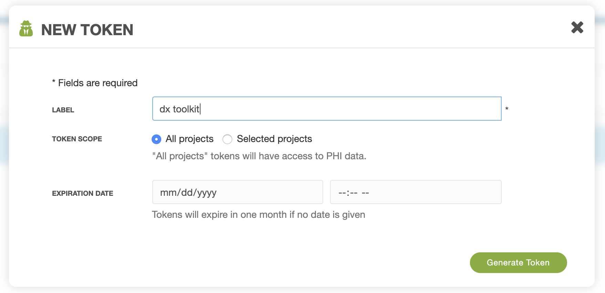

The token is now displayed. Select and copy it.


At the terminal of your computer, log into "dx" with the token.

```bash
dx login --token TvmrnvgkHeyYouCanChargeYourElectricCarForFreeAtWork

# Available projects (CONTRIBUTE or higher):
# … here lists your projects … 

# Pick a numbered choice:
```

Enter a number to select a project. You are now logged into your
account. Run `dx ls` to do a directory listing on the selected project.
Next, upload the GenomePaint FileViewer to this project.

Run this command to download the FileViewer source code, to a file named
"GenomePaint (SVCNV, VCF, FPKM)".

```bash
wget 'https://pecan.stjude.cloud/static/fileviewers/GenomePaint%20(SVCNV%2C%20VCF%2C%20FPKM)'
```

Run this command to upload the file to your DNAnexus project as a
FileViewer.

```bash
dx upload --type FileViewer 'GenomePaint (SVCNV, VCF, FPKM)' 
# [===========================================================>] Uploaded 5,257 of 5,257 bytes (100%) /.../GenomePaint (SVCNV, VCF, FPKM)
# ID                  file-Fjypgf...
# Class               file
# Project             project-F0QQBv...
# Folder              /
# Name                GenomePaint (SVCNV, VCF, FPKM)
# State               closing
# Visibility          visible
# Types               FileViewer
# Properties          -
# Tags                -
# Outgoing links      -
# Created             Fri Feb  7 12:26:32 2020
# Created by          xzhou
# Last modified       Fri Feb  7 12:26:33 2020
# archivalState       "live"
# Media type
```

With this, you have successfully obtained the GenomePaint FileViewer on
your DNAnexus account.

### Hosting and launching custom GenomePaint track from Amazon AWS

#### Amazon S3 Introduction

Amazon AWS has secure and highly available storage service known as S3.
Amazon S3 stores data as objects within buckets. An object consists of a
file and optional metadata. To store an object in Amazon S3, you upload
a file to a bucket. When uploading, you can set permissions on the
object and any metadata. Likewise many settings can be configured for a
bucket. To get familiarized with common terminologies used for Amazon
S3, [checkout the official guide](https://docs.aws.amazon.com/AmazonS3/latest/gsg/AmazonS3Basics.html).

#### Sign Up for Amazon S3

Go to [https://aws.amazon.com/s3/](https://aws.amazon.com/s3/) and
click "Create an AWS account". Once created, AWS will notify you by
email when your account is active and available for you to use.

#### Create a new Bucket on S3

Login to your account and access the "S3 Management Console" at
[https://console.aws.amazon.com/s3/](https://console.aws.amazon.com/s3/).
Here, click the "+ Create bucket" button.


A new window pops up with details required for creating a new bucket.

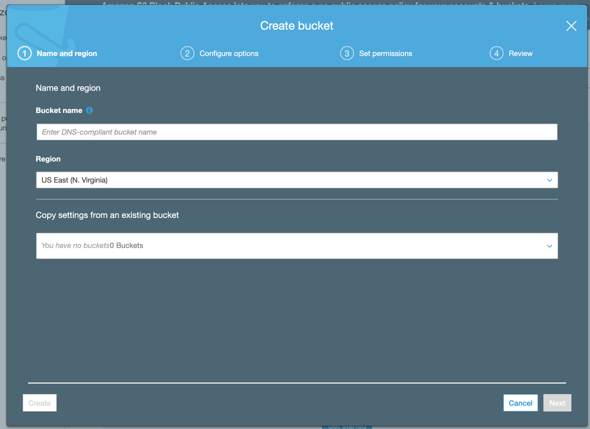

In the 'Bucket name' box enter a unique DNS-compliant name. This name
should be unique across all buckets on Amazon S3. The URL for the
objects inside the bucket will include the bucket name as well.

At "Configure options", you can change the settings or keep default as
per requirements.

At "Set permissions", make the bucket public so files can be accessible
from GenomePaint. To make the Bucket public, leave all the checkboxes
unchecked.


Next page will summarize all settings for the new bucket. After
confirming, click "Create bucket".

#### Add custom track files to a Bucket

Select the bucket you want files to upload to.

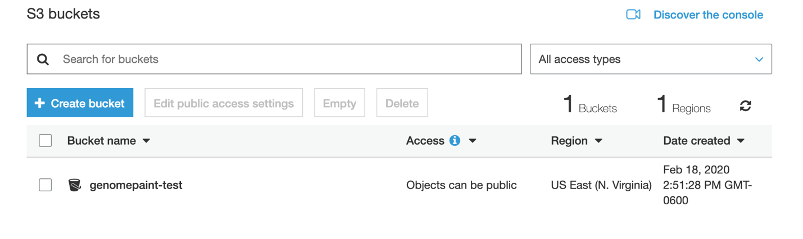

Then, click the "Upload" button.

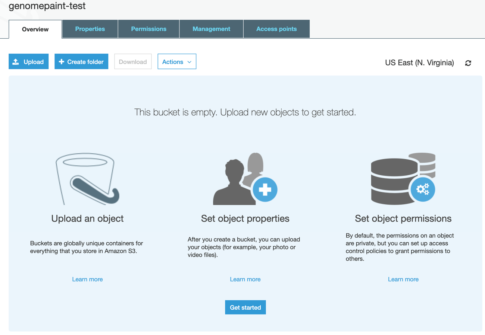

On the next page, select all the GenomePaint track files and associated
index files for uploading.

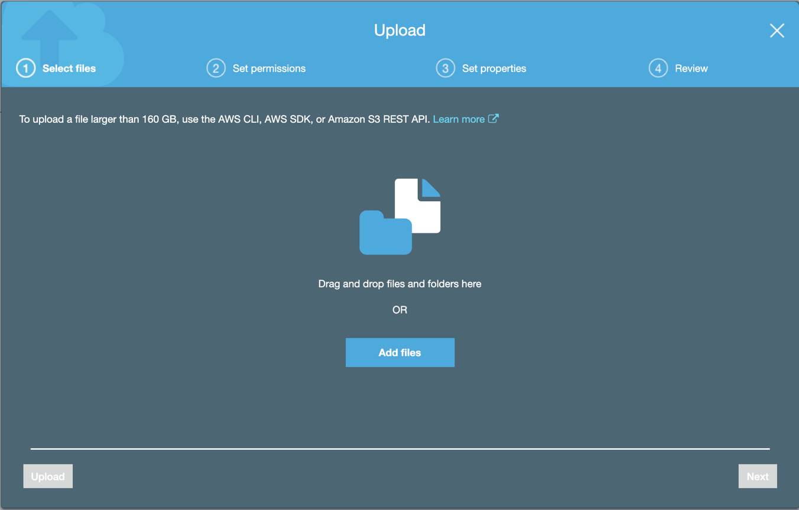

Once a file is selected, it will appear in the menu. Click 'Upload' at
the bottom. Make sure to add index files (.tbi and .csi) with the vcf,
svcnv or fpkm files.


#### Enable public access to the track files

Once the file is uploaded to the bucket, it will appear in the list of
files.

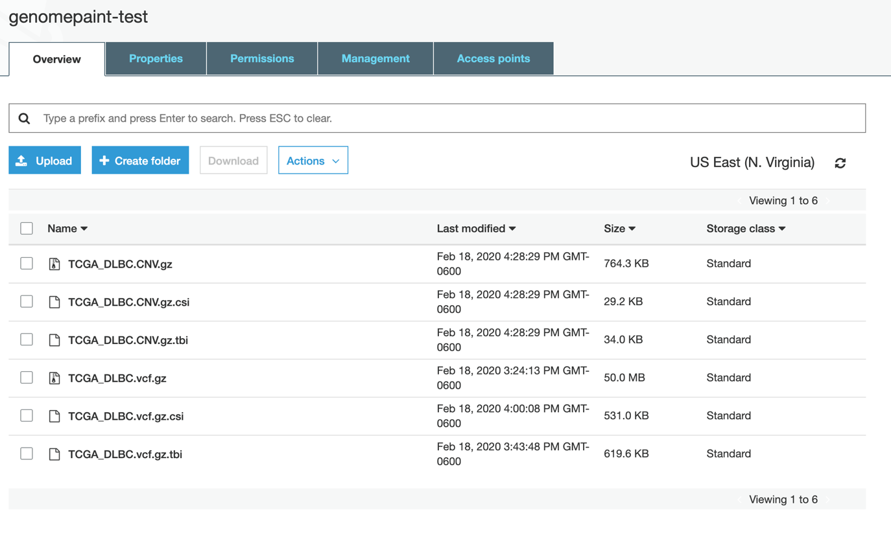

Select all the files you want to visualize in the GenomePaint. Click
"Actions" and select "Make public" option. A window will pop-up to
confirm the action.


#### Submit a custom track from S3 to GenomePaint

First, obtain the URLs to the SVCNV, VCF, FPKM ".gz" files. Click on a
".gz" file to see a detailed page and find its URL at the bottom.

Add the URLs as parameters of the following GenomePaint URL.

```
https://proteinpaint.stjude.org?block=on&genome=[GENOME]&svcnvfpkmurl=[TRACKNAME],svcnv,[svcnv_URL],vcf,[vcf_URL],fpkm,[fpkm_URL]
```

For example,  

[https://proteinpaint.stjude.org/?block=on&genome=hg38&position=chr9:21843776-22119276&svcnvfpkmurl=TCGA_DLBC,svcnv,https://genomepaint-test.s3.amazonaws.com/TCGA_DLBC.CNV.gz,vcf,https://genomepaint-test.s3.amazonaws.com/TCGA_DLBC.vcf.gz](https://proteinpaint.stjude.org/?block=on&genome=hg38&position=chr9:21843776-22119276&svcnvfpkmurl=TCGA_DLBC,svcnv,https://genomepaint-test.s3.amazonaws.com/TCGA_DLBC.CNV.gz,vcf,https://genomepaint-test.s3.amazonaws.com/TCGA_DLBC.vcf.gz)

This URL will serve as visualization access point for your files in the
Amazon S3.
