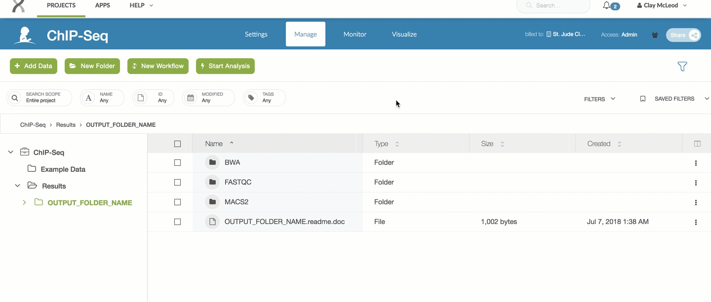

| | | 
|-------------|-----------------------|
| **Authors** | Xing Tang, Yong Cheng |
| **Publication** | N/A (not published) |
| **Technical Support** | [Contact Us](https://stjude.cloud/contact) |

## Overview

The ChIP-Seq Peak Calling workflow follows ENCODE best practices to call 
broad or narrow peaks on Illumina-generated ChIP-Seq data. 
Here, a Gzipped FastQ file from an Immunoprecipitation (IP) experiment 
is considered the "case sample file" and a Gzipped FastQ file from a control 
experiment is considered the "control sample file". The pipeline can run on
matched case/control samples (recommended for better results) or just a 
case sample.

## Inputs

| Name | Type | Description | Example |
|--|--|--|--|
| FastQ files (*required* if using FastQ inputs) | Input file | Gzipped FastQ files generated by experiment. | Sample_R1.fastq.gz and Sample_R2.fastq.gz |

## Outputs

| Name | Format | Description  |
|--|--|--|
| BED file | .bed | Peak calls |
| Binary file | .bb | Binary format for BED file |
| BigWig file | .bw | Shows read coverage |
| Metrics file | .txt | Shows mapping and duplication rate |
| Cross correlation plot | .pdf | Quality plot showing if the forward and reverse reads tend to be centered around binding sites. |

## Workflow Steps

1. The reads of the FastQ file(s) are aligned to the specified reference genome. 
2. The aligned reads are then post-processed based on best-practice QC techniques
(removing multiple mapped reads, removing duplicated reads, etc). 
3. Peaks are called by SICER (broad peak analysis) or MACS2 (narrow peak
analysis). 
    * Qualified peaks will be output as BED (.bed) and big BED (.bb)
files. 
    * The coverage information will be output as a bigWig (.bw)
file. 
    * A cross correlation plot and general metrics file are generated to help check
the quality of experiment.

## Creating a workspace
Before you can run one of our workflows, you must first create a workspace in DNAnexus for the run. Refer to [the general workflow guide](running-sj-workflows.md#getting-started) to learn how to create a DNAnexus workspace for each workflow run.

You can navigate to the ChIP-Seq Peak Calling workflow page [here](https://platform.stjude.cloud/workflows/chip-seq).

## Uploading Input Files

The ChIP-Seq Peak Caller takes Gzipped FastQ files generated from an IP experiment as [input](#inputs). 

Refer to [the general workflow guide](running-sj-workflows.md#uploading-files) to learn how to upload input files to the workspace you just created.

## Running the Workflow

Refer to [the general workflow guide](running-sj-workflows.md#running-the-workflow) to learn how to launch the workflow, hook up input files, adjust parameters, start a run, and monitor run progress.

For the ChIP-Seq workflow, you will see special preset options in the "Launch Tool" dropdown. These are explained below. 

You'll need to decide **(1)** whether you'd like to run broad OR narrow peak
calling and **(2)** whether you have a case sample and a control sample (preferred)
OR just a case sample. This will determine which preset you should click in this dropdown. Note that if you are not doing a case/control run, when you get to the [hooking up inputs step](running-sj-workflows.md#hooking-up-inputs) you only need to hook up the case sample.

### Broad vs. narrow peak calling

Choosing between broad and narrow peak calling depends on the experiment design. The following are good rules of thumb for choosing between the two configurations. If you are not sure which configuration to use, please consult with an expert at your institution or [contact us](https://stjude.cloud/contact).

**Narrow Peak Calling**

If your target protein is a transcription factor, you should probably choose narrow peak calling. You can also try the narrow peak calling workflows for the following histone marks:

* H3K4me3
* H3K4me2
* H3K9-14ac
* H3K27ac
* H2A.Z

**Broad Peak Calling**

You should try the broad peak calling workflows for the following
histone marks:

* H3K36me3
* H3K79me2
* H3K27me3
* H3K9me3
* H3K9me1

**Special Cases**

In some scenarios, H3K4me1, H3K9me2 and H3K9me3 might behave between
narrow and broad shape, you might need to look into each peak region and
consult experts.

!!! warning
    If your fragment size is less than 50 base pairs, please refer to the
    [frequently asked questions](#frequently-asked-questions).

### Selecting parameters

The following are the parameters that can be set, a short
description of each parameter, and an example value. How to customize parameters is covered in [the general workflow guide](running-sj-workflows.md#selecting-parameters). If you
have questions, please [contact us](https://stjude.cloud/contact).

| Parameter Name | Description | Example |
|--|--|--|
| Output prefix (*required*) | A name used a prefix for all outputs in the run | SAMPLE1 |
| Reference genome (*required*) | Supported reference genome from one of hg19, GRCh38, mm9, mm10, dm3 | GRCh38 |
| Output bigWig | Whether or not to include a bigwig file in the output | True |
| Remove blacklist peaks | Whether or not to remove known problem areas | True |
| Fragment length | Hardcoded fragment length of your reads. 'NA' for auto-detect. | NA |

!!! caution
    Please be aware of the following stumbling points when setting parameters:

    * Do not use spaces anywhere in your input file names, your output
      prefix, or any of the other parameters. This is generally bad
      practice and doesn't play well with the pipeline (consider using
      "_" instead).
    * Do not change the output directory when you run the pipeline. At
      the top of parameter input page, there is a text box that allows
      you to change the output folder. **Please ignore that setting**. You
      only need to specify an output prefix as described above. All of
      the results will be put under `/Results/[OUTPUT_PREFIX]`.

## Analysis of Results
Today, the ChIP-Seq pipeline does not produce an interactive visualization. We are working on adding this! In the meantime, you can view the cross-correlation plot(s)
as outlined in the sections below.

Refer to [the general workflow guide](running-sj-workflows.md#raw-results-files) to learn how to access raw results files.

ChIP-Seq results will be in the `Results` folder. Select the output folder name you specified in the [parameters](#selecting-parameters) part of this workflow run.

### Interpreting results

For the ChIP-Seq pipeline, every pipeline run outputs a `README.doc` file
which contains the latest information on which results are included.
You can refer to that file for the most up to date information on raw outputs.

## Frequently asked questions

If you have any questions not covered here, feel free to 
[contact us](https://hospital.stjude.org/apps/forms/fb/st-jude-cloud-contact/).

**Q: Should I choose narrow peak calling pipeline or broad peak calling pipeline?**

A. We built two workflows: one for narrow peak calling and another broad
peak calling. If your target protein is a transcription factor, please
use narrow peak calling workflow. For histone marks H3K4me3, H3K4me2,
H3K9-14ac, H3K27ac and H2A.Z, you could try narrow peak calling
workflow. For histone marks H3K36me3, H3K79me2, H3K27me3, H3K9me3 and
H3K9me1, you could try broad peak calling workflow. In some scenario,
H3K4me1, H3K9me2 and H3K9me3 might behave between narrow and broad
shape, you might need to look into each peak region and consult
experts.

**Q. What to do if your fragment size is less than 50 base pairs?**

A. We estimate fragment size from the data based on the cross correlation
plot. Usually the fragment size is above 50bp. If the estimated
fragment size lower than 50bp, the workflow will stop at the peak
calling stage (MACS2/SICER) after BWA mapping finishes. You can rerun
the analysis with a specified fragment length.

## Similar Topics

[Running our Workflows](../analyzing-data/running-sj-workflows.md)  
[Working with our Data Overview](../managing-data/working-with-our-data.md)   
[Downloading/Uploading Data](../managing-data/data-transfer-app.md)   
