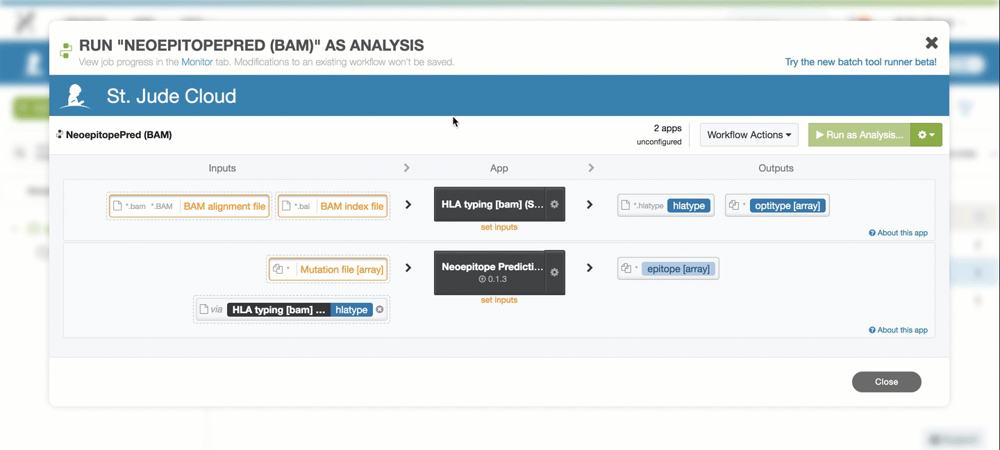
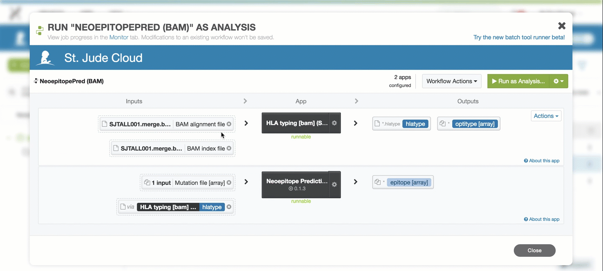
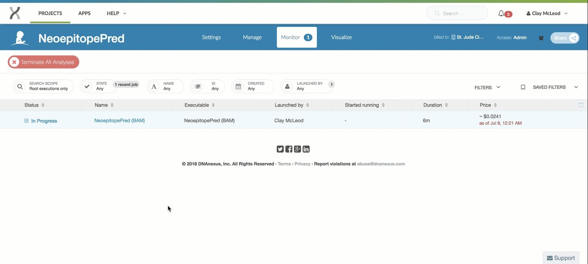

| | |
|-------------|----------------|
| **Authors** | Ti-Cheng Chang |
| **Publication** | [The Neoepitope Landscape in Pediatric Cancers. Genome Medicine. 2017. 9.1: 78](https://www.ncbi.nlm.nih.gov/pubmed/28854978). |
| **Technical Support** | [Contact Us](https://stjude.cloud/contact/) |

Cancers are caused by somatically acquired alterations including single 
nucleotide variations (SNVs), small insertion/deletions (indels),
translocations, and other types of rearrangements. The genes affected by
these mutations may produce altered proteins, some of which may lead to
the emergence of tumor-specific immunogenic epitopes. We developed an
analytical workflow for identification of putative neoepitopes based on
somatic missense mutations and gene fusions using whole genome
sequencing data. The workflow has been used to characterize neoepitope
landscape of 23 subtypes of pediatric cancer in the Pediatric Cancer
Genome Project[^1].

## Overview

**Inputs**

| Name | Type | Description | Example |
|--|--|--|--|
| FastQ files (*required* if using FastQ inputs) | Input file | Gzipped FastQ files generated by experiment. | Sample_R1.fastq.gz and Sample_R2.fastq.gz |
| BAM files (*required* if using BAM inputs) | Input file | BAM files aligned against HG19/Hg38 (WGS, WES or RNA-Seq). | Sample.bam |
| BAM indices (*required* if using BAM inputs) | Input file | Corresponding BAM index of the BAM files above. | Sample.bam.bai |
| Mutation file (*required*) | Input file |  File describing the mutations present in the sample (special format, see below). | *.txt (tab-delimited) |
| SNV or fusion | Parameter | Specify the mutation file contains SNV or gene fusion. | SNV |
| Peptide size | Parameter | Size of the peptide. | 9 |
| Affinity threshold | Parameter | Affinity cutoff for epitope prediction report. | 500 |

**Outputs**

| Name | Description |
|--|--|
| Epitope affinity prediction (html) | Epitope affinity. The peptide with affinity &lt; cutoff will be highlighted. |
| Epitope affinity prediction (xlsx) | Excel tables for the information of all epitopes |
| Affinity (raw output) | Epitope affinity |
| Peptide sequence (raw output) | Peptide sequences in Fasta format |

**HLA Typing Algorithm**

The HLA typing algorithm is used to predict the HLA class I alleles.
Users can either provide FastQ (paired or single end reads) or a BAM
file as input. When using a BAM file as input, the reads surrounding the
HLA loci and unmapped reads will be extracted. The reads will be fed
into Optitype for HLA typing. The default settings for Optitype are
used. The output of the HLA type can be combined with the our epitope
detection algorithm to perform affinity prediction of neoepitopes.

If you use **FastQ** files as input:  

1.  The input FastQs will be aligned against the Optitype HLA reference
    sequences using razers3 (see <https://github.com/FRED-2/OptiType>).
2.  The fished FastQs will be used for HLA typing using Opitype.

If you use **BAM** files as input:  

1.  The reads falling within the HLA loci and their paralogous loci will
    be extracted.
2.  The reads unmapped to the human genome will be extracted.
3.  The reads from step 1 and 2 will be combined and deduplicated (in
    FastQ format).
4.  The input FastQs will be aligned against the Optitype HLA reference
    sequences using razers3 (see <https://github.com/FRED-2/OptiType>).
5.  The fished FastQs will be used for HLA typing using Opitype.

**Epitope Prediction Algorithm**

The epitope prediction algorithm first extracts peptides covering an array
of tiling peptides (size defined by users) overlapping each missense
mutation or gene fusion. Fusion junctions can be identified using RNA-Seq
by fusion detection tools (Li et. al, unpublished). NetMHCcons[^3] is subsequently 
used to predict affinities of the peptide array for each HLA receptor in 
each sample. The neoepitope with affinity lower than the threshold will 
be highlighted in output file (default 500 nM). Below is an outline of internal steps the algorithm performs in order to generate the final report.

1.  Check the version of the genomic position of the input SNV/fusion
    file.
2.  Lift over the genomic coordinations if the reference genomic
    position is not HG19. Currently, the internal genome annotation was
    based on HG19 and the genome coordinates of the mutation files will
    be adjusted to HG19 for peptide extraction.
3.  Extract the peptide flanking the mutations.
4.  Run NetMHCcons to obtain the affinity prediction of the peptides.
5.  Produce the affinity report of each peptide.

## Getting started

To get started, you need to navigate to the [NeoepitopePred tool page](https://platform.stjude.cloud/tools/neoepitope). You'll need to click
the "Start" button in the left hand pane. This creates a cloud workspace
in DNAnexus with the same name as the tool. After this, you will be able 
to upload your input files to that workspace.

!!! note
    If you can't see the "Start" button, one of these two scenarios is likely the case:

    * You see three buttons on the left sidebar instead of one. In this case,
      you've already clicked the "Start" button previously, and a cloud workspace has
      already been created for you. In this case, you're good! You can move
      on to the next section.
    * If you cannot see *any* buttons on the left side, you probably have not
      logged in yet. If you see a sentence that says "Log in to launch this 
      tool", simply login and try again.

    If neither of these are the case and you still can't click "Start",
    [contact us](https://stjude.cloud/contact).

### Input file configuration

Users need to provide a mutation file for SNV or gene fusion. The format
of the mutation file is shown in the following example. The file can be
prepared in Excel and saved as a tab-delimited text file to use as
input.

The HLA alleles for testing will be derived from the HLA typing module
using the workflow. The peptide size and affinity cutoff can be modified
by users. 

**Mutation file format**

| GeneName | Sample | Chr | Postion_hg19 | Class | AAChange | mRNA_acc | ReferenceAllele | MutantAllele |
|--|--|--|--|--|--|--|--|--|
| Gene1 | SampleA | chr10 | 106150600 | missense | R663H | NM_00101 | A | T |
| Gene2 | SampleA | chr2 | 32330151 | missense | N329N | NM_00102 | T | G |

!!! example "Notes on preparing the above file"
    -   The chromosome requires a 'chr' prefix.
    -   The position requires a suffix of HG19/HG38 to indicate the human genome assembly version.
    -   Only the missense mutations/gene fusion is supported currently and
        the other types of mutations will not be processed.

**Mutation file example**

## Uploading data

NeoepitopePred takes the following files as input:

* A pair of Gzipped FastQ files or an HG19/HG38 aligned BAM file. These can be
  generated from whole genome sequencing, whole exome sequencing, or RNA-Seq. 
* A file describing the mutations in a sample. 

You can upload these files using the [data transfer application](../managing-data/data-transfer-app.md)
or by uploading them through [the command line](../analyzing-data/command-line.md).
Both of the guides linked here will contain more details on how to upload
data using that method, so we defer to those guides here.

!!! tip
    If you plan to upload data through the St. Jude Cloud Data Transfer application
    (recommended), you can click the "Upload Data" button in the left panel. If you
    have not already downloaded the app, do so by clicking "Download app". Once you
    have the app, you can click "Open app" to open the app with the tool's cloud 
    workspace already opened and ready to drag-and-drop files into it!

    For more information, check out the [data transfer application](../managing-data/data-transfer-app.md) guide.

## Running the tool

!!! caution
    This pipeline assumes HG19 coordinates in the mutation file. If the
    coordinates are based on HG38, the coordinates will lifted over to HG19
    to perform epitope affinity prediction.

Once you've uploaded data to your cloud workspace, 
click "Launch Tool" on the [tool's landing page](https://platform.stjude.cloud/tools/neoepitope). 
A dropdown will present the different presets for running the workflow. Here, you can select whether you wish to start with FastQ files or a BAM file.

### Selecting parameters

There are a number of other parameters that can be customized. To 
see the options available, click the gear cog next to the 
"Neoepitope Prediction" substep. For a full list of the parameters and their
descriptions, see [the input section](#input) (specifically, you are 
looking at the items in the table labeled "parameters").

### Hooking up inputs

Next, you'll need to hook up the FastQ/BAM and mutation files you uploaded in 
[the upload data section](#uploading-data). You can do this by 
clicking on the `BAM alignment file` and `BAM index file` and `Mutation array` slots and
selecting the respective files.

### Starting the workflow

Once your input files are hooked up, you should be able to start the workflow
by clicking the "Run as Analysis..." button in the top right hand corner
of the workflow dialog.

!!! tip
    If you cannot click this button, please ensure that all of the inputs are correctly hooked up (see [hooking up inputs](#hooking-up-inputs)).

    If you're still have trouble, please [contact us](https://stjude.cloud/contact) and include
    a screenshot of the workflow screen above.

## Monitoring run progress

Once you have started one or more NeoepitopePred runs, you can safely close your
browser and come back later to check the status of the jobs. To do this,
navigate to the [tool's landing page](https://platform.stjude.cloud/tools/neoepitope). 
Next, click "View Results" then select the "View Running Jobs" option. 
You will be redirected to the job monitoring page. Each job you kicked off
gets one row in this table.

 

You can click the "+" on any of the runs to check 
the status of individual steps of the ChIP-Seq pipeline.
Other information, such as time, cost of individual steps in the pipeline, 
and even viewing the job logs can accessed by clicking around the sub-items.

 

!!! tip 
    Power users can refer to the [DNAnexus Monitoring Executions Documentation](https://documentation.dnanexus.com/user/running-apps-and-workflows/monitoring-executions) for advanced capabilities for monitoring jobs.

## Analysis of results

Each tool in St. Jude Cloud produces a visualization that makes understanding
results more accessible than working with excel spreadsheet or tab delimited
files. This is the primary way we recommend you work with your results. We also
include the raw output files for you to dig into if the visualization is not 
sufficient to answer your research question.

### Finding the raw results files

Navigate to the [tool's landing page](https://platform.stjude.cloud/tools/neoepitopepred). 
In the left hand pane, click "View Results" then "View Results Files". You will
be taken to the filesystem view your cloud workspace. This is similar to your the
filesystem on your computer, and you can do many common operations such as deleting,
renaming, and moving files.

 

### Interpreting results

**HLA typing**

The output of this app contain the prediction of the HLA class I alleles
from OptiType.

* A folder stamped with the time will present in the output folder
  (optitype), which contains the raw output.

* The file contains the predicted HLA alleles of the sample.

**Neoepitope prediction**

The output contains one summary HTML, one folder with raw output, and one
folder with outputs in Excel formats:

**Epitope_affinity_prediction.html** (shown below):   

* This file provides a summary of the epitope prediction that can be visualized directly from web browser.  
* The peptides with affinity lower than user-defined cutoff will be highlighted in green in the webpage.  

**Raw_output** (shown below): this folder contains the raw output of the affinity
prediction. There will two major types files present here: affinity.out and flanking.seq.

**affinity.out**: these files are the prediction results from the
    netMHCcons for each peptide.

The following columns will be shown in the output:

| Column | Description |
|--|--|
| Gene name | the name of the genes |
| Sample | the name of the samples |
| Chromosome (chr) | the chromosome location of the variation |
| Position | the chromosomal position of the variation. Currently, the position will be lifted over to HG19 to ensure correct translation of peptid sequences based on the internal annotation database of the pipeline. Therefore, the position will be labeled as HG19. |
| Class | class of the variation |
| Reference allele | reference allele at the position |
| Mutant allele | mutated allele at the position |
| mRNA_acc | NCBI accession number of the mRNA |
| Allele | HLA allele tested |
| Peptide | the neoepitope sequences tested |
| Gene_variant | the gene and variant residues |
| 1-log50k | Prediction score from netMHCcons |
| nM | Affinity as IC50 values in nM |
| %Rank | % Rank of prediction score to a set of 200.000 random natural 9mer peptides |
| HLAtype | All of the hla alleles predicted in the specific sample |

**flanking.seq**: these files contain the sequences used for the prediction.

**XLSX**: this folder contains the raw output of the affinity prediction as
described above in Excel files. The files can be downloaded and opened with Excel for downstream filtering and analyses.

## Frequently asked questions

None yet! If you have any questions not covered here, feel free to reach
out on [our contact form](https://hospital.stjude.org/apps/forms/fb/st-jude-cloud-contact/).

[^1]: Downing JR, Wilson RK, Zhang J, et al. The Pediatric Cancer Genome
Project. Nature genetics. 2012;44(6):619-622.
[^2]: Szolek A, Schubert B, Mohr C, Sturm M, Feldhahn M, Kohlbacher O:
OptiType: precision HLA typing from next-generation sequencing
data. Bioinformatics 2014, 30:3310-3316.
[^3]: Karosiene E, Lundegaard C, Lund O, Nielsen M: NetMHCcons: a
consensus method for the major histocompatibility complex class I
predictions. Immunogenetics 2012, 64:177-186.
