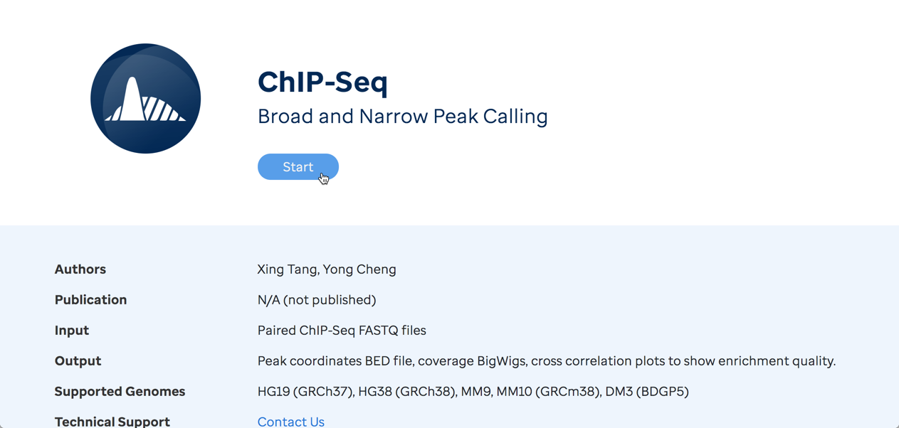
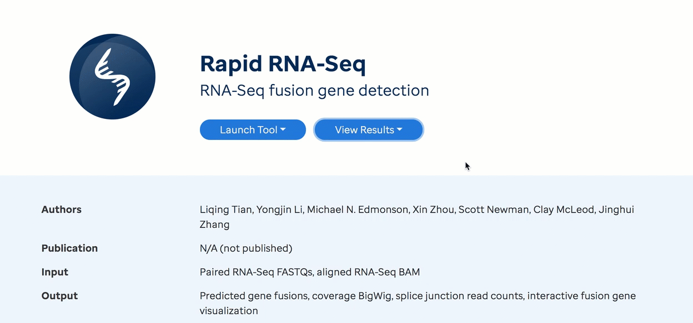
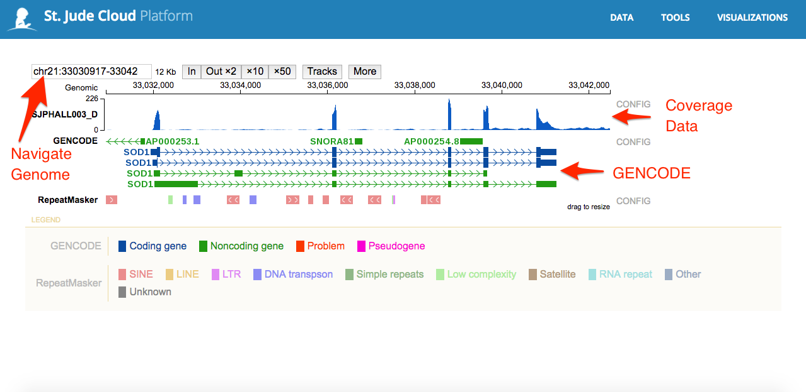
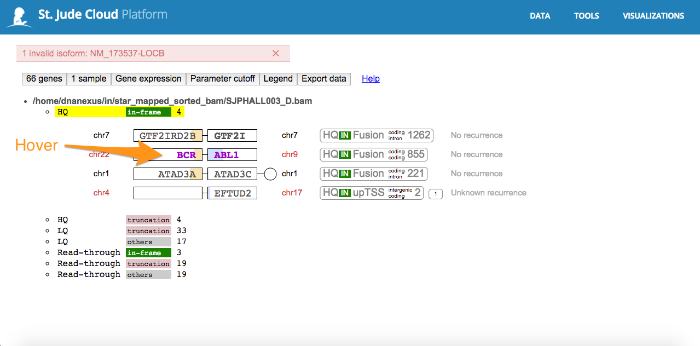
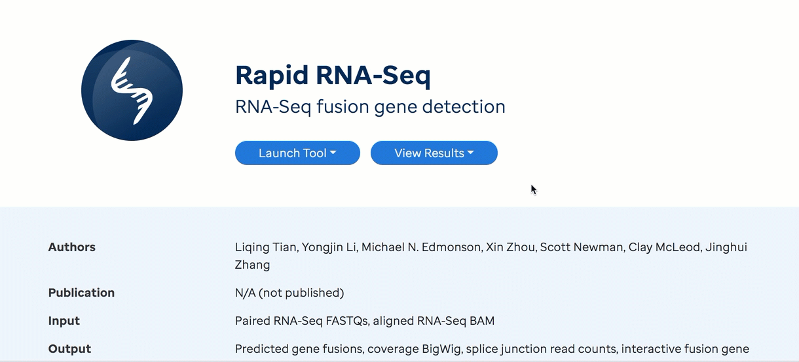

In this guide, we will explain generally how to run, from end-to-end, any of our in house analysis workflows from within the DNAnexus cloud ecosystem. The [DNAnexus](https://www.dnanexus.com/) genomic ecosystem is the backbone for the computation and storage in St. Jude Cloud. If you'd like, you can read an introduction to the DNAnexus ecosystem [here](https://documentation.dnanexus.com/). If you haven't already, follow [this guide](../requesting-data/data-request.md) to request access to St. Jude data in this secure cloud ecosystem. 

## Getting started

To get started with any St. Jude Cloud workflow, first navigate to the appropriate workflow page. Below is a complete list of the workflows we offer along with links to their corresponding tool page and documentation page.

* NeoepitopePred [[tool page](https://platform.stjude.cloud/workflows/neoepitopepred)] [[documentation](neoepitope.md)]
* ChIP-Seq Peak Calling [[tool page](https://platform.stjude.cloud/workflows/chip-seq)] [[documentation](chipseq.md)]
* Rapid RNA-Seq Fusion Detection [[tool page](https://platform.stjude.cloud/workflows/rapid_rna-seq)] [[documentation](rapid-rnaseq.md)]
* WARDEN Differential Expression Analysis [[tool page](https://platform.stjude.cloud/workflows/warden)] [[documentation](warden.md)]
* Mutational Signatures [[tool page](https://platform.stjude.cloud/workflows/mutational_signatures)] [[documentation](mutational-signatures.md)]

From the appropriate workflow page, click the "Start" button in the left hand pane. This creates a new DNAnexus cloud workspace (with the same name as the workflow) and imports the workflow.

With subsequent runs, in place of the "Start" button will be two buttons "Launch Tool" and "View Results", meaning a cloud workspace with the workflow has already been created for you. In this case, you're good! You can move on to the next section.

!!! note
    If you have not yet logged in, in place of the "Start" button will be a button the says "Log In". If you see this, simply login and try again. For a guide to creating an account go [here](../requesting-data/create-an-account.md).

    If you are still unable to start the workflow,
    [contact us](https://stjude.cloud/contact).

## Uploading Files

Now that a DNAnexus cloud workspace has been created, you will be able to upload input files to that workspace. The specific documentation for each workflow will detail what input files you will need to upload. 

You can upload these files using the [data transfer application](../managing-data/data-transfer-app.md)
or by uploading them through [the command line](../analyzing-data/command-line.md). Both of the guides linked here will contain more details on how to upload data using that method, so we defer to those guides here.

!!! tip
    If you plan to upload data through the St. Jude Cloud Data Transfer application
    (recommended), you can click the "Upload Data" button the appears in the left panel after you click "Start". If you
    have not already downloaded the app, do so by clicking "Download app". Once you
    have the app, you can click "Open app" to open the app with the workflow's cloud 
    workspace already opened and ready to drag-and-drop files into it!

    For more information, check out the [data transfer application](../managing-data/data-transfer-app.md) guide.

## Running the Workflow

Once you've uploaded data to your cloud workspace, click "Launch Tool" on the workflow's landing page. A dropdown will present any presets required for running the workflow. For example, some workflows ask that you select whether you wish to start with FastQ files or a BAM file. Launching the workflow will redirect you to you workspace in DNAnexus.

The gif below shows an example with the [Rapid RNA-Seq workflow](https://platform.stjude.cloud/tools/rapid_rna-seq)

### Selecting Parameters

Some workflows allow you to specify or customize one or more run parameters. Many parameters will be set to a default value. To see all parameter options available, click the gear cog next to the substep titled with the workflow name. For a full list of the parameters and their
descriptions, see **Inputs** table on the documentation page for the workflow that you are running. Below is an example showing how to customize parameters for the Neoepitope Prediction workflow.

### Hooking up Inputs

Next, you'll need to hook up the input files you uploaded in 
[the upload files section](#uploading-files). In the example below, we are running the Rapid RNA-Seq workflow using the FastQ version of the pipeline. The example gif shows  that you hook up the inputs by clicking on the `Fastq/R1` and `Fastq/R2` slots and selecting the respective input files. This process is similar for all workflows.

### Starting the Workflow

Once your input files are hooked up, you should be able to start the workflow by clicking the **Run as Analysis...** button in the top right hand corner of the workflow dialog. See the example below using the Rapid RNA-Seq workflow.

!!! tip
    If you cannot click this button, please ensure that all of the inputs are correctly hooked up.

    If you're still have trouble, please [contact us](https://stjude.cloud/contact) and include a screenshot of the workflow screen above.

## Monitoring Run Progress

Once you have started one or more workflow runs, you can safely close your browser and come back later to check the status of the jobs. To do this, navigate to the landing page of the workflow that you want to check. Next, click "View Results" then select the "View Running Jobs" option. 
You will be redirected to the job monitoring page in your DNAnexus workspace. Each job you kicked off gets one row in this table. See the two examples below for the Rapid RNA-Seq workflow.

 

You can click the "+" on any of the runs to check the status of individual steps of the workflow. Other information, such as time, cost of individual steps in the workflow, and even viewing the job logs can accessed by clicking around the sub-items.

 

!!! tip 
    Refer to the [DNAnexus Monitoring Executions Documentation](https://documentation.dnanexus.com/user/running-apps-and-workflows/monitoring-executions) for advanced capabilities for monitoring jobs.

## Accessing Results

### Custom Visualizations
Most workflows in St. Jude Cloud produce one or more visualizations that helps you to understand the raw results. 

To access the visualization(s), navigate to the landing page of the workflow that you want to check. Next, click "View Results" then select the "Visualize Results" option. 

You should now see a list of visualization files. Click on a visualization name to explore.

Below is a brief description of two of our custom visualizations.

#### ProteinPaint BigWig Viewer

The ProteinPaint interactive coverage viewer is used to visualize any
bigWig file. You can follow these steps to get an
understanding of how it works.

1.  Open up the custom viewer file output by your pipeline. The name of
    this file will vary, so consult the specific pipeline guide to know
    where to find it.
2.  Click "Launch" in the bottom right corner to launch the custom
    viewer.

    

3.  Once the page has loaded, you will be able to see the bigWig viewer.
    You can navigate around the genome by gene or genomic location.
    Alongside the coverage track is the GENCODE gene reference.

    

#### ProteinPaint Fusion Viewer

The ProteinPaint interactive fusion viewer is used to visualize putative
fusions called by Rapid RNA-Seq. You can follow these steps to get an
understanding of how it works.

1.  Open up the custom viewer file output by your pipeline. The name of
    this file will vary, so consult the specific pipeline guide to know
    where to find it.
2.  Click "Launch" in the bottom right corner to launch the custom
    viewer.

    

3.  Once the page has finished loading, you will be presented with a
    summary of all of the fusions produced by the pipeline. Each bullet
    point is a separate category for the structural variants, with the
    more interesting fusions at the top. Click one of the categories to
    view the fusions in that category.

    

4.  You can see all of the fusions in that category are now listed on
    the screen. Hover over one of the fusions to see the detailed view.

    

5.  The popup contains a large amount of information that might be
    interesting to you based on your use case, such as the transcript
    and other metrics like read counts, quality metrics, and recurrence.

    

### Raw Results Files

If additionally, you would like to view raw output files, you may do so by following the directions below. 

To access the raw output file, navigate to the landing page of the workflow that you want to check. Next, click "View Results" then select the "View Results Files" option.

You should now be in the filesystem view of your workflow's workspace in DNAnexus with access to files that you
uploaded as well as results files that are generated. See the example filesystem view below for the Rapid RNA-Seq workflow.

 

This is similar to your the filesystem on your computer, and you can do many common operations such as deleting, renaming, and moving files. How/where the result files are generated are specific to each pipeline. Please refer to your individual workflow's documentation on where the output files are kept.

If you have any unanswered questions about how to run one of our in-house workflows, please [contact us](https://stjude.cloud/contact).

## Similar Topics

[Command Line Interaction](../analyzing-data/command-line.md)  
[Working with our Data Overview](../managing-data/working-with-our-data.md)   
[Downloading/Uploading Data](../managing-data/data-transfer-app.md)  
[Technical FAQs](../../../faq.md#how-can-i-explore-and-manipulate-data-files-stored-on-the-cloud-without-downloading-the-files-to-my-local-machine)