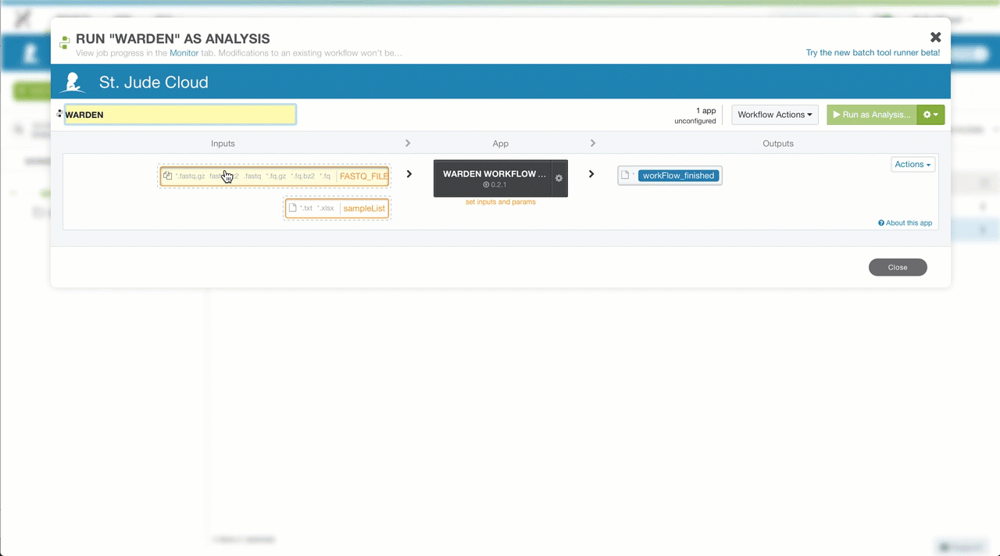
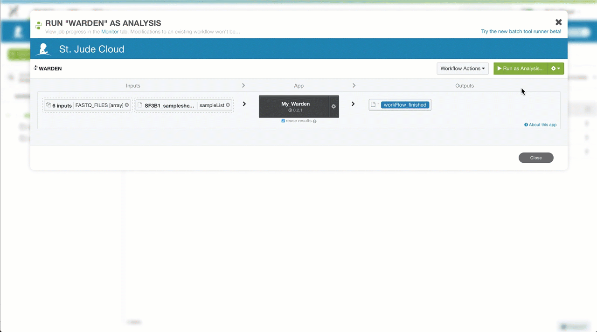
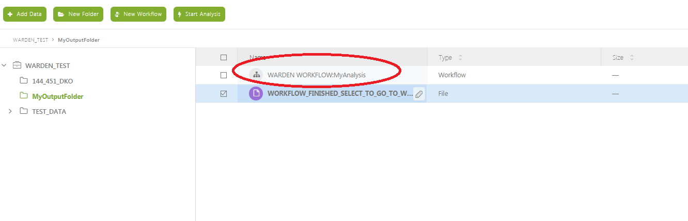
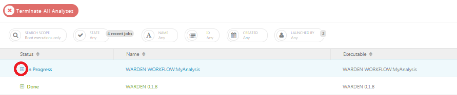

| | |
|-------------|--------------|
| **Authors** | Lance Palmer |
| **Publication** | N/A (not published) |
| **Technical Support** | [Contact Us](https://stjude.cloud/contact) |

## Overview

The WARDEN (**W**orkflow for the **A**nalysis of **R**NA-Seq **D**ifferential **E**xpressio**N**)
software uses RNA-Seq sequence files to perform alignment, coverage
analysis, gene counts and differential expression analysis.

## Inputs

The WARDEN workflow requires two types of input files and that two parameters be set manually. All other parameters are preset with reasonable defaults.

| Name | Type | Description | Example |
|---|---|---|---|
| FastQ files (*required*) | Input file(s) | Gzipped FastQ files generated by experiment | Sample1.fastq.gz, Sample2.fastq.gz |
| Sample sheet (*required*) | Input file | Sample sheet generated and uploaded by the user | *.txt |

### Input file configuration

You'll need to create a sample sheet which describes the relationship between case and control samples, phenotype/condition information, and the comparisons you would like to perform. The sample sheet is a tab-delimited text document that can be created in Microsoft Excel (recommended) or a text editor.

!!! note 
    You will need to upload your sample sheet in a similar manner as your
    FastQ files, so you can follow the [same uploading instructions](running-sj-workflows.md#uploading-files)
    to achieve this.

#### Prepare using Microsoft Excel

!!! tip 
    Download the [<i class="material-icons material-icons-sjcloud-custom">file_download</i> sample excel spreadsheet](../../../files/guides/tools/warden/samplesheet.xlsx) as a starting
    point!

The final product for the excel spreadsheet will look like the screenshot below. If you create the sample sheet from scratch, please ensure the the columns are **exactly** in this order.

> 

**Sample rows**

Each row in the spreadsheet (except for the last row, which we will talk 
about in the next section) corresponds to a sample with one or more FastQ files. You should fill in these rows based on your data and the guidelines below:

!!! example "Guidelines"
    * The sample name should be unique and should only contain letters,
    numbers and underscores.
    * The condition/phenotype column associates similar samples together.
    The values should contain only letters, numbers and underscores.
    * ReadFile1 should contain forward reads (e.g. `*.R1.fastq.gz` or `*_1.fastq.gz`).
    * ReadFile2 will contain reads in reverse orientation to ReadFile2
    (e.g. `*.R2.fastq.gz` or `*_2.fastq.gz`).
    * For single end reads a single dash ('-') should be entered in the ReadFile2 column.

**Comparison row**

The last line in the sample sheet is called the "comparison row". This
line specifies the comparisons to be done between conditions/phenotypes.
All pairwise combinations of the values in the "Phenotype" column can be 
analyzed. To specify the comparisons, on a separate line, include `#comparisons=` followed be a comma delimited list of two conditions separated by a dash. 

!!! example
    The following lines are all valid examples.

    1.  `#comparisons=KO-WT`
    2.  `#comparisons=Condition1-Control,Condition2-Control`
    3.  `#comparisons=Phenotype2-Phenotype1,Phenotype3-Phenotype2,Phenotype3-Phenotype1`

!!! note
    If a comparison has at least 3 samples for each condition/phenotype,
    VOOM/LIMMA will be run. A simple differential comparison will be run on
    all samples.

**Finalizing the sample sheet**

To finalize the sample sheet, save the Microsoft Excel file with
whatever name you like. Save the file as an Excel Workbook with the
.xlsx extension.

#### Prepare using a text editor

!!! tip 
    Download the [<i class="material-icons material-icons-sjcloud-custom">file_download</i> sample text file](../../../files/guides/tools/warden/samplesheet.txt) as a starting
    point!

Creating a sample sheet with a text editor is an option for advanced users. The process of creating a sample sheet with a text editor is the same as creating one with Microsoft Excel, with the small difference that you must manually create your columns using the tab character. Save the file
with a .txt extension.

## Outputs

| Name | Description |
|---|---|
| FastQC Report | Quality control analysis by FastQC. |
| Aligned BAM | Aligned BAM files from STAR mapping. |
| Splice junctions | Splice junction information from STAR mapping. |
| Coverage files | bigWig (`.bw`) and BED (`.bed`) files detailing coverage. |
| Gene counts | Gene counts generated by HT-Seq count. |
| VOOM/LIMMA results | Pairwise comparisons of expression data. Requires at least 3 samples vs 3 samples. |
| Simple DE analysis | No statistical analysis, requires only a 1 samples vs 1 sample comparison. |
| MA/Volcano plots | Both of the above produce tabular outputs, MA plots and volcano plots. |

## Workflow Steps

1. FastQ files generated by RNA-Seq are mapped to a reference genome using the STAR.
2. HT-Seq count is used to assign mapped reads to genes. 
3. Differential expression analysis is performed using VOOM normalization of counts and
LIMMA analysis. 
4. Coverage plots of mapped reads are generated as interactive visualizations.

## Creating a workspace
Before you can run one of our workflows, you must first create a workspace in DNAnexus for the run. Refer to [the general workflow guide](running-sj-workflows.md#getting-started) to learn how to create a DNAnexus workspace for each workflow run.

You can navigate to the WARDEN Differential Expression Analysis workflow page [here](https://platform.stjude.cloud/workflows/warden).

## Uploading Input Files

The WARDEN Differential Expression analysis pipeline takes Gzipped FastQ files generated by an RNA-Seq experiment as [input](#inputs). 

Refer to [the general workflow guide](running-sj-workflows.md#uploading-files) to learn how to upload input files to the workspace you just created.

## Running the Workflow

Refer to [the general workflow guide](running-sj-workflows.md#running-the-workflow) to learn how to launch the workflow, hook up input files, adjust parameters, start a run, and monitor run progress.

!!! note
    The WARDEN tool operation is slightly different than the other pipelines
    because it accepts a variable number of samples. **First**, you will run
    a "bootstrapping" step that creates a custom executable for your
    analysis. **Second**, you will need to manually execute the generated
    workflow from the first step. This allows us to take advantage of many
    nice features, like check-pointing and cost reduction. Don't worry, 
    we'll show you how to do this step by step below.

### Hooking up Inputs

You'll need to hook up the FastQ files and sample sheet you uploaded in [the upload data section](#uploading-input-files). 
Click the `FASTQ_FILES` input field and select **all** FastQ files. Next, click the `sampleList` input field and select the corresponding samplesheet.

### Selecting Parameters

We now need to configure the parameters for the pipeline, such as reference genome and sequencing method. You can access all of the available parameters 
by clicking on the `WARDEN WORKFLOW GENERATOR` substep. For the general workflow instructions refer [here](running-sj-workflows.md#selecting-parameters)

!!! example "Parameter setup steps"
    1. In the `Output Folder` field, select a folder to output to. You can
    structure your experiments however you like (e.g. `/My_Outputs`)
    1. In the `analysisName` field, enter a prefix for all of the output files. This
    can be any value you want to use to remember this run. **Be sure to use underscores
    instead of spaces here!**
    1. Select the `sequenceStandedness` from the drop down menu. 
    This information can be determined from the sequencing or source 
    of the data. If you don't know what to put here, select "no".
    1. Select the `Genome` pulldown menu. Choose the appropriate box.
    2. The LIMMA parameters can be left alone for most analyses. If you are
    an advanced LIMMA user, you can change the various settings exposed
    below the required parameters.
    1. When all parameters have been set, press the save button.

### Starting the workflow

Once your input files are hooked up and your parameters are set, you should be able to start the workflow by clicking the "Run as Analysis..." button in the top right hand corner of the workflow dialog. For the general workflow instructions refer [here](running-sj-workflows.md#starting-the-workflow).

The tool will begin running and will automatically take you to the Monitor page, where you should see that your workflow is "In Progress".

When the custom workflow has finished generating, the word 'Done' will appear in green in the status column. This indicates that the bootstrapping step has completed successfully. 

## Custom Workflow Process

1. Wait for the workflow generator to finish.
2. Click on the WARDEN name in the name column.

3. You will now be on a page specific to the running of the workflow.
    On the left side, you will see the inputs you selected for the
    workflow generator. On the right side are the output files
    (including the generated workflow). Select the generated workflow as
    shown in the picture below.

    

4. You will now be within the output folder you specified earlier.
    Select the file that begins with 'WARDEN WORKFLOW:'

    

5. A workflow generated for your data will be presented to you. Select
    'Run as analysis' in the upper right.

    

6. The workflow will initiate, and you will be brought to the 'Monitor'
    page. (Note to get back to this page, you can select 'Monitor' on
    one of the menu bars near the top ) Expand the the workflow progress
    be selecting the '+' sign next to 'In Progress'

    

7. As parts of the pipeline are run, you will see different tasks in
    different colors. Green means done, blue is running, orange is
    waiting, and red means error.

    

8. When done the status will be shown as 'Done'. Select the Workflow
    name under Status.

    

9. You will be brought to a page that show more information about the
    workflow analysis. Click on the output folder to go to the output.

    

10. The output folders will now be shown.

    

For a description of the output, please refer to [Interpreting Results](#analysis-of-results).

## Analysis of Results

Each tool in St. Jude Cloud produces a visualization that makes understanding results more accessible than working with excel spreadsheet or tab delimited files. This is the primary way we recommend you work with your results. 

Refer to [the general workflow guide](running-sj-workflows.md#custom-visualizations) to learn how to access these visualizations.

We also include the raw output files for you to dig into if the visualization is not sufficient to answer your research question.

Refer to [the general workflow guide](running-sj-workflows.md#raw-results-files) to learn how to access raw results files.

### Interpreting Primary Results

#### Alignment statistics

Several files should be examined initially to determine the quality of
the results. **alignmentStatistics.txt** shows alignment statistics for
all samples. This file is a plain text tab-delimited file that can be
opened in Excel or a text editor such as Notepad++. This file contains
information on the total reads per sample, the percentage of duplicate
reads and the percentage of mapped reads. An example of this file is
below. (Within the DNAnexus output directory structure, these files will
be in the COMBINED\_FLAGSTAT directory.)

> 

#### Multidimensional scaling (MDS) Plot

The second set of files to look at are the [Multidimensional scaling
(MDS) plots](https://en.wikipedia.org/wiki/Multidimensional_scaling)
using the plotMDS function within LIMMA. Similar to PCA, these graphs
will show how similar samples are to each other. There are different
sets of MDS plots. For comparisons where there are 3 or more samples per
condition, an MDS plot using Voom (Limma) normalized values are
generated. An example can be seen below. These files will be labeled
**mdsPlot.png**. For all comparisons, regardless of sample size, and MDS
plot will also be generated with Counts per million (CPM) normalized
gene counts. These files will be labeled **mdsPlot.normCPM.png**.
(Within the DNAnexus output directory structure, these files will be in
the LIMMA directory.)

MDS plot from just CPM normalized data.

### ProteinPaint Visualizations

Several files on DNAnexus allow the data to be viewed in the Protein
Paint viewer. (Note: We plan to have links downloaded in the future to
allow the viewing of these files off of DNAnexus.)

**LIMMA differential expression viewer**

Within LIMMA/VIEWERS directory (note if no comparisons meet the 3 sample
condition, the LIMMA folder will not exist), there will be a viewer file
for each valid comparison ( \**results.*.txt.viewer\*\*). Simply select
the file and press 'Launch viewer' in the lower right. A viewer will pop
up showing both the MA Plot and Volcano plot. By moving the mouse over a
circle, the circle will highlight and the corresponding gene on the other
graph will also highlight. Additional information about the gene and its
expression values will also be shown. One can also type in multiple gene
symbols in the provided text box. By pressing 'Show gene labels' all
these genes will show up on the plots.

**Simple differential expression viewer**

There will also be a viewer for the simple differential expression
analysis in SIMPLE\_DIFEX/VIEWERS. The P-value for the results have all
been set to 1, so the volcano plot will not be relevant.

**bigWig viewer**

In the BIGWIG\_VIEWER directory there will be a bigwigViewer file.
Select this file and then 'Launch viewer'. A graph of coverage for the
genome should be visible.

### Interpreting Secondary Results
-----------------
#### Interactive MA/Volcano Plots

In addition to viewing the MA and volcano plots through the visualization tool

-----------------
#### Differential expression results

Other useful differential expression results will be downloaded by the desktop app. This included tabular output from the differential expression analysis. For each comparison with three or more samples per condition, `results.*.txt` will be produced.

-----------------
#### GSEA.input.txt and GSEA.tStat.txt

Input files that can be used for GSEA analysis. The tStat file is preferred for a more accurate analysis, but will not give a heatmap diagram.
- (Within the DNAnexus output directory structure, these files will be in the LIMMA directory.)

- For plain text results from the simple differential expression analysis, the files will be named `simpleDE.*.txt`. (Within the DNAnexus output directory structure, these files will be in the SIMPLE\_DIFEX directory.)

- Prelabelled MA and volcano plots are provided for the analysis. These files are labeled `maPlot.*.png` and `volcanoPlot.*.png` where `*` is the comparison (e.g. ko\_vs\_wt)

- The MA plot shows the average expression of the gene on the X-axis, and Log2 fold change between condition/phenotype is on the Y-axis (if the name is for example maPlot.condition2-condition1.png then the fold change would represent condition1 minus condition2). Each gene is represented by a circle. The top 20 genes (by p-value) are identified on the plot. The genes are color coded by the chosen multiple testing correction method (False Discovery Rate (FDR) by default. An example MA plot can be seen below. (Within the DNAnexus output directory structure, these files will be in the LIMMA directory.)

The volcano plot shows the Log2Fold change between the conditions on the
X-axis, and the -Log10 of the multiple testing corrected P-value on the
Y-axis.

An MA plot is generated for all comparisons regardless of number of
samples. This is the `simpleDEPlot.*.png` no statistics are shown
and genes are not labeled. (Within the DNAnexus output directory structure, these files will be in the SIMPLE\_DIFEX directory.)
-----------------
#### Differential analysis input

Inputs and commands are provided for rerunning differential expression
analysis on ones own computer. The R commands used for the analysis are
found in **voomLimma.R**. An experienced R user can rerun the analysis
with any desired changes. This analysis requires the input
**countFile.txt** which contains counts per genes, the
**Rparameters.txt** file containing input parameters, and a processed
sample list file **sampleList.txt**

(Within the DNAnexus output directory structure, these files will be in
the LIMMA directory.)

The input for the simple differential analysis expression will be
**Rparameters\_simple.txt**, **simpleDE.R**, **countFile.txt** and
**sampleList.txt**. **countFile.txt** and **sampleList.txt** are the
same files used by the LIMMA analysis.

(Within the DNAnexus output directory structure, these files will be in
the SIMPLE\_DIFEX directory.)

-----------------
#### Coverage results

bigWig files will be generated for use in genome browsers (such as IGV
<http://software.broadinstitute.org/software/igv/>). For each sample,
multiple bigWig files will be found. For all types of sequencing
strandedness, there will be bigWig files labeled,
**\*.sortedCoverageFile.bed.bw** where '*' is the sample name. For
stranded data there will also be\*.sortedPosCoverageFile.bed.bw*\* and
**\*.sortedNegCoverageFile.bed.bw** which contains coverage information
for the positive and negative strand of the genome.

(Within the DNAnexus output directory structure, these files will be in
the BIGWIG directory.)

-----------------
#### Quality Control Results (FastQC)

Within the FastQC directory, for each sample and read direction there
will be an html file and a zip file (**\*.FastQc.html**
**\*.FastQc.zip** where '\*' is the base FastQ name), containing results
from FastQTC. For the average user the html file is sufficient. This
file can give some basic statistics on the quality of the data.

(Within the DNAnexus output directory structure, these files will be in
the FastQC directory.)

-----------------
#### BAM alignment files

There are two BAM files generated per sample that contain mapping
information for all reads. The first is labeled
**\*.Aligned.sortedByCoord.dup.bam** where '*' is the sample name. The
BAM file is sorted by coordinates and has duplicates marked. The second
file is\*.Aligned.toTranscriptome.out.bam*\* and contains reads mapped
to transcripts.

(Within the DNAnexus output directory structure, these files will be in
the ALIGN directory.)

-----------------
#### Chimeric reads and junction files

Additional files created by STAR are provided. More information on these
files can be found [here](http://labshare.cshl.edu/shares/gingeraslab/www-data/dobin/STAR/STAR.posix/doc/STARmanual.pdf).
**\*.SJ.out.tab** contain splice junction information. Fusion detection
files are labeled **\*.Chimeric.out.bam** and
**\*.Chimeric.out.junction**.

(Within the DNAnexus output directory structure, these files will be in
the ALIGN directory.)

-----------------
#### FPKM and count files (per sample)

Per sample files containing FPKM and raw count values for each gene can
be found in **\*.fpkm.txt** and **\*.htseq\_counts.txt** where '\*' is
the sample name. Within the DNAnexus output directory structure, these files will be in
the HTSEQ directory.

-----------------
### Methods Files

A more human readable explanation is found in **methods.docx**. Detailed
documentation can be found in **methods.txt**

(Within the DNAnexus output directory structure, these files will be in
the METHODS directory.)

### Auxiliary Files

This section describes the files that exist within the DNAnexus output
folder. Most of these files will not be of interest to the average user.
However, interactive viewers are describe in [LIMMA differential
expression viewer](#limma-differential-expression-viewer) and [Simple
differential expression viewer](#simple-differential-expression-viewer).

The output will be divided into multiple folders. The results being the
most useful will be the differential expression analysis results in the
LIMMA and SIMPLE\_DIFEX folders. Bigwig files for viewing read coverage
will be in the BIGWIG folder. Other folder contain different types of
data and are explained in further detail below.

> 

The following description of files is sorted by their output directory.

-----------------
#### ALIGN

This directory contains the BAM files described in [BAM alignment
files](#bam-alignment-files) and the chimeric and junction files are
described in [Chimeric reads and junction
files](#chimeric-reads-and-junction-files). In addition there are 2 log
files. **\*Log.final.out** has relevant statistics for the alignment.
The **\*.Log.out** file just contains a log of the analysis run,
including input parameters. Per sample FLAGSTAT results are found in
**\*.flagStatOut.txt**. Finally the ALIGN directory has
multiple *.starAlign.methods.txt files. These files can be ignored as
they are summarized in the finalmethods.docx*\* and **methods.txt**
files described in [Methods Files](#methods-files).

-----------------
#### BIGWIG

All of the files here are described in section [Coverage
results](#coverage-results). The **bgToBw.methods.txt** files can be
ignored as they are summarized in the files described in [Methods
Files](#methods-files).

-----------------
#### BIGWIG_VIEWER

See [bigWig viewer](#bigwig-viewer)

-----------------
#### COMBINED_FLAGSTAT

This directory contains the **alignmentStatistics.txt** file, which contains the combined alignment statistics from all samples.  It is generated from the flagstat files describe in the ALIGN directory.

-----------------
#### COMBINED_HTSEQ

Used for input in differential expression analysis. The
combineCountFile.txt is the same as countFile.txt described in
[Differential analysis input](#differential-analysis-input)

-----------------
#### COVERAGE 

BED graph files used to generate bigWig files are here.

-----------------
#### FastQC

See [Quality Control Results (FastQC)](#quality-control-results-FastQc)

-----------------
#### HTSEQ

Per-sample HTSEQ-count results (**\*.htseq\_counts.txt**) and FPKM
results (**\*.fpkm.txt**). Temporary methods files are found as
\*.htseq-count.methods.txt

-----------------
#### LIMMA

**mdsPlot.png**, **maPlot.png**,**volcanoPlot.png** are described in
[Initial analysis of results](#initial-analysis-of-results)

**results.txt**,**GSEA.input.txt** and **GSEA.tStat.txt** are
describe in [Differential expression
results](#differential-expression-results)

**voomLimma.R**, **countFile.txt**, **Rparameters.txt**, and
**sampleList.txt** are described in [Differential analysis
input](#differential-analysis-input)

See [LIMMA differential expression
viewer](#limma-differential-expression-viewer) for a description of the
VIEWERS directory.

Other files in the LIMMA directory include contrastFiles.txt
contrastsFile.txt, and limmaSampleList.txt which are used internally.
limmaMethods.txt is an intermediate file describing methods. Out.tar.gz
is used for testing purposes. The sessionInfo.txt file describe the R
session working parameters and modules loaded. meanVariance.png is a
plot for assessing quality of count data
(<https://genomebiology.biomedcentral.com/articles/10.1186/gb-2014-15-2-r29>)

-----------------
**METHODS**

The files here are described in [Methods Files](#methods-files).

-----------------
**SAMPLELIST**

These files are used internally by the pipeline.

-----------------
**SIMPLE_DIFEX**

**mdsPlot.normCPM.png** and **simpleDEPlot.png** are described in
[Initial analysis of results](#initial-analysis-of-results)

**simpleDE.txt** are describe in [Differential expression
results](#differential-expression-results)

**simpleDE.R**, **countFile.txt**, **Rparameters\_simple.txt**, and
**sampleList.txt** are described in [Differential analysis
input](#differential-analysis-input)

See [Simple differential expression
viewer](#simple-differential-expression-viewer) for a description of the
VIEWERS directory.

Other files in the SIMPLE\_DIFEX directory include contrastFiles.txt
contrastsFile.txt, and limmaSampleList.txt which are used internally.
simpleDifEx.methods.txt is an intermediate file describing methods.
Out.tar.gz is used for testing purposes. The sessionInfo.txt file
describe the R session working parameters and modules loaded.

## Frequently Asked Questions

None yet! If you have any questions not covered here, feel free to reach
out on [our contact
form](https://hospital.stjude.org/apps/forms/fb/st-jude-cloud-contact/).

## Similar Topics

[Running our Workflows](../analyzing-data/running-sj-workflows.md)  
[Working with our Data Overview](../managing-data/working-with-our-data.md)   
[Upload/Download Data (local)](../managing-data/upload-local.md)   
