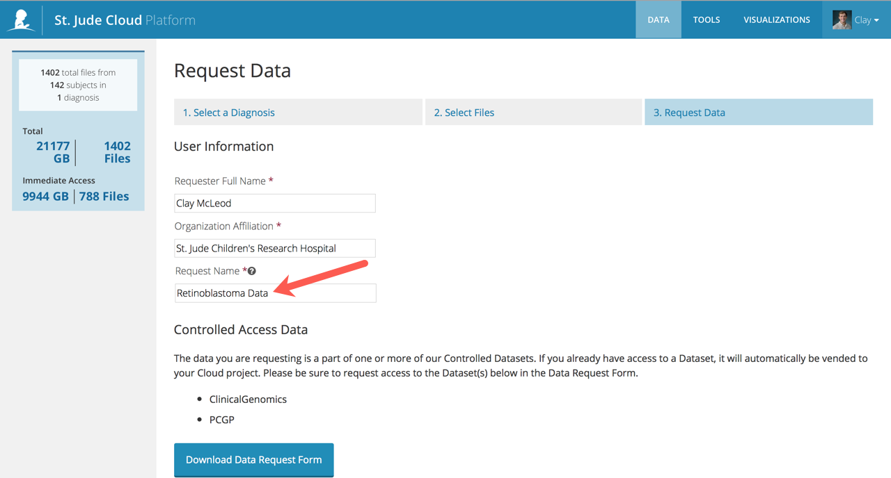
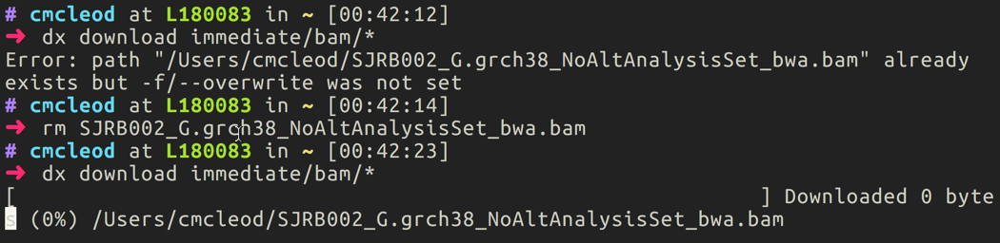

# Command Line Interaction

Before you begin interacting with St. Jude Cloud Platform from the
command line, you'll need to understand some details on the underlying
architecture of the platform. The St. Jude Cloud Platform is built on
top of a genomics cloud ecosystem provided by [DNAnexus](https://www.dnanexus.com/). 

## Overview

Workspaces in DNAnexus are organized by projects, which are essentially
folders in the cloud. Each data request and tool in St. Jude Cloud
creates its own unique cloud workspace (DNAnexus project). For instance,
a data request creates a DNAnexus project behind the scenes with the
same name as the request name you specify when you request data.

## Installation

Open-source software provided by DNAnexus called the [dx-toolkit](https://github.com/dnanexus/dx-toolkit) is
used to interact with the St. Jude Cloud Platform from the command line.
You can use this to create these projects, upload and download data, and
many other operations. You'll need to install that software on your
computer by following [this guide](https://documentation.dnanexus.com/downloads#DNAnexus-Platform-SDK).

!!! tip
    A quickstart to getting up and running with the dx-toolkit:

    1.  Install Python 2.7.13+. Note that using the system-level Python is
        usually not a good idea (by default, system level Python is
        typically too old/does not support the latest security protocols
        required). You can install using [Anaconda](https://conda.io/docs/user-guide/getting-started.html) (recommended) or using
        the default [Python installer](https://www.python.org/downloads/).
    2.  Run `pip install dxpy`.
    3.  Type `dx --help` at the command line.

## A quick tour

### Logging in

To log in using the dx-toolkit, run the following command:

```bash 
dx login --noprojects
# enter username and password when prompted
```

!!! note
    If you are a St. Jude employee, you'll need to follow [this
    guide](https://documentation.dnanexus.com/user/login-and-logout#generating-an-authentication-token) to log in instead.

### Selecting a project

First, you'll need to choose which cloud workspace you would like to
access. This depends on if you are downloading data from a request or
working with input/output files from a tool. You can see the workspaces
available to you by running the following command in your terminal:

```bash 
dx select
```

This will present with a prompt similar to the below screenshot. A list
of your available cloud workspaces will be shown with a number out to
the left of each. You should enter the number corresponding to the
workspace you are wanting to interact with. In the example below, the
user has selected the Rapid RNA-Seq tool.


### Some useful commands

Moving data back and forth between the cloud and your local computer is
simple once you have selected the correct project for your tool.

You will find that many common Linux commands with `dx` prepended work as expected.

```bash
# list available files for the tool for the main folder
dx ls

# list all available files for the tool
dx find .

# list all commands
dx --help
```

## Uploading data

You can use the following process to upload data to be used by St. Jude
Cloud Platform tools:

1.  First, click "View" on the tool you'd like to run from [this
    page](https://stjude.cloud/tools.html). In this example, we will
    choose the Rapid RNA-Seq tool.

2.  If you have not already, click "Start" on the tool you'd like to
    run. This will create a cloud workspace for you to upload your
    data to with the same name as the tool.

    

3.  Open up your terminal application and select the cloud workspace
    with the same name as the tool you are trying to run.

    

4.  Last, navigate to the local files you'd like to upload to the cloud
    and use the `dx upload` command as specified in
    [upload-download-data]{role="ref"} to upload your data to St. Jude
    Cloud.

    

## Downloading data

!!! warning
    To download data from a St. Jude Cloud data request, you must have
    indicated that you wished to download the data in your Data Access
    Agreement (DAA) during your submission. Any downloading of St. Jude data
    without completing this step is strictly PROHIBITED.

You can use the following steps to download data from a St. Jude Cloud
data request:

1.  Complete a data request using the St. Jude Cloud Platform. In this
    example, we've created a request with the name "Retinoblastoma
    Data".

    

2.  Open up your terminal application and select the cloud workspace
    relevant to your data request. For instance, in this case we
    would type `#!bash dx select "Retinoblastoma Data"`.

    

3.  You can use typical commands like `#!bash dx ls`,
    `#!bash dx pwd`, and `#!bash dx cd` to navigate around
    your cloud folder as you would a local folder. Your project may look
    different based on what data you requested and whether you were
    previously approved to access the data. Your data should either be
    in the **restricted** folder (if this is your first time
    requesting access) or the **immediate** folder (if you
    were previously granted access permission).

    

4.  In the root of every data request is a file called
    `SAMPLE_INFO.txt`. This should contain all of the
    information about the samples you checked out as well as the
    associated metadata we provide.

5.  To download data from the cloud to local storage, use the
    `#!bash dx download` command as specified in
    [upload-download-data]{role="ref"}. For instance, if I wanted to
    download all of the BAM files to my local computer, I would type
    `#!bash dx download immediate/bam/*`.

    
