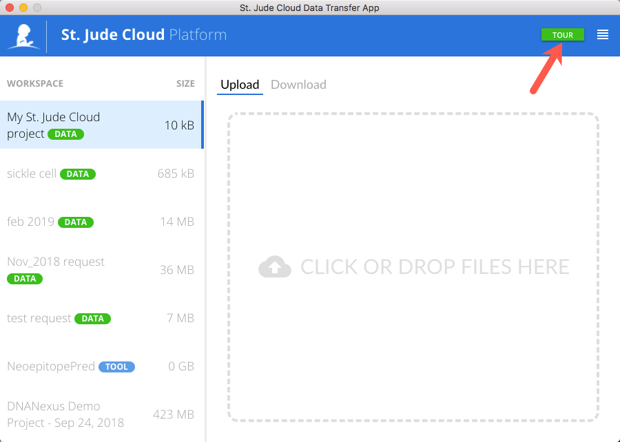
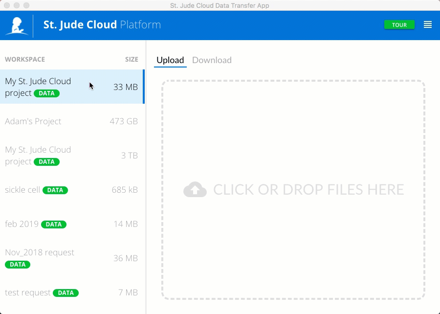
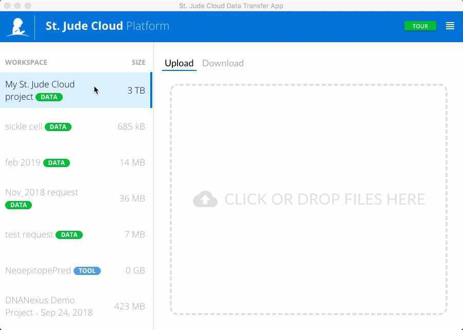

# Data Transfer App

The Data Transfer App is a downloadable tool with an easy to use graphical user interface that allows you to upload/download files to/from your DNAnexus projects on the cloud. 

For users looking to upload/download files using the command line, please refer to the [command line interaction guide](../analyzing-data/command-line.md).

If you are interested in viewing the source code, you can do so [here](https://github.com/stjude/sjcloud-data-transfer-app). If you
would like to file an issue you are experiencing with the application,
you can do so [here](https://github.com/stjude/sjcloud-data-transfer-app/issues) or let us know your feedback through our [contact us form](https://stjude.cloud/contact).

## Getting Started
[Click here](https://dta.stjude.cloud) to download the latest release of the
St. Jude Cloud data transfer application. 

Once you've completed installing the app, you will see a page that looks like this. 

Log in with your DNAnexus credentials (or click on *I'm a St. Jude employee* to log in with your St. Jude credentials). 

Each time you log in, the app will prompt you to grant it access to all files in your DNAnexus projects. Click *Grant Access* to proceed. Access is granted per session and will expire once you log out of the data transfer app.

Once you've given the app access to your DNANexus projects, you will see the projects listed in a sidebar on the left and an upload/download panel on the right.  

Before moving on, we encourage you to take the **TOUR** by clicking on the green button in the upper right corner.

As you will see in the tour, you have the option to *Show All Files* in your DNAnexus projects. It is a good idea to always have this option enabled.

!!! Warning
    You can increase the concurrency (# of files that will upload or download at the same time) but this will affect the performance of the app. For example changing the concurrency from 1 to 100 will move files at roughly 100th of the speed.

## Uploading Files
Select the DNAnexus project on the left that you would like to upload files to. Select **Upload** in the app's Upload/Download panel. To select files you may either (1) Click in the upload space to select files in your computer's file navigation application 

or (2) highlight all the files you want to upload, then drag and drop them into the app's upload space.

Review the list of files to upload, and click **Upload**.

To learn how to upload files using the command line, please refer to the [command line interaction guide](../analyzing-data/command-line.md#uploading-data).

## Downloading Files
Select the DNAnexus project on the left that you would like to download files from. Select **Download** in the app's Upload/Download panel. In may take a minute to display all the files in your project. Once all files are displayed, select the files you want to download and click **Download**.

Note that the Data Transfer App does not recognize any directory structure you may have within your DNAnexus projects. It is simply a dump of all the files in each project. 

To learn how to download files using the command line, please refer to the [command line interaction guide](../analyzing-data/command-line.md#downloading-data).

## Similar Topics

[About our Data](../requesting-data/about-our-data.md)   
[Making a Data Request](../requesting-data/data-request.md)   
[Managing Data Overview](working-with-our-data.md)  
[Command Line Interaction](../analyzing-data/command-line.md)  