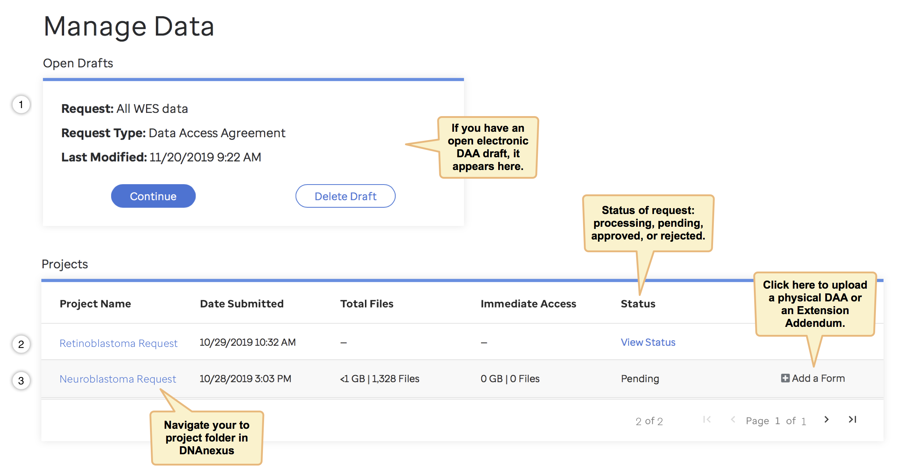
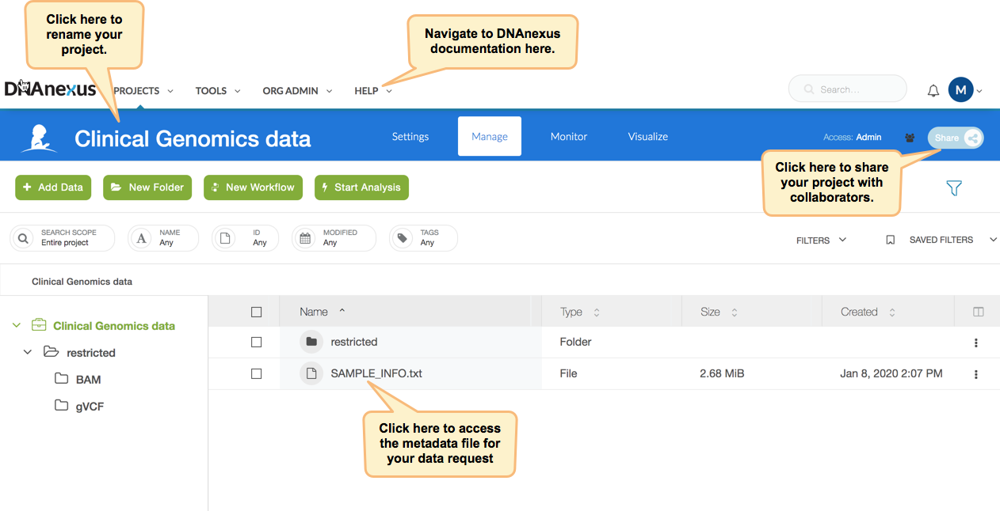

In this overview, we will explain how to manage your data request(s) from St. Jude Cloud's genomics platform [My Dashboard page](https://platform.stjude.cloud/dashboard) and how to access and manage your data (once it has been vended to you) from within a DNAnexus project.  The [DNAnexus](https://www.dnanexus.com/) genomic ecosystem is the backbone for the computation and storage in St. Jude Cloud. This means that each data request in St. Jude Cloud corresponds to a project in DNAnexus. If you'd like, you can read an introduction to the DNAnexus ecosystem [here](https://documentation.dnanexus.com/). If you haven't already, follow [this guide](../requesting-data/data-request.md) to request access to St. Jude data in this secure cloud ecosystem.


## Managing Your Data Requests

Below is a snapshot of the [My Dashboard](https://platform.stjude.cloud/dashboard) on our Genomcis Platform. From this page you can check the status of your data request, complete an [EDAA](../requesting-data/how-to-fill-out-DAA.md#the-electronic-data-access-agreement-process) draft, upload a revised [DAA](../requesting-data/how-to-fill-out-DAA.md) or an [Extension Addendum](how-to-fill-out-Extension.md), or link to your DNAnexus project folder for a specific data request.


    

!!! example "Pending Request Types"
    1. Request 1 is an Open Draft, meaning the requestor has not yet finished the setup wizard and the DocuSign envelope has not yet been sent to any of the signatories. 

    2. Request 2, listed in the Projects section, has been sent to the signatories, but has not been completed by all of them. This status will look like the Request 3 when all of the signatories sign the document and it is ready to be sent to the Data Access Committee(s). 

    3. Request 3 is pending approval from the Data Access Committee(s), and the status will change from Pending to either Approved or Rejected, based on their decision. All submitted manual-process Data Access Agreements will show up on your My Dashboard page like Request 3. 

If you have a question about the status of your data request which is not answered on the "My Dashboard" page, you can email us at [support@stjude.cloud](mailto:support@stjude.cloud).

## Accessing Your Data

Once your data access request is approved, the data you requested from St. Jude Cloud will automatically be distributed to a DNAnexus project with the same name that you entered through the data request setup wizard. From your [My Dashboard](https://platform.stjude.cloud/dashboard) page, click on a specific data request name to navigate directly to your corresponding project in DNAnexus. (You can also follow the link in the approval email from notifications@stjude.cloud.)




When the data is vended, the directory structure of your DNAnexus project will look something like this:

```
project_space/
├── restricted/
│   ├── bam/
│   ├── gVCF/
│   ├── Somatic_VCF/
│   └── CNV/
└── SAMPLE_INFO.txt
```

The `SAMPLE_INFO.txt` file provides all the [metadata](../requesting-data/about-our-data.md#metadata) associated with the request, and the restricted folder contains all the data for which you were approved separated by file type. 


## Using Your Data

There are two primary ways you can interact with data vended to you in St. Jude Cloud:

* **Cloud access**. You can choose to work with the data in DNAnexus' genomics cloud ecosystem. This is our suggested method of interaction, as you can avoid downloading the data to your local servers (which both takes time and is error prone). If you choose to leverage this approach, you can either wrap your own analysis pipeline as a cloud app (see [our guide](../analyzing-data/creating-a-cloud-app.md)) or leverage any of DNAnexus' publicly available apps (see [DNAnexus' guide](https://documentation.dnanexus.com/user/running-apps-and-workflows).
* **Download the data** (*not suggested*). The second way to interact with data vended to you in St. Jude Cloud is by downloading the data to your local servers. If you wish to do this, you can either leverage the St. Jude Cloud Data Transfer Application (see [our guide](data-transfer-app.md)) or you can download the data on the command line (see [our guide](../analyzing-data/command-line.md)). **Note that you must have indicated you wish to download the data in your [data access agreement](../requesting-data/how-to-fill-out-DAA.md#the-data-access-agreement).**

## Similar Topics

[About our Data](../requesting-data/about-our-data.md)   
[Making a Data Request](../requesting-data/data-request.md)  
[Uploading/Downloading Data](data-transfer-app.md)   
