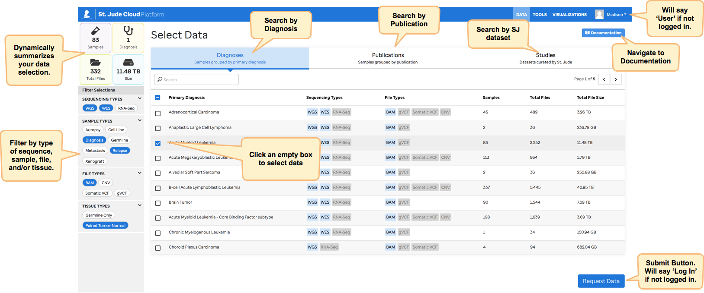
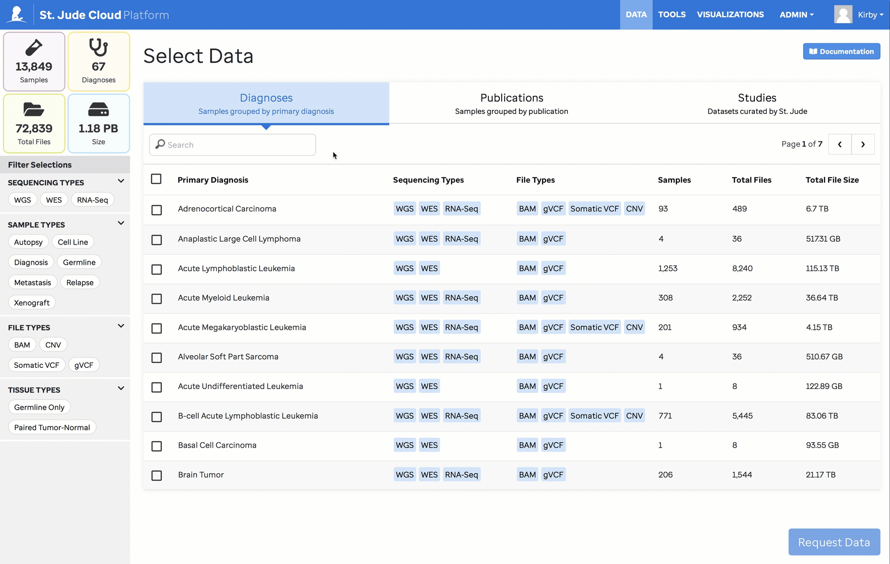
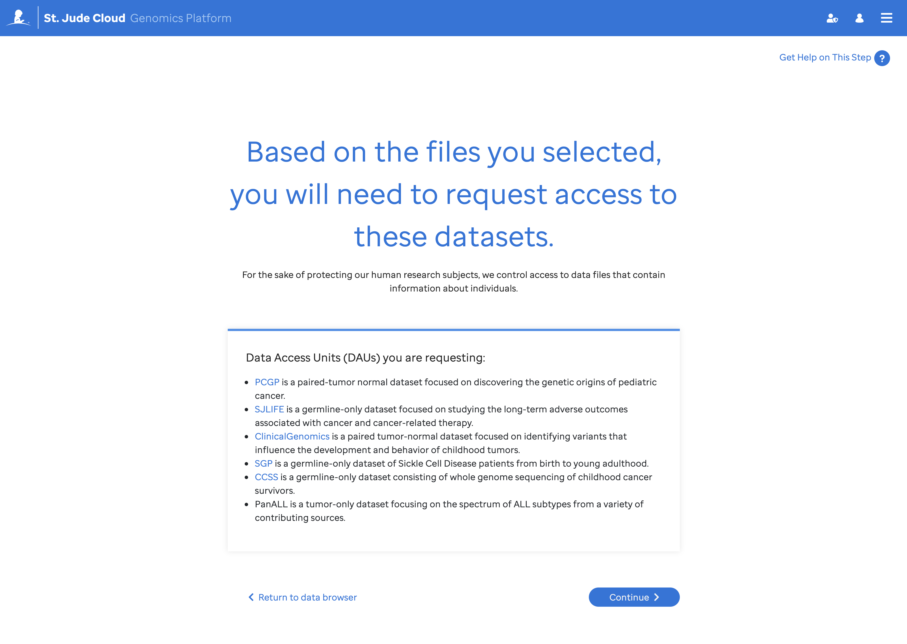
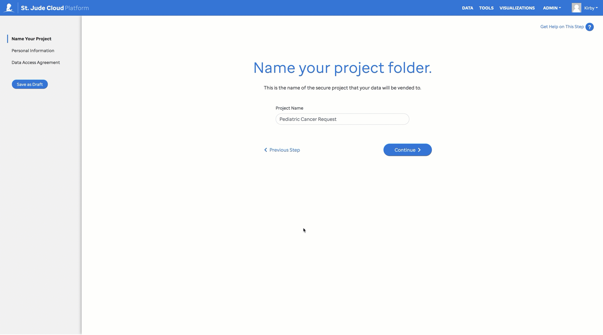

!!! warning "For-Profit Companies"
    St. Jude Cloud does not allow for-profit companies to access any restricted access genomics data. We are persistently working with our institution to create a path forward for companies. If you work for a for-profit company and would like to be notified if this rule changes, feel free to email us at
    [support@stjude.cloud](mailto:support@stjude.cloud).
    
## Request Process Overview
   
Creating a data request is the premier way to access raw St. Jude next 
generation sequencing data in the cloud. You can get a **free** copy of 
the data in a secure cloud environment powered by [Microsoft Azure](https://azure.microsoft.com/en-us/) and 
[DNAnexus](https://www.dnanexus.com/), or you can elect to download the data to your local computing 
environment.

#### Helpful Things to Remember:

1. Data in St. Jude Cloud is grouped into [Data Access Units (DAUs)](glossary.md#data-access-unit), which usually correspond to large-scale sequencing initiatives at St. Jude. 
2. Individuals can [apply for access](glossary.md#data-access-agreement) to DAUs on a case-by-case basis for a specific amount of time (usually 1 year).
3. Access to data in a given DAU is assessed by the corresponding [Data Access Committee](glossary.md#data-access-committee) who reviews a variety of factors to grant access.
4. There are a number of terms of use and restrictions outlined in the [Data Access Agreement](https://platform.stjude.cloud/access_form). Everyone who will be working with the data must understand and agree to these terms.

## Selecting Data

The primary way to make your data selection is through our [Genomics Platform Data Browser](https://platform.stjude.cloud/requests/diseases). You can search our raw genomic data by diagnosis, publication, or study by selecting a tab along the top. You may further refine your search by applying filters from four categories: Sequencing Type, Sample Type, File Type, and Tissue Type. Please note that applying multiple filters within the same category filters using 'OR' logic while applying multiple filters across different categories filters using 'AND' logic. For example in the overview image above, we have filtered the browser to only show data that is (either WGS OR WES) AND (Diagnosis OR Relapse) AND BAM AND Paired Tumor-Normal.
 
As you filter and make selections, the data summary panel in the upper left hand corner will update dynamically to give you important descriptive information about the set of data you have selected. Click on an empty box to make a selection; when selected, the box will turn blue with a white check mark. Once you have completed your data selection, click on *Request Data* to submit your request and proceed. 

!!! note
    You must have [created an account](../accounts-and-billing.md) and be logged in to submit a data request. If you have not yet created an account or you are not logged in, the submit button will say *Log In* rather than *Request Data*.

Alternatively, you may be directed to the Genomics Platform Data Browser through another App to request specific samples. The [PeCan homepage](../../pecan/index.md#requesting-raw-genomics-through-pecan) is one such app that allows you to select data through an interactive visualization.

After clicking on *Request Data*, we ask that you review your selection and make sure that the [DAUs](glossary.md#data-access-unit) corresponding to the set of data you have selected is indeed the data you want to request. 

## Making the Request

Now that you have selected your data, you will need to fill in some information to complete the request. From here, necessary information will be collected through a setup wizard. All of your progress will be automatically saved, and you can follow along with your progress on the left sidebar. 

This information will be collected whether you are requesting open-access or controlled-access data. It helps us structure your project folder correctly when we vend the data to you. 

## Signing the Data Access Agreement

!!! info 
    If you already have access to the data or are requesting open-access data, you will not be prompted to go through this section.

Every person who requests access to our controlled-access data must sign the [Data Access Agreememnt (DAA)](glossary.md#data-access-agreement). If you are located in the United States of America, you can opt in to completing the DAA through an electronic setup wizard. If you are not located in the USA, or would like to complete the form manually, you can follow our instructions on [Filling Out The Data Access Agreement](how-to-fill-out-DAA.md).

If you opt to do the process through the setup wizard, the necessary information will be collected and added automatically to your agreement. Once you have completed the setup wizard, the form will be sent to you and necessary signatories through email via [DocuSign](https://www.docusign.com). You can learn more about our electronic data access agreement process [here](how-to-fill-out-DAA.md#the-electronic-data-access-agreement-process). 

Request approval typically takes a week or two if your data access agreement is correctly and completely filled out. You will receive automated emails from notifications@stjude.cloud at the time that your request is approved.

!!! tip 
    If you receive an email from us that your DAA is incomplete, you may edit your DAA and upload the revised copy using the 'Add a Form' button the on [My Dashboard](../managing-data/working-with-our-data.md#managing-your-data-requests) page. 

## Managing your Data Request
Go to our [Managing Data Overview](../managing-data/working-with-our-data.md) documentation page to learn how to check the status of your data request, complete an EDAA draft, upload a revised DAA, and ultimately access your data from your [My Dashboard](https://platform.stjude.cloud/requests/manage) page.

!!! info
    If you would like to download the data to local storage, there are
    extra steps you'll need to follow such as [getting additional signatures](how-to-fill-out-DAA.md#data-download-permission)
    on your data access agreement. We recommend that you work with the data
    in the cloud if it's feasible; the data provided by St. Jude is free, the compute charges are reasonable, and working in the cloud helps to eliminate the long, error-prone downloading process. Porting your tools to be run in the cloud is easy, as well. We recommend you follow [this guide](../analyzing-data/creating-a-cloud-app.md) to get started.

## Similar Topics

[About our Data](about-our-data.md)  
[About our Decision Process & Terminology](glossary.md)    
[Creating an Account](../accounts-and-billing.md)   
[Managing Data Overview](../managing-data/working-with-our-data.md)  
[Renewing your Data Access](../managing-data/how-to-fill-out-Extension.md)    