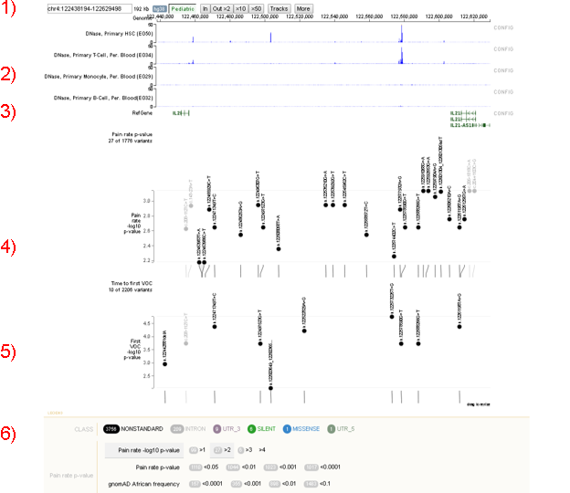

# Glossary

# Visualizations

## Genome Browser

Upon launching the Genome Browser from the ‘Pain Study’, the user will be shown a view of the IL-2 and IL-21 genes as well as the intergenic region between them.

    
