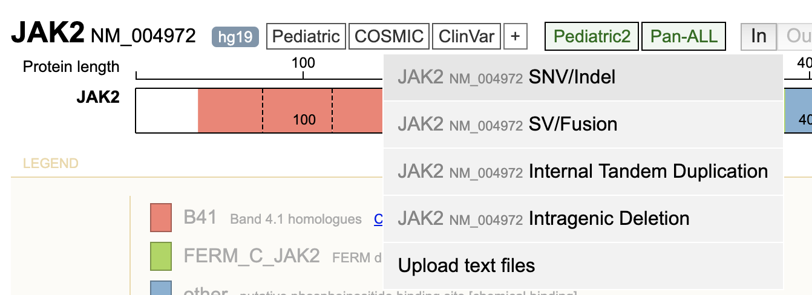

**Loading SNV/indel mutations from text file**
----------------------------------------------

This function allows user to upload a mutation data set that are
detected in many samples over many genes. SV/fusion and CNV data are
supported in addition to SNV/indel. ProteinPaint generates an
informative global view for the uploaded data, and these data can be
compared to pediatric/COSMIC datasets, or explored in depth using the
single gene-based mutation visualization described above.

To use the file uploading feature, click the "+" button following the
data set buttons and select "Upload text files":

Alternatively, go to
[https://proteinpaint.stjude.org/](https://proteinpaint.stjude.org/),
click the "Apps" button at the top and select the option "Load mutation
from text file".

In both case, a new panel will be displayed prompting you to upload
mutation data from text files:

Use the drop-down menu to select the mutation type, then click the
"Choose File" button to upload file.

The panel lists supported mutation data types and format descriptions.
