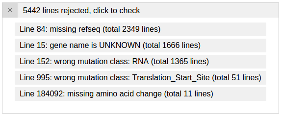
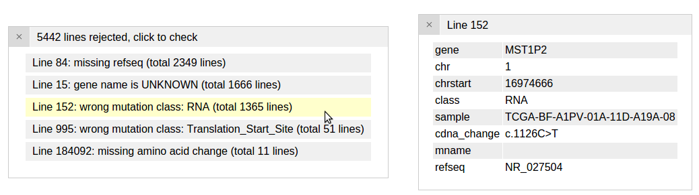

### **Loading TCGA MAF file**

The MAF format is extensively used by TCGA and others to present cancer
genomic mutations. The MAF format is specified here:
[[https://wiki.nci.nih.gov/display/TCGA/Mutation+Annotation+Format+(MAF)+Specification]{.underline}](https://wiki.nci.nih.gov/display/TCGA/Mutation+Annotation+Format+(MAF)+Specification).
Here we describe steps to download MAF files from the TCGA Data Portal
and display on ProteinPaint.

Visit the TCGA data portal at [[https://tcga-data.nci.nih.gov/tcga/]{.underline}](https://tcga-data.nci.nih.gov/tcga/) and go to the "Open-Access HTTP Directory" from the menu:

In the HTTP directory, click on any of the disease folder to look for
mutations stored in MAF files:

You may need to go down several folders to find the MAF files. For skin
cancer, the path of folders to find MAF files is:

skcm/

\> gsc/

\> broad.mit.edu/

\> illuminaga\_dnaseq/

\> mutations/

\> broad.mit.edu\_SKCM.IlluminaGA\_DNASeq.Level\_2.0.1.0/

As an example, from this folder we download a MAF file named
"PR\_TCGA\_SKCM\_PAIR\_Capture\_All\_Pairs\_QCPASS.aggregated.capture.tcga.uuid.somatic.maf".

This MAF file can be submitted to ProteinPaint. Due to the relatively
large size of this MAF file, it can be helpful to keep only essential
columns so as to reduce file size and speed up uploading and subsequent
browsing. This can be done either using a shell command, or a
spreadsheet software.

Using shell command:

\$ cut -f1,5,6,9,16,40,42,44
PR\_TCGA\_SKCM\_PAIR\_Capture\_All\_Pairs\_QCPASS.aggregated.capture.tcga.uuid.somatic.maf
\> TCGA\_SKCM.slim.maf

Using a spreadsheet software (e.g. Microsoft Excel, OpenOffice):

1.  Import the MAF file into the software by choosing "tab" as
    > delimiter.

2.  Select columns with following header names: Hugo\_Symbol,
    > Chromosome, Start\_position, Variant\_Classification,
    > Tumor\_Sample\_Barcode, cDNA\_Change, Protein\_Change,
    > Refseq\_mRNA\_Id. Copy the contents of selected columns.

3.  Create a new sheet and paste these columns into the new sheet.

4.  Choose "Save as..." and select "tab-delimited text" format to save
    > this sheet to a text file.

Both methods will generate a new file which is 10% the size of the
original MAF file. This new file contains following columns. Note that
ProteinPaint does not require any specific order on the columns:

1.  Hugo\_Symbol

2.  Chromosome

3.  Start\_position

4.  Variant\_Classification

5.  Tumor\_Sample\_Barcode

6.  cDNA\_Change

7.  Protein\_Change

8.  Refseq\_mRNA\_Id

At the time of writing, ProteinPaint does not support disease subtype
and subgroup information, as well as fusion gene data from the uploaded
text file. Please check with the latest instructions on ProteinPaint to
find out all supported data types and attributes.

### **Uploading MAF file to ProteinPaint**

Load the trimmed-down version of the MAF file to ProteinPaint using the
file upload panel previously shown:

{width="5.082707786526684in"
height="3.279166666666667in"}

After loading this file, two new panels appear. The first panel shows
the 5 reasons that some lines from the uploaded file are rejected by
ProteinPaint. The reasons are ranked by the number of lines in which
they occur:

{width="4.341666666666667in"
height="1.776641513560805in"}

Click the first entry to inspect a rejected line for the reason "wrong
mutation class: RNA". This is because that "RNA" describes a mutation in
a noncoding gene, which ProteinPaint currently does not support:

{width="7.104166666666667in"
height="1.8770833333333334in"}

Please refer to other tutorials on exploring the data content from an
uploaded MAF file.
