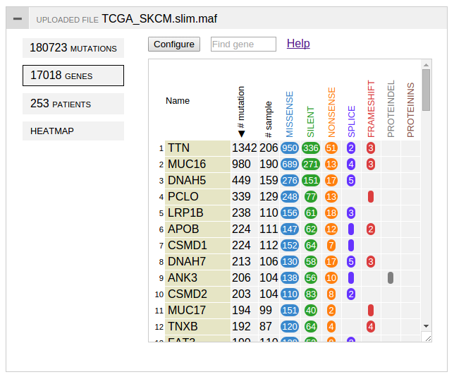
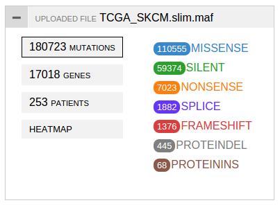

**Uploaded mutation data user interface**

After loading a mutation data file through "\bulk", a panel similar to
below will be generated:

On the right is an active panel. By default it displays the gene table.

On the left is a set of tabs displaying various stats about the uploaded
data set. They can be clicked to show/hide corresponding panel. While a
panel is displayed, the tab has a black border as indication.

The first tab "mutations" is the most simple one. Click it to show a
list of mutation classes found in the data set, ranked by the number of
cases in each class:

The gene, sample, and heatmap panels are described in separate
tutorials.

The header of the panel (gray box with the file name) is a drag-bar and
can be used to move the panel around in the web browser window.

By clicking the button on the left of the header, the panel will be
folded to show only the header. Click again to show full panel.

