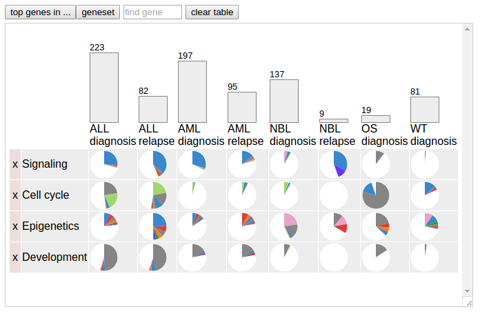

**Using disease pie charts**

When the uploaded data set stratify samples based on disease categories,
pie charts can be made to visualize mutation to a gene or gene set in
each disease category.

to be finished ...
