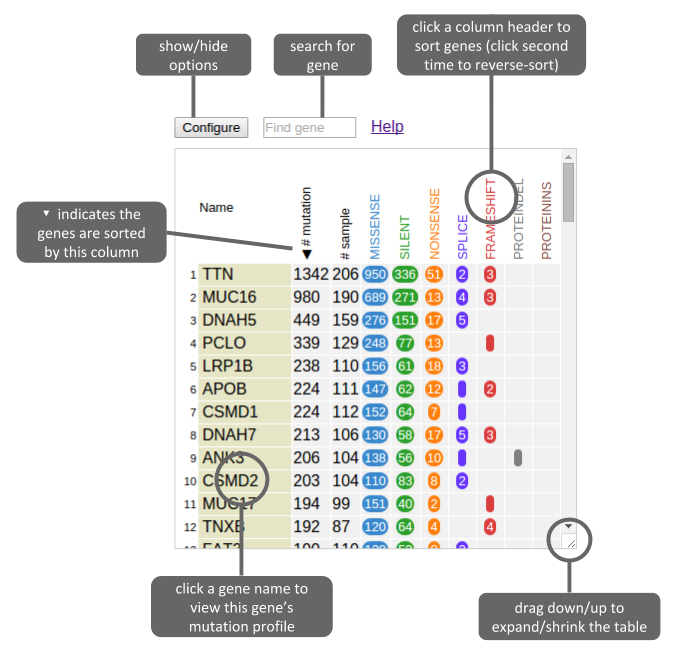
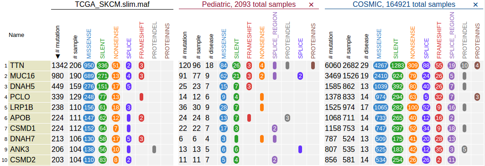

### **Using the gene table**

Updated: Dec 11, 2015

Above example shows the gene table after loading a public data set (TCGA
skin cancer SNV/indel). [[See this
tutorial]{.underline}](https://docs.google.com/document/d/1Aexsd7eYxPIm2FnIIDmDOajLfVv7zl9xyxzt55kFUYc/edit?usp=sharing)
for procedures to obtain and upload this data set.

By default, the gene table shows top-100 recurrently mutated genes from
the data set, ranked by the total number of mutations in each gene, as
illustrated above. It also shows the breakdown of mutation classes using
multiple columns.

Click the gene names in yellow boxes to show this gene in ProteinPaint
along with its mutations from this data set.

To find a gene, type gene name in the search box on top. Scope of search
is limited to this data set:

Click the button "Configure" on top to show options (and the button
turns red, click again to hide):

**Number of genes shown**

There are tens of thousands of genes in this data set. The viewer shows
top 100 genes to avoid draining user's computer memory. To show more or
less genes, click the button "more" or "less". Each click will
add/remove ten genes from the rank.

**Showing a set of given genes**

By providing a list of gene names, gene table will show only provided
genes. Click "cancel" to go back to full list view:

**Noncoding mutation visibility**

If there are noncoding mutations, user can determine whether to show
them in the table. Use the show/hide switch to toggle the noncoding
mutation visibility.

The noncoding mutation includes classes of silent, splice\_region, exon,
UTR, and intron.

**Importing pediatric and COSMIC data sets for comparison**

User can import pediatric or COSMIC data set and show them alongside the
uploaded data for easy comparison across data sets. Click on the
"Pediatric" or "COSMIC" button to import:

The sample size for pediatric and COSMIC is also indicated in the top
header, as a reference for comparing mutated sample counts across
different data sets.

Here's how ProteinPaint decides whether to import **silent** mutation:

-   Do not import silent mutation when there is no silent mutation in
    > uploaded data set.

-   Otherwise, silent mutation will only be imported if the
    > **missense-to-silent ratio** is less than 5 in the uploaded data
    > set. Total number of missense and silent mutations across all
    > genes in the uploaded data set is used. If the missense-to-silent
    > ratio is greater than 5, the silent mutation is considered
    > insignificant.

Note that the importing function is limited to 10 genes at a time since
a larger request may delay the response and cause timeout error. To show
the gene counts for additional genes, simply click the button once again
to query the next 10 genes in the list. The server will remember the
genes that have been imported before (by all users) in order to speed up
the importing.

To remove the imported data sets, click the "X" mark on the right of the
pediatric or COSMIC header.
