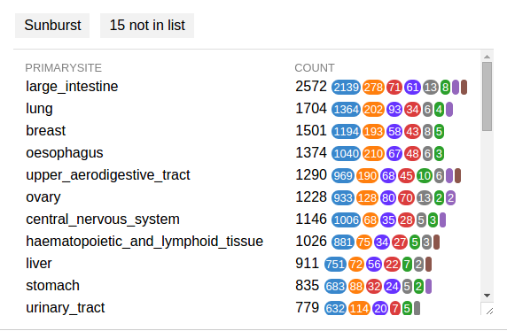
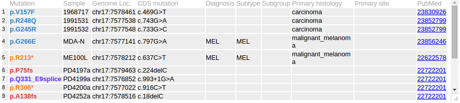

In the header of the Pediatric data set graph, click on the third button
labeled "Cancer subtype" to show a menu listing number of mutations in
each cancer type and subtype:

In above example, "HGG" is a type of cancer, with two subtypes named
"DIPG" and "Non-BS-HGG" shown as indented rows. The right-side numbers
are the number of *TP53* mutations in each category. Following the total
number is a breakdown by mutation classes, beginning with the largest
class. Note that this list of options is generated based on the data for
specific protein, and will have different content for another protein.

Choose the option "HGG" from above example to show high-grade glioma
mutations in a separate graph below the protein:

On the top, a new handle is created for "Pediatric, HGG", which can be
used to toggle or delete this subset of data:

Click "X" on the right of this handle to remove this subset.

A button on the top of cancer subtype list allows creating a sunburst
chart for all mutations from the current data set:

COSMIC data can also be stratified in a similar way, but according to
tissue types. On the header of COSMIC graph, click the button labeled
"Tissue" to get a list of tissue types. Choose a tissue type and a new
graph will be created showing COSMIC mutations for only this tissue
type:

Note the new button "15 not in list" on the top, as a way to indicate
some mutations are not identified by tissue type. Click this button to
show these mutations:

Note that the "Primary site" fields are blank for all these mutations,
the reason why they are excluded from the stratification menu.
