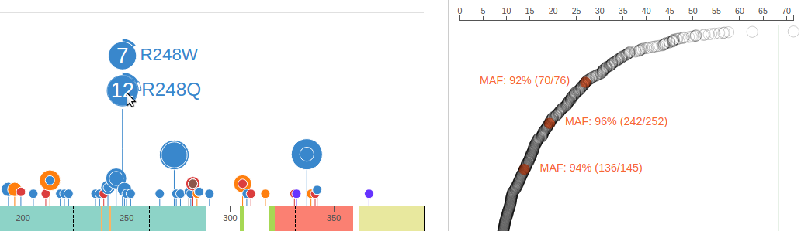
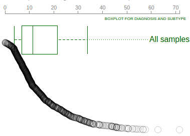
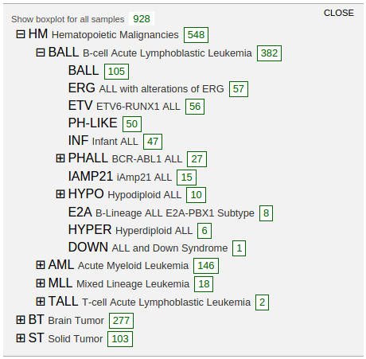
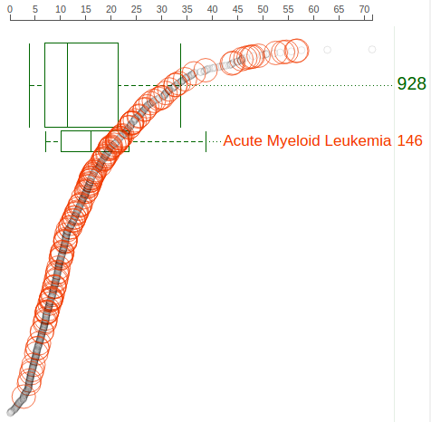
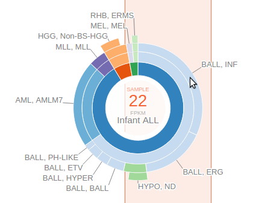

Gene expression data by RNA-Seq is available for close to 1000 pediatric
cancer samples. This data set is made available on ProteinPaint in the
form of gene-level FPKM values, so that while browsing the Pediatric
mutations in genes of interest, the user may view gene expression levels
in the same cohort.

## Rope graph

When showing Pediatric data for *TP53* on ProteinPaint, the gene
expression data will be shown as a "rope graph" on right:

The "rope" consists of circles representing Pediatric samples that have
been profiled by RNA-Seq. Each circle's distance to left represents its
*TP53* FPKM value, also indicated by the axis on top. The circles are
arranged from top to bottom in descending order of *TP53* FPKM values.
Mouse over a circle to see the details about the expression in one
sample:

Since the expression panel shows data about the same cohort as the
mutation panel, the corresponding samples can be highlighted on the
right when the user hovers the cursor over the discs representing
mutations. The following shows 3 samples which are highlighted with the
MAF label by hovering cursor over R248Q. The highlight effect disappears
upon moving cursor out of the R248Q disc:

By showing the mutation table for R248Q cases, a button is available as
an additional way to highlight samples in the expression panel. In this
way, the highlight effect will persist until the user clicks the button
again. This can be convenient when making screenshots retaining such
highlighting:

The rope graph can be adjusted by dragging vertically on the circles.
The circles are divided into two halves for this adjustment: the top
half with high expression is for adjusting vertical span; the bottom
half with low expression is for adjusting vertical position:

In this way, the rope plot can be compressed to avoid overlap with
boxplots, or reverse the ranking order:

To reset the rope plot to its default look, choose the "Reset circle
positions" option from the options menu:

### **Expression value distribution of selected samples**

A boxplot is created by default to show expression value distribution
for all samples. In the following screenshot, the boxplot is labeled by
a number "928" indicating it represents all 928 samples:

Additional boxplots can be added for subsets of the sample from each
individual cancer types. To select cancer types and create boxplots,
mouse over the "Options ⇣" for a menu:

Select "Boxplots" to show the cancer type listing in a new panel. This
listing shows highest groups by default:

Clicking on the labels in each group to reveal more detailed groupings:

A box labeled with a number in each row indicates the cohort size for
each cancer type. Click on the box to show a boxplot representing the
gene expression distribution in the selected cohort:

In above screenshot, separate boxplots are shown for the BALL, AML, and
MLL cohorts, in comparison with the big boxplot at the bottom
representing all pediatric cancer samples. At the cancer type listing,
the number buttons show no border as an indication. The boxplots are
labeled with the cancer name and cohort size, with box heights
reflecting the relative cohort sizes. The rope graph can also change to
highlight samples from a cohort represented by a boxplot:

Click on the boxplot label to highlight its samples in the rope graph,
or click again to cancel the highlight.

The boxplots can be moved to a different vertical position by dragging
on the labels. To remove a boxplot, either click the boxplot graph
directly, or go to the cancer type listing and click the corresponding
number button.

### **Cancer type distribution at selected expression range**

The user can drag on the axis of the rope graph to select a range of
FPKM values, and in turn select a set of samples with FPKM values within
the range. The cancer composition of selected samples will be indicated
by a sunburst chart:

The center of the sunburst chart shows the range of FPKM values and the
number of samples within that range. The chart shows up to four layers
to represent the cancer type stratification, with inner to outer layers
representing: cancer group, cancer, subtype, and subgroup. This is in
unison to the hierarchical list shown above. The surrounding text labels
represent the name of each smallest group in selected samples. Mouse
over an arc from any of the four layers to see the full name and sample
count at the center:

An orange-colored box behind the sunburst chart marks out the FPKM value
range. User can slide this bar left or right and see the change to the
sunburst chart to conveniently explore the cancer type composition of
samples stratified by an gene expression level gradient. User can also
drag on the thick bars on top of the orange box to widen or narrow the
box and change the span of FPKM value range. To dismiss the FPKM range
selection, click on the center of the sunburst chart.

Finally, the screenshot and data of the sample expressions can be
exported through the menu options, in the same fashion with the mutation
data. The screenshot will retain all items currently shown in the
expression panel, including rope graph, boxplots, and the sunburst
chart.
