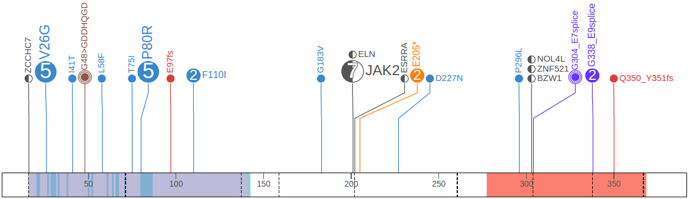
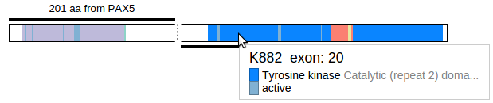
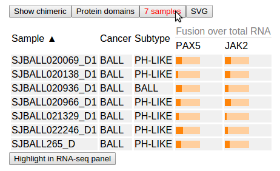

Fusion gene data are available for a subset of Pediatric cancer samples
(Ph-like B-cell acute lymphoblastic leukemia, **Fig. 1b**), detected
from RNA-Seq data using the software CICERO (Li, Y. and Zhang, J. in
preparation). The comprehensive set of fusion gene information from all
Pediatric samples is being produced at the time of writing and will be
made available on ProteinPaint.

As an example, viewing Pediatric mutations for *PAX5* shows a number of
fusion gene events amongst SNVs and indels:

In this graph, there are 7 cases of fusion with *JAK2*. The disc is
half-filled on left indicating the N-terminus part of *PAX5* protein is
fused with *JAK2*.

Conversely, in *JAK2* ProteinPaint shows the same set of 7 fusion events
with *PAX5*:

Click on the half-filled disc labeled "PAX5" to view a graphical
representation of this fusion event:

In this view, the protein schema is displayed for both *PAX5* and
*JAK2*. The two proteins are positioned in this way that the N-terminus
segment (PAX5) is on top, and the C-terminus (JAK2) is on bottom. A
thick horizontal line marks out the part of each protein that is
retained in the fusion event, and a thin dashed line joins the segments.
The amino acid positions from which the dashed line starts and ends are
marked on both proteins.

Click the button "Show chimeric" to transform the view into a "chimeric"
protein, in which only the N-terminus of PAX5 and C-terminus of JAK2 are
visible:

Mouse over either of the proteins to examine details about protein
domains through the tooltip:

Click the button "7 samples" to view the list of samples from which the
PAX5-JAK2 fusion has been discovered:

In this table, "Fusion over total RNA" shows color-bars to show the
fraction value of fusion transcripts in the total transcripts of each
gene (PAX5 and JAK2). This fraction value is calculated by the software
CICERO.
