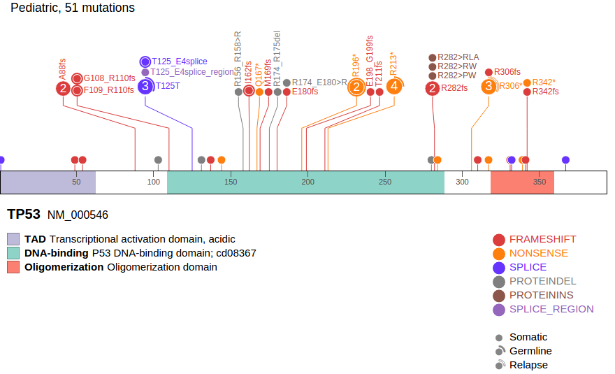

User can export figure or data for the current view on ProteinPaint.
Mouse over the "More" link following the data set handles for a menu,
then click "Export SVG" to download an SVG file as the screenshot of
current view, like the example below:

The exported figure will contain following contents, many will reflect
user's customization:

-   Datasets that are currently displayed, including custom data

-   Expand/fold states of all mutations

-   Sequences in the protein if at zoom-in level

-   Show/hide state of exon boundaries

-   Sunburst charts

-   Protein domains without the hidden ones

-   All mutations without the hidden classes or origins

-   Legend for protein domain, mutation class and origin

Following is another screenshot showing a customized graph, leaving out
exon boundaries, three types of domains, and missense mutations:

The exported figure is an SVG file, which can be viewed on a web
browser, printed to a PDF file, or edited using a text editor. Note that
the exported SVG file can be properly displayed in Adobe Illustrator CS2
but not CS6.

To export SNV/indel data, use either one of the two buttons labeled
"html" and "text". This will export the entire sets of mutation data
from all figures shown in ProteinPaint, without filtering.
