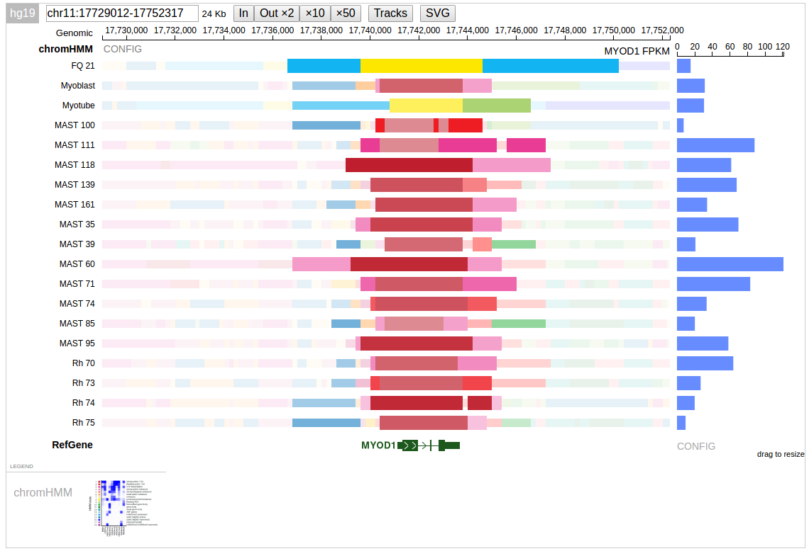

**The Profile-Gene-Value track (PGV)**

The PGV track is a combination of genomic profiling results and
gene-level numerical values over a set of samples.

Here is a screenshot of chromatin states and the expression level for
one gene over a set of samples.



A live example: [https://pecan.stjude.org/proteinpaint/study/retina2017](https://pecan.stjude.org/proteinpaint/study/retina2017)

### Gene-value track

Example lines from a gene-value track:

```javascript
chr1    3205900 3671498 {"sample":"sample1","value":1.83479,"gene":"Gm37363"}
chr1    3205900 3671498 {"sample":"sample1","value":1.87122,"gene":"Gm37180"}
chr1    3205900 3671498 {"sample":"sample2","value":2.10581,"gene":"Gm37329"}
chr1    3205900 3671498 {"sample":"sample3","value":3.21379,"gene":"Gm19938"}
```

The file has four columns:
1. Chromosome name
2. Start position of the gene (feature), 0-based
3. Stop position of the gene (feature), 0-based
4. JSON object
    a.  Required keys:
        i.  "**sample**":STR
        ii. "**gene**": STR
        iii. "**value**": FLOAT
             1. Currently, only nonnegative values are supported
    b.  The chromosomal position should match with the gene. It's totally okay to describe other type of genomic features rather than genes, but the "gene" key should still be used for the moment.

Each line represents a numerical value for a gene in a sample. The gene
chromosome positions are for indexing purpose.

The gene-value track should be compressed and indexed, and hosted in the
same way as the [JSON-BED track](https://drive.google.com/open?id=1GP81rer7YEb0RpIej2XXfx-k7SCAL1Od9At_oczf06A).

### Track format with single type of gene-value

This format is suitable for just one type of gene-value in PGV track,
e.g. expression.

Example:

```javascript
{
"type":"profilegenevalue",
"genevaluetrack":{
    "file":"rhb/fpkm.db"
},
"genevaluetype":"FPKM",
"genevaluematchname":"sampleID",
"legendimg":{
    "file":"rhb/chromhmm.png",
   },
"name":"RHB chromHMM",
"tracks":[  
    {"type":"bedj",
     "file":"rhb/fq21.gz",

     "stackheight":20,
     "stackspace":1,
     "name":"sample1",
     "sampleID":"sample1"
    },
    {"type":"bigwig",
     "file":"path/to/file.bw",
     "height":20,
     "name":"sample2",
     "sampleID":"sample2",
     "scale":{"auto":1},
     "pcolor":"blue"
    },
   ... more member tracks ...
]
}
```

-   **genevaluetrack**
    -   A JSON-BED file that stores numerical data **per gene per sample**.
        -   When the file is stored on the ProteinPaint server, use "file" to provide path. Otherwise, provide the URL with the "url" keyword.
    -   The file follows [JSON-BED format](https://drive.google.com/open?id=1GP81rer7YEb0RpIej2XXfx-k7SCAL1Od9At_oczf06A) and needs to be compressed by bgzip and indexed by tabix.
    -   Each line stores one numerical value for one gene in one sample. The JSON part should be an object with following attributes:
        -   **gene**
            -   the name of gene
        -   **sample**
            -   the name of sample, should match one of the member tracks (but not required to be so)
        -   **value**
            -   the numerical value
-   **genevaluetype**
    -   The type of the gene value, e.g. "FPKM", will be displayed on the track
-   **genevaluematchname**
    -   Optional.
    -   If not provided:
        -   The "name" of each member track will be used for sample name matching with the "genevaluetrack"
    -   If provided:
        -   Value can be arbitrary string, and will be an attribute for member tracks
        -   E.g. "genevaluematchname":"sampleID", then the "sampleID" attribute should exist for member tracks, and the value of "sampleID" of each track will be used for sample name matching
-   **legendimg**
    -   File
        -   Relative path to an PNG image as the legend of this track. E.g. a state-by-assay heatmap for the case of chromHMM tracks.
    -   Image URL is not supported yet.
    -   The image will be displayed in the LEGEND section at the bottom.
-   **tracks : \[ \]**
    -   An array of member tracks
    -   Each member track is one JSON object, which must be properly defined according to its type. Supported types are:
        -   JSON-BED
        -   bigWig
    -   Each member track must have the "name" attribute, the name value must be unique

### Track format for multiple types of gene values

This format should be used for multiple types of gene values in a PGV
track, e.g. RNA expression + proteomics.

Notably, this format uses "genevaluetklst" to store a set of gene value
tracks. Thus it's also able to replace the single-track format discussed
above.

```javascript
{
"type":"profilegenevalue",
"name":"RHB chromHMM",
"genevaluetklst":[
    {
    "file":"path/to/fpkm_file.gz",
    "name":"Gene FPKM",
    "matchname":"RNAsampleID",
    },
    {
    "file":"path/to/proteomics_file.gz",
    "name":"Proteomics",
    "matchname":"PROTEINsampleID",
    }
},
"tracks":[  ... member tracks ... ]
}
```

### Track format for having multiple types of data points in one of the gene-value track

With application for protein phosphorylation. In such case the value
types will be specific to genes. May also support fixed set of types.

```javascript
{
"type":"profilegenevalue",
"name":"RHB chromHMM",
"genevaluetklst":[
    {
    "file":"path/to/phosphorylation.gz",
    "name":"phosphorylation",
    "multivaluekey":"site",
    "axistickformat":".0e",
    }
},
"tracks":[  ... member tracks ... ]
}
```

Example rows of the phosphorylation data file:

```
chr1    879582  894689  {"sample":"MAST 118","value":149697.325,"gene":"NOC2L","site":"S56"}
chr1    879582  894689  {"sample":"MAST 118","value":3463144.33,"gene":"NOC2L","site":"S673"}
chr1    879582  894689  {"sample":"MAST 118","value":4299136.975,"gene":"NOC2L","site":"S672"}
chr1    879582  894689  {"sample":"MAST 118","value":86552.805,"gene":"NOC2L","site":"S49"}
chr1    879582  894689  {"sample":"MAST 35","value":106901.32,"gene":"NOC2L","site":"S56"}
```

In such phosphorylation data, each row represents the phosphorylation
value for one specific amino acid residue (denoted by the "site" key),
in one gene, of one sample.

Note that the genomic coordinates are of genes.
