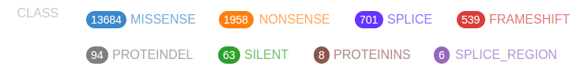
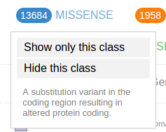
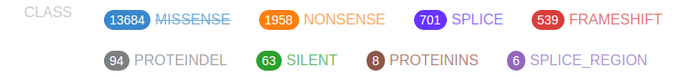
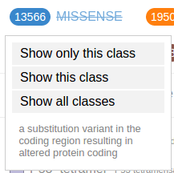
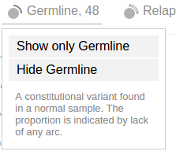

## Filtering mutations based on class and origin

ProteinPaint uses the color of the discs to represent the mutation
classes, as indicated in the legend:

The numbers in the legend indicate the total number of mutations
currently shown for each class. Clicking on a class shows a menu:

Use the options in the menu to show/hide mutations from a selected
class. The following screenshot shows the view after hiding all missense
mutations, making nonsense mutations (orange) the most abundant class.
There is also a strikethrough to the MISSENSE class label in legend,
indicating it is hidden

As another example, the following shows only splice site mutations, with
strikethroughs in all the other class labels in the legend:

To restore mutations for of all classes, click on any mutation class
button then select "Show all classes":

In the Pediatric data set, germline and relapse mutations are also
denoted in the "Origin" section of the legend:

Click on an origin type to see a menu similar to the mutation class
menu:

Using these options, only germline mutations are shown as below:

