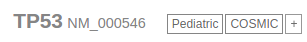
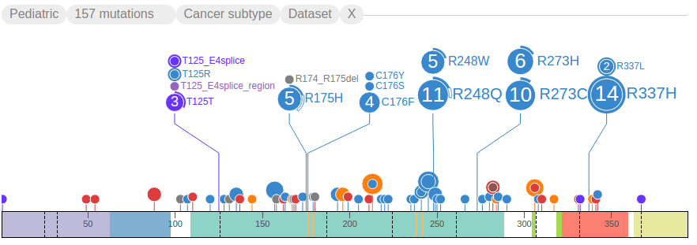
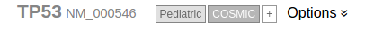
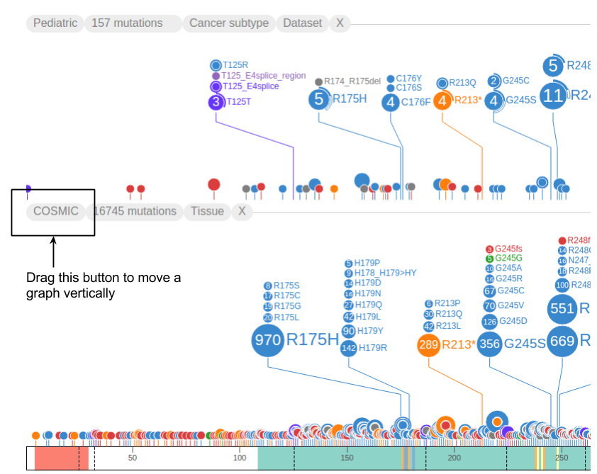
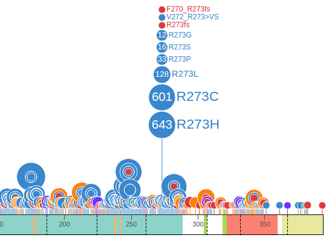
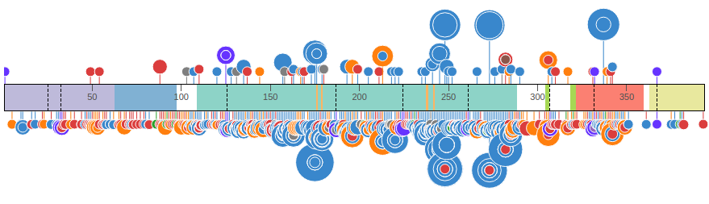
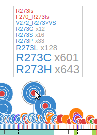
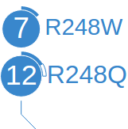

Pediatric and COSMIC are the two data sets formally supported by
ProteinPaint. These are indicated by two buttons on the top, referred to
as **handles**. Click the handle labeled "Pediatric" to load
Pediatric mutations:

Once loaded, the Pediatric mutations will be shown as discs extending
from the protein, and the handle will turn gray, indicating the data has
been loaded. The top of the graph shows a header with a set of buttons
starting with "Pediatric":

Click the handle for "COSMIC" to load adult cancer mutations. This can
take a few moments to load since the amount of COSMIC mutations may be
much larger than Pediatric, depending on specific protein. In the
following example, COSMIC data is shown on the other side of the protein
from the Pediatric data set, allowing for convenient comparison. On the
COSMIC side of the graph, discs extend downward from the protein, and
the header is at the bottom:

At this stage, you may click either "Pediatric" or "COSMIC" handle to
hide the graph from ProteinPaint display, after which the handle turns
dark gray again:

Click on the handle to toggle the the data set on again.

Dragging the first button in the graph header moves the graph
vertically. It can be moved to the top or bottom of the protein ruler,
or change its order of appearance when there are multiple data set
graphs. The following shows both COSMIC and Pediatric data sets on top
of the protein:

ProteinPaint shows the full view of the protein by default, and groups
mutations by amino acid positions, so that discs representing mutations
at the same amino acid position will be aligned to the same horizontal
position. At each amino acid position, discs are vertically stacked by
the number of mutations in each group, with largest group closest to the
protein, as illustrated by an example from COSMIC:

The text labels to the right of the discs show amino acid changes.
Together the disc radii and label font sizes reflect the number of
affected samples by each mutation. Clicking on any text label will fold
the discs and their labels. Clicking on a disc will expand its folded
mutation. These interactive features allow the user to configure and
customize the fold/expand states of any mutation as desired. For added
convenience, an option is provided allowing the user to toggle the
fold/expand of all mutations in a dataset by clicking on the second
button of the graph header. The following shows all *TP53* mutations
folded using this method:

When folded, the discs will be slightly raised away from the protein by
a distance relative to the number of mutations at that amino acid
position. To get a quick view of the data contained in any folded disc,
mouse over the disc and a tooltip will appear, for example:

ProteinPaint highlights mutations of germline and relapse origin using
arcs surrounding the discs. In the example below, the 11 mutations for
R248Q show two types of arcs, the solid arc indicates two of these
mutations are from germline samples, and hollow arc indicates one is
from a relapsed sample. The remaining portion of the disc not covered by
an arc indicates the final 8 mutations are from diagnostic (somatic)
samples:

At the present time, only the Pediatric dataset contains germline and
relapse mutations. All COSMIC mutations are somatic.
