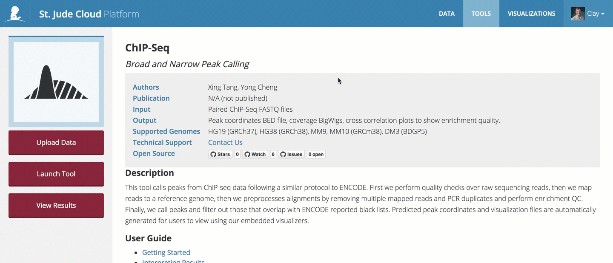
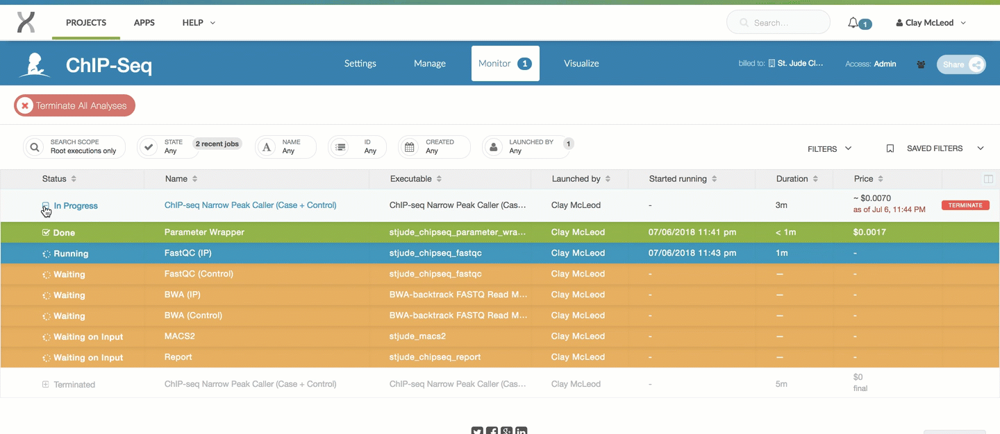

| | | 
|-------------|-----------------------|
| **Authors** | Xing Tang, Yong Cheng |
| **Publication** | N/A (not published) |
| **Technical Support** | [Contact Us](https://stjude.cloud/contact) |

## Introduction

This pipeline is designed to call either broad of narrow peaks on Illumina-genearted
ChIP-Seq data. The pipeline accepts one FastQ file from an Immunoprecipitation (IP)
experiment and one FastQ file from a control experiment. First, the reads of the
FastQ file(s) are aligned to the specified reference genome. The aligned
reads are then post-processed based on best-practice QC techniques
(removing multiple mapped reads, removing duplicated reads, etc). Last,
peaks are called by SICER (broad peak analysis) or MACS2 (narrow peak
analysis). Qualified peaks will be output BED (.bed) and big BED (.bb)
files. The coverage information is also included also a bigWig (.bw)
file with an accompanying visualization by ProteinPaint. A cross
correlation plot and general metrics file are generated to help check
the quality of experiment.

## Overview

### Process

!!! todo
    Write ChIP-Seq process section.

### Inputs

!!! todo
    Write ChIP-Seq inputs section.

### Outputs

!!! todo
    Write ChIP-Seq outputs section.

## Getting started

To get started, you need to navigate to the [ChIP-Seq tool page](https://platform.stjude.cloud/tools/chip-seq). Here, you will need to click
the "Start" button in the left hand pane to create your tools cloud workspace.

!!! note
    If you can't see the "Start" button, one of these two scenarios is likely the case:

    * You see three buttons on the left sidebar instead of one. In this case,
      you've already clicked the "Start" button previously, and a cloud workspace has
      already been created for you. In this case, you're good! You can move
      on to the next section.
    * If you cannot see *any* buttons on the left side, you probably have not
      logged in yet. If you see a sentence that says "Log in to launch this 
      tool", simply login and try again.

    If neither of these are the case and you still can't click "Start",
    [contact us](https://stjude.cloud/contact).

## Uploading data

The ChIP-Seq Peak Caller takes Gzipped FastQ files generated from an
IP experiment as input. You can upload your input FastQ files by
using the [data transfer application](../data/data-transfer-app.md)
or by uploading them through [the command line](../data/command-line.md).

!!! tip
    If you plan to upload data through the St. Jude Cloud Data Transfer application
    (recommended), you can click the "Upload Data" button in the left panel. If you
    have not already downloaded the app, do so by clicking "Download app". Once you
    have the app, you can click "Open app" to open the app with the tool's cloud 
    workspace already opened and ready to drag-and-drop files into it!

    For more information, check out the [data transfer application](../data/data-transfer-app.md) guide.

## Running the tool

Click "Launch Tool" on the [tool's landing page](https://platform.stjude.cloud/tools/chip-seq). 
A dropdown will present the different presets for running the tool.
You'll need to decide **(1)** whether you'd like to run broad/narrow peak
calling and **(2)** whether you have a case sample and a control sample (preferred)
or just a case sample. After you've selected your base pipeline, there are various other 
parameters that you can set as outlined below.

### Broad vs. narrow peak calling

Choosing between broad and narrow peak calling depends on the experiment
design. The following are good rules of thumb for choosing between the
two configurations. If you are not sure which configuration to use,
please consult with an expert or [contact us](https://stjude.cloud/contact).

**Narrow Peak Calling**

If your target protein is a transcription factor, you should probably
choose narrow peak calling. You can also try the narrow peak calling
workflows for the following histone marks:

* H3K4me3
* H3K4me2
* H3K9-14ac
* H3K27ac
* H2A.Z

**Broad Peak Calling**

You should try the broad peak calling workflows for the following
histone marks:

* H3K36me3
* H3K79me2
* H3K27me3
* H3K9me3
* H3K9me1

**Special Cases**

In some scenarios, H3K4me1, H3K9me2 and H3K9me3 might behave between
narrow and broad shape, you might need to look into each peak region and
consult experts.

!!! warning
    If your fragment size is less than 50 base pairs, please refer to the
    [frequently asked questions](#frequently-asked-questions).

## Running the tool

### Selecting parameters

There are a number of other parameters that can be customized. To 
see the options available, click the gear cog next to the 
"Parameter Wrapper" applet.

The following are the parameters that can be set, a short
description of each parameter, and an example value. If you
have question, please [contact us](https://stjude.cloud/contact).

| Parameter Name | Description | Example |
|--|--|--|
| Output prefix | A name used a prefix for all outputs in the run | SAMPLE1 |
| Reference genome | Supported reference genome (HG19, HG38, mm9, mm10, dm3) | HG38 |
| Output bigWig | Whether or not to include a bigwig file in the output | True |
| Remove blacklist peaks | Whether or not to remove known problem areas | True |
| Fragment length | Hardcoded fragment length of your reads. 'NA' for auto-detect. | NA |

!!! caution
    Please be aware of the following restrictions when setting parameters:

    * Do not use spaces anywhere in your input file names, your output
      prefix, or any of the other parameters. This is generally bad
      practice and doesn't play well with the pipeline (consider using
      "_" instead).
    * Do not change the output directory when you run the pipeline. At
      the top of parameter input page, there is a text box that allows
      you to change the output folder. **Please ignore that setting**. You
      only need to specify an output prefix as described aboce. All of
      the results will be put under `/Results/[OUTPUT_PREFIX]`.

### Selecting inputs

Next, you'll need to hook up the FastQ files you uploaded in 
[the upload data section](#uploading-data). You can do this by 
clicking on the `ChIP Reads` and `Control Reads` slots and
selecting the respective files. If you are not doing a case/control
run, you only need to hook up the case sample.

### Starting the workflow

Once your input files are hooked up, you should be able to start the workflow
by clicking the "Run as Analysis..." button in the top right hand corner
of the workflow dialog.

!!! note
    If you cannot click this button, please ensure that:

    * all of the inputs are correctly hooked up (see [selecting inputs](#selecting-inputs)), and 
    * all of the required parameters are set (see [setting parameters](#setting-parameters)).

## Monitoring run progress

Navigate to the [tool's landing page](https://platform.stjude.cloud/tools/chip-seq). 
To monitor the status of your jobs, click "View Results" then select
the "View Running Jobs" option. You will be redirected to the job
monitoring page. Here, you can click the "+" to see the status of each
step of the ChIP-Seq workflow. 

 

Other information, such as time, cost 
of individual steps in the pipeline, and even the job logs themselves 
are available by clicking around the sub-items.

 

!!! note
    Power users can view the [DNAnexus Job Monitoring Tutorial](https://wiki.dnanexus.com/UI/Jobs) and the [DNAnexus Command Line Tutorial for Job Monitoring](https://wiki.dnanexus.com/Command-Line-Client/Monitoring-Executions) for advanced capabilities for monitoring jobs.

## Navigating results

### Viewing result files

Navigate to the [tool's landing page](https://platform.stjude.cloud/tools/chip-seq). 
In the left hand pane, click "View Results" then "View Results Files". You will
be taken to the DNAnexus to your cloud workspace. You can then navigate the results 
files as shown in the image below.

### Visualization results

!!! todo
    Add section about custom visualization results for ChIP-Seq pipeline.

## Analysis of results

For the ChIP-Seq pipeline, all results are distributed in the `Results`
folder. Underneath this folder, you will see all of the runs you've
completed, sorted by the output prefix you specified in chipseq-parameter-config.

The exact content of the output folder changes as the version of the
pipeline updates. Please refer to the `README.txt` found in the output
folder for your run for the most up to date information on raw outputs.

### Custom ProteinPaint visualizations

!!! todo
    Add section about custom visualization results for ChIP-Seq pipeline.

## Frequently asked questions

If you have any questions not covered here, feel free to 
[contact us](https://hospital.stjude.org/apps/forms/fb/st-jude-cloud-contact/).

**Q: Should I choose narrow peak calling pipeline or broad peak calling pipeline?**

A. We built two workflows: one for narrow peak calling and another broad
peak calling. If your target protein is a transcription factor, please
use narrow peak calling workflow. For histone marks H3K4me3, H3K4me2,
H3K9-14ac, H3K27ac and H2A.Z, you could try narrow peak calling
workflow. For histone marks H3K36me3, H3K79me2, H3K27me3, H3K9me3 and
H3K9me1, you could try broad peak calling workflow. In some scenario,
H3K4me1, H3K9me2 and H3K9me3 might behave between narrow and broad
shape, you might need to look into each peak region and consult
experts.

**Q. What to do if your fragment size is less than 50 base pairs?**

A. We estimate fragment size from the data based on the cross correlation
plot. Usually the fragment size is above 50bp. If the estimated
fragment size lower than 50bp, the workflow will stop at the peak
calling stage (MACS2/SICER) after BWA mapping finishes. You can rerun
the analysis with a specified fragment length.