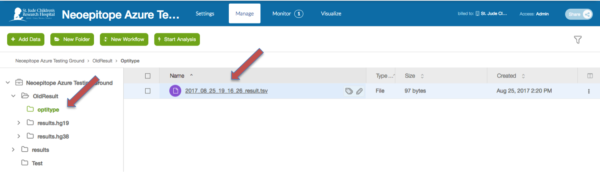
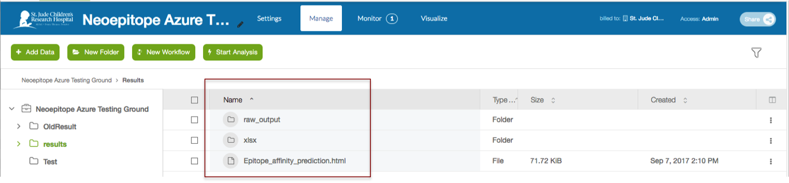
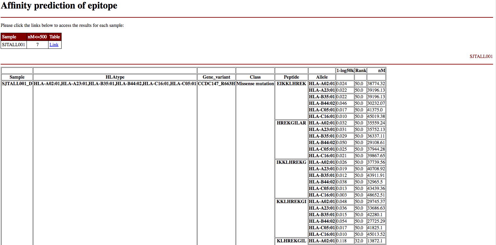

| | |
|-------------|----------------|
| **Authors** | Ti-Cheng Chang |
| **Publication** | [The Neoepitope Landscape in Pediatric Cancers. Genome Medicine. 2017. 9.1: 78](https://www.ncbi.nlm.nih.gov/pubmed/28854978). |
| **Technical Support** | [Contact Us](https://stjude.cloud/contact/) |

## Introduction

Cancers are caused by somatically acquired alterations including single 
nucleotide variations (SNVs), small insertion/deletions (indels),
translocations, and other types of rearrangements. The genes affected by
these mutations may produce altered proteins, some of which may lead to
the emergence of tumor-specific immunogenic epitopes. We developed an
analytical workflow for identification of putative neoepitopes based on
somatic missense mutations and gene fusions using whole genome
sequencing data. The workflow has been used to characterize neoepitope
landscape of 23 subtypes of pediatric cancer in the Pediatric Cancer
Genome Project[1].

<h2>Content</h2>
overview operation monitoring navigate results faq

**References**

[1] Downing JR, Wilson RK, Zhang J, et al. The Pediatric Cancer Genome
Project. Nature genetics. 2012;44(6):619-622. <doi:10.1038/ng.2287>.

## Overview

### Inputs

The HLA typing and neoepitope prediction workflow two required inputs:  
1.  FastQs or BAM file and BAM index
2.  Mutation file

<table>
<colgroup>
<col style="width: 16%" />
<col style="width: 10%" />
<col style="width: 54%" />
<col style="width: 18%" />
</colgroup>
<thead>
<tr class="header">
<th>Name</th>
<th>Type</th>
<th>Description</th>
<th>Example</th>
</tr>
</thead>
<tbody>
<tr class="odd">
<td>FastQ files</td>
<td>Input file</td>
<td>Gzipped FastQ files generated by experiment</td>
<td><em>.fastq or</em>.fq</td>
</tr>
<tr class="even">
<td>BAM files</td>
<td>Input file</td>
<td>BAM files aligned against Hg19/Hg38 (WGS, WES or RNAseq)</td>
<td>*.bam</td>
</tr>
<tr class="odd">
<td>BAM index</td>
<td>Input file</td>
<td>BAM index of the BAM file</td>
<td>*.bai</td>
</tr>
<tr class="even">
<td>Mutation file</td>
<td>Input file</td>
<td>Mutation information</td>
<td>*.txt(tab-delimited)</td>
</tr>
<tr class="odd">
<td>SNV or fusion</td>
<td>Parameter</td>
<td>Specify the mutation file contains SNV or gene fusion</td>
<td>SNV</td>
</tr>
<tr class="even">
<td>Peptide size</td>
<td>Parameter</td>
<td>Size of the peptide</td>
<td>9</td>
</tr>
<tr class="odd">
<td>Affinity threshold</td>
<td>Parameter</td>
<td>Affinity cutoff for epitope prediction report</td>
<td>500</td>
</tr>
</tbody>
</table>

### Outputs

<table>
<colgroup>
<col style="width: 32%" />
<col style="width: 67%" />
</colgroup>
<thead>
<tr class="header">
<th>Name</th>
<th>Description</th>
</tr>
</thead>
<tbody>
<tr class="odd">
<td>Epitope affinity prediction (html)</td>
<td>Epitope affinity. The peptide with affinity &lt; cutoff will be highlighted.</td>
</tr>
<tr class="even">
<td>Epitope affinity prediction (xlsx)</td>
<td>Excel tables for the infomation of all epitopes</td>
</tr>
<tr class="odd">
<td>Affinity (raw output)</td>
<td>Epitope affinity</td>
</tr>
<tr class="even">
<td>Peptide sequence (raw output)</td>
<td>Peptide sequences in fasta format</td>
</tr>
</tbody>
</table>

### Theory

#### HLA Typing Algorithm

The HLA typing algorithm is used to predict the HLA class I alleles.
Users can either provide fastq (paired or single end reads) or a BAM
file as input. When using a BAM file as input, the reads surrounding the
HLA loci and unmapped reads will be extracted. The reads will be fed
into Optitype for HLA typing. The default settings for Optitype are
used. The output of the HLA type can be combined with the our epitope
detection algorithm to perform affinity prediction of neoepitopes (see
epitope-pred).

#### Epitope Prediction Algorithm

The stjude-epitope applet is used to extract peptides covering an array
of tiling peptides (size defined by users) overlapping each missense
mutation or gene fusion. Fusion junctions can be identified using RNAseq
by fusion detection tools (e.g. CICERO, Li et al.). NetMHCcons
(Karosiene et al.) is subsequently used to predict affinities of the
peptide array for each HLA receptor in each sample. The neoepitope with
affinity lower than the threshold will be highlighted in output file
(default 500 nM).

### Process

HLA typing:  
If you use **FastQ** files as input:  
1.  The input fastqs will be aligned against the Optitype HLA reference
    sequences using razers3 (see <https://github.com/FRED-2/OptiType>).
2.  The fished fastqs will be used for HLA typing using Opitype.

If you use **BAM** files as input:  
1.  The reads falling within the HLA loci and their paralogous loci will
    be extracted.
2.  The reads unmapped to the human genome will be extracted.
3.  The reads from step 1 and 2 will be combined and deduplicated (in
    fastq format).
4.  The input fastqs will be aligned against the Optitype HLA reference
    sequences using razers3 (see <https://github.com/FRED-2/OptiType>).
5.  The fished fastqs will be used for HLA typing using Opitype.

Neoepitope prediction:  
1.  Check the version of the genomic position of the input SNV/fusion
    file.
2.  lift over the genomic coordinations if the reference genomic
    position is not Hg19. Currently, the internal genome annotation was
    based on Hg19 and the genome coordiantes of the mutation files will
    be adjusted to Hg19 for peptide extraction.
3.  Extract the peptide flanking the mutations.
4.  Run NetMHCcons to obtain the affinity prediction of the peptides.
5.  Produce the affinity report of each peptide.

**References**

> 1.  Szolek A, Schubert B, Mohr C, Sturm M, Feldhahn M, Kohlbacher O:
>     OptiType: precision HLA typing from next-generation sequencing
>     data. Bioinformatics 2014, 30:3310-3316.
> 2.  Karosiene E, Lundegaard C, Lund O, Nielsen M: NetMHCcons: a
>     consensus method for the major histocompatibility complex class I
>     predictions. Immunogenetics 2012, 64:177-186.

## Pipeline Operation

!!! caution
    This pipeline assumes HG19 coordinates in the mutation file. If the
    coordinates is based on HG38, the coordinates will lifted over to HG19
    to perform epitope affinity prediction.

### Uploading Data

The HLA Typing and Neoepitope Prediction pipeline takes either a Gzipped
FastQ file or a BAM file aligned to HG19 or HG38 (WGS, WES or RNAseq).
You can upload the files you would like to run using the desktop-application or by uploading data manually
using the commandline.

!!! note
    You should click "Start" before attempting to upload data to the tool
    (the tool's workspace is only created once you do this). After you are
    redirected, you can safely close the tab that was just opened.

### Input File Configuration

Users need to provide a mutation file for SNV or gene fusion. The format
of the mutation file is shown in the following example. The file can be
prepared in Excel and saved as a tab-delimited text file to use as
input.

The HLA alleles for testing will be derived from the HLA typing module
using the workflow. The peptide size and affinity cutoff can be modified
by users. The neoepitope step can be used as an independent app
alternatively, allowing users to predict epitopes in multiple samples.

#### Mutation file format

<table>
<colgroup>
<col style="width: 16%" />
<col style="width: 8%" />
<col style="width: 8%" />
<col style="width: 12%" />
<col style="width: 8%" />
<col style="width: 8%" />
<col style="width: 8%" />
<col style="width: 14%" />
<col style="width: 12%" />
</colgroup>
<thead>
<tr class="header">
<th>GeneName</th>
<th>Sample</th>
<th>Chr</th>
<th>Postion_hg19</th>
<th>Class</th>
<th>AAChange</th>
<th>mRNA_acc</th>
<th>ReferenceAllele</th>
<th>MutantAllele</th>
</tr>
</thead>
<tbody>
<tr class="odd">
<td>Gene1</td>
<td>SampleA</td>
<td><blockquote>

chr10

</blockquote></td>
<td><blockquote>

106150600

</blockquote></td>
<td>missense</td>
<td><blockquote>

R663H

</blockquote></td>
<td>NM_00101</td>
<td><blockquote>

A

</blockquote></td>
<td><blockquote>

T

</blockquote></td>
</tr>
<tr class="even">
<td>Gene2</td>
<td>SampleA</td>
<td><blockquote>

chr2

</blockquote></td>
<td><blockquote>

32330151

</blockquote></td>
<td>missense</td>
<td><blockquote>

N329N

</blockquote></td>
<td>NM_00102</td>
<td><blockquote>

T

</blockquote></td>
<td><blockquote>

G

</blockquote></td>
</tr>
</tbody>
</table>

!!! note
    The mutation file required a format as shown in the example above.

    -   The chromosome requires a 'chr' prefix.
    -   The position requires a suffix of HG19/HG38 to indicate the human
        genome assembly version.
    -   Only the missense mutations/gene fusion is supported currently and
        the other types of mutations will not be processed.

#### Mutation file example

### Parameter Configuration

Click “Start” on the [tool’s landing page
&lt;https://platform.stjude.cloud/tools/neoepitopepred](). You will be
redirected to the tool’s workspace, and the workflow screen should
automatically pop up.

#### Select input files

The required inputs appear on the left side of the screen. You should
see an image similar to the picture below.

> 
>
> 

1.  Option1 : Click on the `BAM alignment file` and `BAM index file`
    field.

    

    Option2 : Click on the `Forward read fastq` and `Reverse read fastq`
    field. A similar window for file selection will show up.

2.  In the file dialog that pops up, select the FastQ/BAM files that
    will be included in the analysis.
3.  Click on the `Mutation file` field.

    

4.  In the file dialog that pops up, select the mutation files (for
    details of mutation file, see [Input File
    Configuration](#input-file-configuration)) that will be used in the
    analysis.
5.  After all the required input selected, green 'runnable' messages
    will show up.

    

6.  Click the green "Run as Analysis" button at the top right to run the
    analysis

### Running the Pipeline

You will see the workflow running, similar to the screenshot below.

> 

You can continue on to the next section for details on monitoring job
progress.

## Monitoring Run Progress

!!! note
    Monitoring the progress of your runs is the same for all pipelines. This
    guide will feature the rapid-rnaseq pipeline,
    but you can follow along for any tool.

Monitoring the status of your pipelines in the St. Jude Cloud is simple.
First, navigate to your tool's description page (for instance, Rapid
RNA-Seq's description page is [here](https://platform.stjude.cloud/tools/rapid_rna-seq)). You should
see a screen similar to the one in the screenshot below. In the left
hand pane, select "View Running Jobs".

Here, you will see a list of all of your previous runs for a tool, as
well as the job status (successful, failed, terminated by user) and
cost. You can click on the "+" icon to the left of each tool run to see
all of the different tools that were run.

Other information, such as time, cost of individual job, and even job
logs are available by clicking on the sub-items.

!!! note
    Advanced users can view the [DNAnexus Job Monitoring Tutorial](https://wiki.dnanexus.com/UI/Jobs) and the [DNAnexus Command Line Tutorial for Job Monitoring](https://wiki.dnanexus.com/Command-Line-Client/Monitoring-and-Listing-Jobs) for more information.

## Navigating Results

!!! note
    Navigating to the raw results of your runs is the same for all
    pipelines. This guide will feature the rapid-rnaseq pipeline, but you can follow along for
    any tool.

### Raw result files

Navigate to your tool's description page (for instance, Rapid RNA-Seq's
description page is
[here](https://platform.stjude.cloud/tools/rapid_rna-seq)). You should
see a screen similar to the one in the screenshot below. In the left
hand pane, select "View Results Files".

You should now be in the tool's workspace with access to files that you
uploaded and results files that are generated. How/where the result
files are generated are specific to each pipeline. Please refer to your
individual pipeline's documentation on where the output files are kept.

### Custom visualization results

Navigate to your tool's description page (for instance, Rapid RNA-Seq's
description page is [here](https://platform.stjude.cloud/tools/rapid_rna-seq)). You should
see a screen similar to the one in the screenshot below. In the left
hand pane, select "Visualize Results".

You should now be in the tool's workspace with access to files that you
uploaded and results files that are generated. How/where the result
files are generated are specific to each pipeline. Please refer to your
individual pipeline's documentation on where the output files are kept.

## Analysis of Results

### HLA typing

The output of this app contain the prediction of the HLA class I alleles
from OptiType.

-   A folder stamped with the time will present in the output folder
    (optitype), which contains the raw output.

-   The file contains the predicted HLA alleles of the sample.

### Neoepitope prediction

The output contains one summary HTML, one folder with raw output and one
folder with outputs in Excel formats:

Epitope\_affinity\_prediction.html:  
-   This file provides a summary of the epitope prediction that can be
    visualized directly from web browser.
-   The peptides with affinity lower than user-defined cutoff will be
    highlighted in green in the webpage.

Raw\_output: this folder contains the raw output of the affinity
prediction.

There will two major types files present here:

-   affinity.out: these files are the prediction results from the
    netMHCcons for each peptide.

The following columns will be shown in the output:

> 1.  `Gene name`: the name of the genes
> 2.  `Sample`: the name of the samples
> 3.  `Chromosome (chr)`: the chromosome location of the variation
> 4.  `Position`: the chromosomal position of the variation. Currently,
>     the position will be lifted over to Hg19 to ensure correct
>     translation of peptide sequences based on the internal annotation
>     database of the pipeline. Therefore, the position will be labeled
>     as HG19
> 5.  `Class`: class of the varitaion
> 6.  `Reference allele`: reference allele at the position
> 7.  `Mutant allele`: mutated allele at the position
> 8.  `mRNA_acc`: NCBI accession number of the mRNA
> 9.  `Allele`: HLA allele tested
> 10. `Peptide`: the neoepitope sequences tested
> 11. `Gene_variant`: the gene and variant residues
> 12. `1-log50k`: Prediction score from netMHCcons
> 13. `nM`: Affinity as IC50 values in nM
> 14. `%Rank`: % Rank of prediction score to a set of 200.000 random
>     natural 9mer peptides
> 15. `HLAtype`: All of the hla alleles predicted in the specific sample

-   flanking.seq: these files contain the sequences used for the
    prediction.

XLSX: this folder contains the raw output of the affinity prediction as
described above in Excel files. The files can be downloaded and opened
with Excel for downstram filtering and analyses

## Frequently asked questions

None yet! If you have any questions not covered here, feel free to reach
out on [our contact form](https://hospital.stjude.org/apps/forms/fb/st-jude-cloud-contact/).