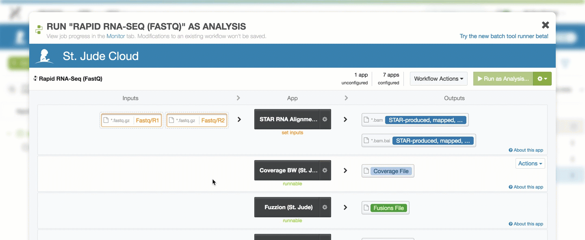
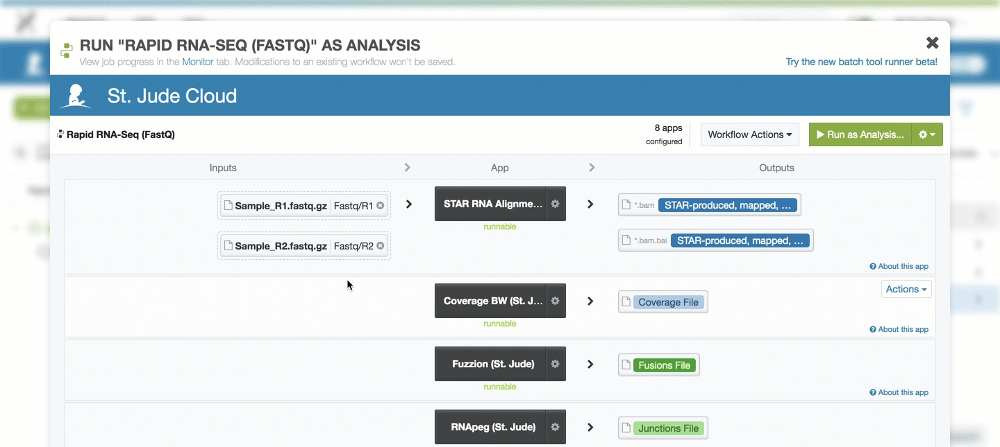

|                       |                                            |
| --------------------- | ------------------------------------------ |
| **Authors**           | Scott Newman, Clay McLeod, Yongjin Li      |
| **Publication**       | N/A (not published)                        |
| **Technical Support** | [Contact Us](https://stjude.cloud/contact) |

Fusion genes are important for cancer diagnosis, subtype definition and
targeted therapy. RNASeq is useful for detecting fusion transcripts; however, computational methods face challenges to identify fusion transcripts
due to events such as internal tandem duplication (ITD), multiple genes, low
expression, or non-templated insertions. To address some of these challenges, St. Jude Cloud offers "Rapid RNA-Seq", an end-to-end
clinically validated pipeline that detects gene fusions and ITDs from human RNA-Seq.

## Overview

**Inputs**

The input can be either of the two entries below, based on whether you want to start
with FastQ files or a BAM file.

| Name | Description | Example |
|--|--|--|
| Paired FastQ files | Gzipped FastQ files generated by human RNA-Seq | Sample_R1.fastq.gz and Sample_R2.fastq.gz |
| BAM file | Aligned reads file from human RNA-Seq | Sample.bam |

!!! caution
    If you provide a BAM file to the pipeline, it **must** be aligned to GRCh37-lite.
    Running a BAM aligned to any other reference genome is not supported. Maybe more
    importantly, we do not check the genome build of the BAM, so errors in computation
    or the results can occur. If your BAM is *not* aligned to this genome build, we 
    recommend converting the BAM back to FastQ files using 
    [Picard's SamToFastq](https://broadinstitute.github.io/picard/command-line-overview.html#SamToFastq)
    functionality and using the FastQ version of the pipeline.

**Outputs**

The Rapid RNA-Seq pipeline produces the following outputs:

| Name | Description |
|--|--|
| Predicted gene fusions (.txt) | File containing putative gene fusions. |
| Coverage file (.bw) | bigWig file containing coverage information. |
| Splice junction read counts (.txt) | Read counts for the splice junction detected. |
| Interactive fusion visualization | Fusion visualization produced by ProteinPaint. |
| Interactive coverage visualization | Coverage visualization produced by ProteinPaint. |

**Process**

1. The raw sequence data is aligned to GRCh37-lite using standard STAR
   mapping.
2. A coverage bigWig (.bw) file is produced to allow the user to assess
   sample quality across the genome.
3. Two gene fusion detection algorithms are run in parallel.
    * The **Fuzzion** (Rice et al. unpublished data) fusion detection
      algorithm is run to provide high sensitivity for recurrent gene
      fusions.
    * The **RNAPEG** (Edmonson et al. unpublished data) splice
      junction read counting algorithm is run to quantify read counts
      for splice junctions. These splice junction read counts are then
      used by **Cicero** (Li et al. unpublished data) to detect
      putative gene fusions.
4. Custom visualizations for putative gene fusions and genome coverage
   are produced by ProteinPaint.

**Mapping**

We use the [STAR aligner](https://www.ncbi.nlm.nih.gov/pmc/articles/PMC3530905/) 
to rapidly map reads to the GRCh37 human reference genome. This step generally 
takes around one hour to complete assuming approximately 55-75 million paired reads
are supplied.

**Coverage**

Internally developed scripts calculate the coverage of mapped reads
genome wide. The resulting bigWig file can be viewed in ProteinPaint or
used for quality control.

**Splice junction read quantification**

We use our RNAPEG software to quantify reads spanning known and novel
splice junctions. RNAPEG also corrects improper mappings at splice
junction boundaries for more accurate definition of novel splice
junctions. The resulting junctions file can be viewed along with the
coverage bigWig file to gain insights into gene expression and splicing
patterns

**Genome-wide fusion prediction**

We developed an assembly-based algorithm CICERO (Clipped-reads Extended
for RNA Optimization) that is able to extend the read-length spanning
fusion junctions for detecting complex fusions. CICERO finds clipped
reads and junction spanning reads, assembles them into a contig and maps
the contig back to the reference genome. Mapped contigs are then
annotated and filtered. Those with potential genic effects including
gene fusion, ITD, readthrough or circular RNA are reported in the
`final_fusions.txt` file. An interactive version of this file with
predictions sorted by quality can be inspected with the ProteinPaint
interactive fusion viewer.

An abstract describing CICERO was presented at ASHG, 2014:
<http://www.ashg.org/2014meeting/abstracts/fulltext/f140120024.htm>

**Low stringency fusion gene "Hotpot" search**

We have observed that certain fusions such as KIAA1549-BRAF in low-grade
glioma have apparently limited read support in the bam file — either due
to low expression or low tumor purity. In these cases, we use a
secondary tool, FUZZION, that performs fuzzy matching for known fusion
gene junctions for every read in the bam file (both mapped and
unmapped). FUZZION can recover even a single low quality read
potentially supporting a known fusion gene junction. The FUZZION output
is a simple text file with read IDs and sequences supporting a
particular gene fusion. The fusion point is indicated with square
brackets `[]`.

## Getting started

!!! caution
    This pipeline assumes GRCh37-lite coordinates. If your BAM is 
    *not* aligned to this genome build, we recommend converting the BAM 
    back to FastQ files using [Picard's SamToFastq](https://broadinstitute.github.io/picard/command-line-overview.html#SamToFastq)
    functionality.

To get started, you need to navigate to the [Rapid RNA-Seq tool page](https://platform.stjude.cloud/tools/rapid_rna-seq). You'll need to click
the "Start" button in the left hand pane. This creates a cloud workspace
in DNAnexus with the same name as the tool. After this, you will be able 
to upload your input files to that workspace.

!!! note
    If you can't see the "Start" button, one of these two scenarios is likely the case:

    * You see three buttons on the left sidebar instead of one. In this case,
      you've already clicked the "Start" button previously, and a cloud workspace has
      already been created for you. In this case, you're good! You can move
      on to the next section.
    * If you cannot see *any* buttons on the left side, you probably have not
      logged in yet. If you see a sentence that says "Log in to launch this 
      tool", simply login and try again.

    If neither of these are the case and you still can't click "Start",
    [contact us](https://stjude.cloud/contact).

## Uploading data

The Rapid RNA-Seq pipeline takes either a paired set of Gzipped FastQ files or 
a GRCh37-lite aligned BAM from human RNA-Seq. You can upload your input file(s)
using the [data transfer application](../data/data-transfer-app.md)
or by uploading them through [the command line](../data/command-line.md).
Both of the guides linked here will contain more details on how to upload
data using that method, so we defer to those guides here.

## Running the tool

Once you've uploaded data to your cloud workspace, click "Launch Tool" on the [tool's landing page](https://platform.stjude.cloud/tools/rapid_rna-seq). A dropdown will present the different presets for running the workflow. Here, you can select whether you wish to start with FastQ files or a BAM file.

### Hooking up inputs

Next, you'll need to hook up the FastQ files you uploaded in 
[the upload data section](#uploading-data). In this example,
we are using the FastQ version of the pipeline, so you can 
hook up the inputs by clicking on the `Fastq/R1` and `Fastq/R2`
slots and selecting the respective files. If you are using 
the BAM-based workflow, the process is similar.

### Starting the workflow

Once your input files are hooked up, you should be able to start the workflow
by clicking the "Run as Analysis..." button in the top right hand corner
of the workflow dialog.

!!! tip
    If you cannot click this button, please ensure that all of the inputs are correctly hooked up (see [hooking up inputs](#hooking-up-inputs)).

    If you're still have trouble, please [contact us](https://stjude.cloud/contact) and include
    a screenshot of the workflow screen above.

## Monitoring run progress

Once you have started one or more Rapid RNA-Seq runs, you can safely close your
browser and come back later to check the status of the jobs. To do this,
navigate to the [tool's landing page](https://platform.stjude.cloud/tools/rapid_rna-seq). 
Next, click "View Results" then select the "View Running Jobs" option. 
You will be redirected to the job monitoring page. Each job you kicked off
gets one row in this table.

 

You can click the "+" on any of the runs to check 
the status of individual steps of the Rapid RNA-Seq pipeline.
Other information, such as time, cost of individual steps in the pipeline, 
and even viewing the job logs can accessed by clicking around the sub-items.

 

!!! tip 
    Power users can refer to the [DNAnexus Monitoring Executions Documentation](https://documentation.dnanexus.com/user/running-apps-and-workflows/monitoring-executions) for advanced capabilities for monitoring jobs.

## Analysis of results

Each tool in St. Jude Cloud produces a visualization that makes understanding
results more accessible than working with Excel spreadsheets or tab delimited
files. This is the primary way we recommend you work with your Rapid RNA-Seq results. We also
include the raw output files for you to dig into if the visualization is not 
sufficient to answer your research question.

### Finding the raw results files

Navigate to the [tool's landing page](https://platform.stjude.cloud/tools/rapid_rna-seq). 
In the left hand pane, click "View Results" then "View Results Files". You will
be taken to the filesystem view your cloud workspace. This is similar to your the
filesystem on your computer, and you can do many common operations such as deleting,
renaming, and moving files.

 

### Navigating Results

#### Raw result files

Navigate to your tool's description page (for instance, Rapid RNA-Seq's
description page is
[here](https://platform.stjude.cloud/tools/rapid_rna-seq)). You should
see a screen similar to the one in the screenshot below. In the left
hand pane, select "View Results Files".

You should now be in the tool's workspace with access to files that you
uploaded and results files that are generated. How/where the result
files are generated are specific to each pipeline. Please refer to your
individual pipeline's documentation on where the output files are kept.

#### Custom visualization results

Navigate to your tool's description page (for instance, Rapid RNA-Seq's
description page is
[here](https://platform.stjude.cloud/tools/rapid_rna-seq)). You should
see a screen similar to the one in the screenshot below. In the left
hand pane, select "Visualize Results".

You should now see a list of visualization files like the ones shown below.

### Interpreting results

The complete output file specification is listed in the [overview section](#overview)
of this guide. Here, we will discuss each of the different output files in more detail.

* **Predicted gene fusions**: The putative gene fusions will be
  contained in the file `[SAMPLE].final_fusions.txt`. This file is a
  tab-delimited file containing many fields for each of the predicted
  SV. The most important columns are the following.

| Field Name | Description |
|--|--|
| `sample` | Sample name |
| `gene*` | Gene name |
| `chr*` | Chromosome name |
| `pos*` | Genomic Location |
| `ort*` | Strand |
| `reads*` | Supporting reads |
| `medal` | Estimated pathogenicity assessment using St. Jude Medal Ceremony |

* **Coverage file**: A standard
    [bigWig](https://genome.ucsc.edu/goldenpath/help/bigWig.html) file
    used to describe genomic read coverage.
* **Splice junction read counts**: A custom file format describing the
    junction read counts. The following fields are included in the
    tab-delimited output file.

| Field Name  | Description |
|--|--|
| `junction` | Splice junction in the TCGA format "chrX:start:+,chrX:end,+". "start" and "end" are the 1-based position of the last mapped nucleotide before the skip and the first mapped nucleotide after the skip (i.e. the last base of the previous exon and the first base of the next exon). Note that in `.bed` output these coordinates will be different, see the .bed output section below. The "+" is currently hardcoded, though this may change in the future. |
| `count` | Raw count of reads supporting the junction. During correction counts for ambiguous junctions can be combined, though obviously these additional reads will not be visible in the raw BAM file. |
| `type` | Either "known" (matching a reference junction) or "novel" (not observed in the reference junction collection). |
| `genes` | Gene symbols from the junction calling process. These still need work in the raw junction calling process, it's recommended to use the "annotated" output files instead which assign matching HUGO gene symbols based on the UCSC refGene table. |
| `transcripts` | List of known transcript IDs matching the junction. |
| `qc_flanking` | Count of supporting reads passing flanking sequence checks (junctions observed adjacent to read ends require 18+ nt of flanking sequence, otherwise 10+ nt). |
| `qc_plus` | Count of supporting reads aligned to the + strand. |
| `qc_minus` | Count of supporting reads aligned to the - strand. |
| `qc_perfect_reads` | Count of supporting reads with perfect alignments (no reference mismatches of quality 15+, indels, or soft clips). |
| `qc_clean_reads` | Count of supporting reads whose alignments are not perfect but which have a ratio of <= 5% of reference mismatches of quality 15+, indels, or soft clips relative to the count of aligned bases on both the left and right flanking sequence. Note: qc_clean_reads does NOT include qc_perfect_reads: to get a count of "perfect plus pretty good" reads the two values must be added together. |

## Known issues

!!! caution "Adapter contamination"
    This pipeline does not, at present, remove adapter sequences. If the
    sequencing library is contaminated with adapters, CICERO runtimes can
    increase exponentially. We recommend running FastQ files through a QC
    pipeline such as FastQC and trimming adapters with tools such as
    Trimmomatic if adapters are found.

!!! caution "High coverage regions"
    Certain cell types show very high transcription of certain loci, for
    example, the immunoglobulin heavy chain locus in plasma cells. The
    presence of very highly covered regions (typically 100,000-1,000,000+ X)
    has an adverse effect on CICERO runtimes. Presently, we have no good
    solution to this problem as strategies such as down-sampling may reduce
    sensitivity over important regions of the genome.

!!! bug "Interactive Visualizations Exon vs Intron Nomenclature"
    When a codon is split over a fusion gene junction, the annotation
    software marks the event as intronic when really, the event should be
    exonic. We are working to fix this bug. In the mean time, if a fusion is
    predicted to be in frame but the interactive plot shows "intronic", we
    suggest the user blat the contig shown just below to clarify if the true
    junction is either in the intron or exon.

## Frequently asked questions

None yet! If you have any questions not covered here, feel free to reach
out on [our contact form](https://hospital.stjude.org/apps/forms/fb/st-jude-cloud-contact/).
