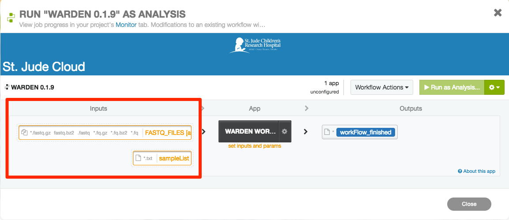
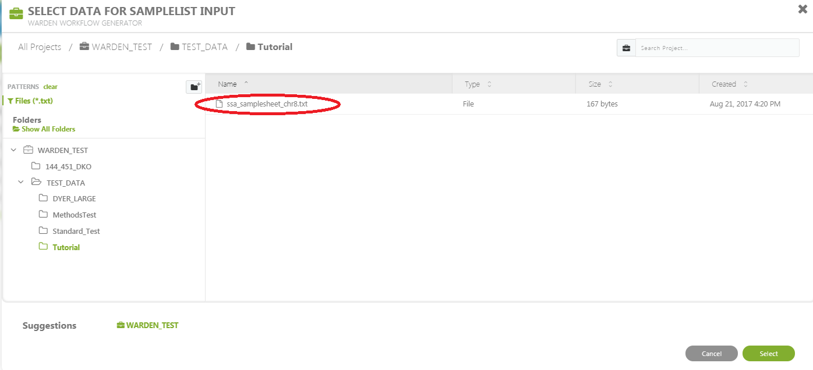
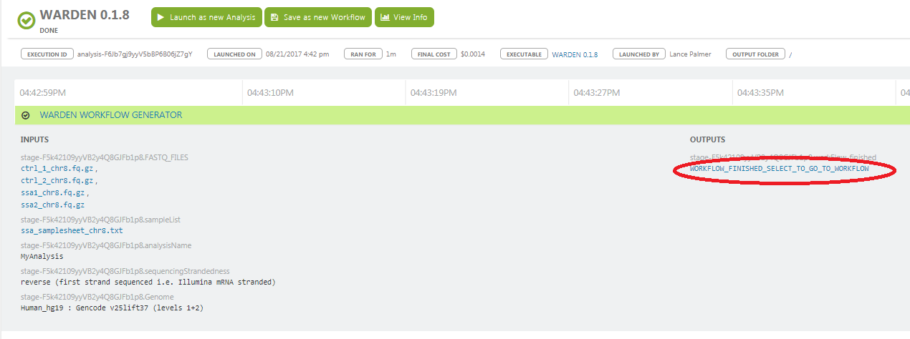
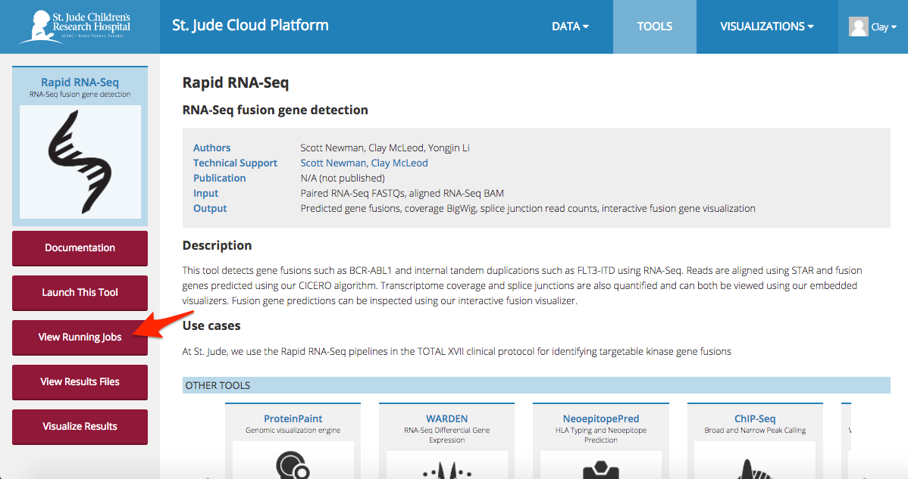
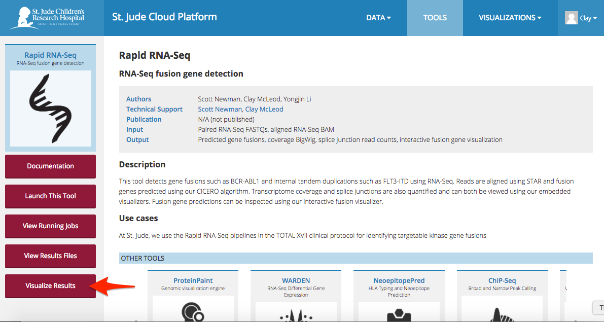
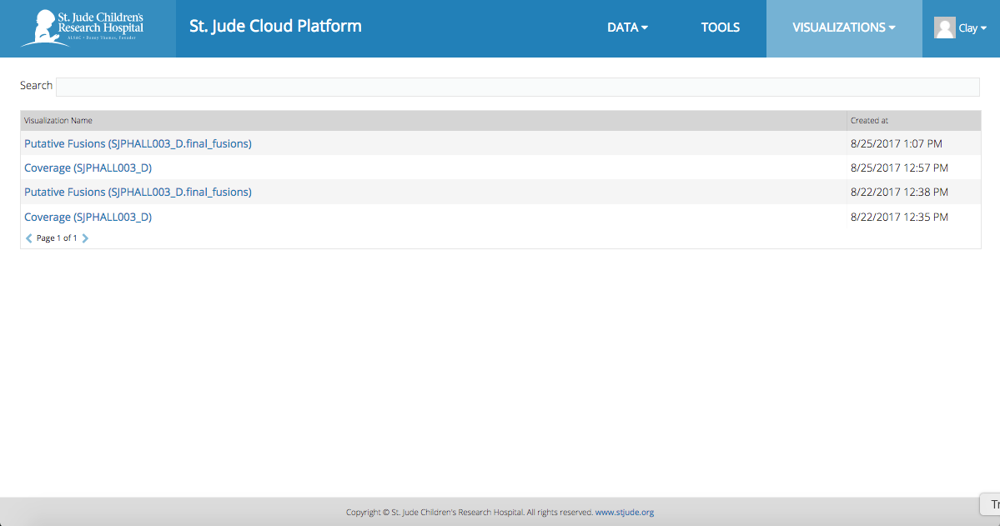
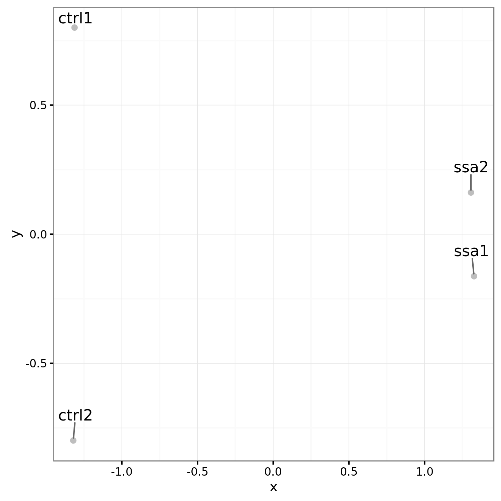
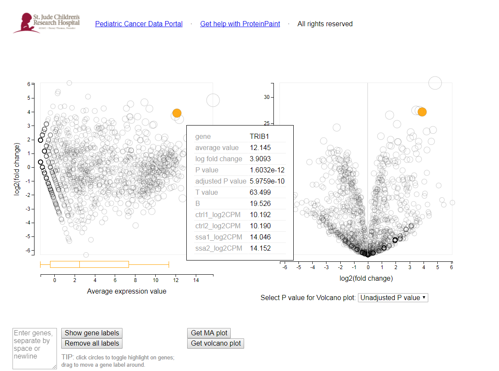

| | |
|-------------|--------------|
| **Authors** | Lance Palmer |
| **Publication** | N/A (not published) |
| **Technical Support** | [Contact Us](https://stjude.cloud/contact) |

## Introduction
The WARDEN (Workflow for the Analysis of RNA-Seq Differential ExpressioN)
software uses RNA-Seq sequence files to perform alignment, coverage
analysis, gene counts and differential expression analysis.

<h2>Contents</h2>
overview operation monitoring navigate results faq

## Overview

### Process

RNA-Seq FASTQ files are mapped to a reference genome using the STAR.
Htseq-count is used to assign mapped reads to genes. Differential
expression analysis is performed using VOOM normalization of counts and
LIMMA analysis. Coverage plots of mapped reads are also generated.

### Inputs

The WARDEN workflow requires 2 types of input files and along with two
required parameters to be set. All other parameters are preset.

<table>
<colgroup>
<col style="width: 16%" />
<col style="width: 10%" />
<col style="width: 54%" />
<col style="width: 18%" />
</colgroup>
<thead>
<tr class="header">
<th>Name</th>
<th>Type</th>
<th>Description</th>
<th>Example</th>
</tr>
</thead>
<tbody>
<tr class="odd">
<td>FastQ files</td>
<td>Input file</td>
<td>Gzipped FastQ files generated by experiment</td>
<td><em>.fastq.gz,</em>.fq.gz</td>
</tr>
<tr class="even">
<td>Sample sheet</td>
<td>Input file</td>
<td>Sample sheet generated and uploaded by the user</td>
<td>*.txt</td>
</tr>
<tr class="odd">
<td>Reference genome</td>
<td>Parameter</td>
<td>Supported reference genome (HG19, HG38, mm9, mm10, dm3, dm6)</td>
<td>HG38</td>
</tr>
<tr class="even">
<td>Sequencing method</td>
<td>Parameter</td>
<td>Sequencing method of experiment (forward, reverse, unstranded)</td>
<td>forward</td>
</tr>
</tbody>
</table>

### Outputs

<table>
<colgroup>
<col style="width: 20%" />
<col style="width: 80%" />
</colgroup>
<thead>
<tr class="header">
<th>Name</th>
<th>Description</th>
</tr>
</thead>
<tbody>
<tr class="odd">
<td>FastQC Report</td>
<td>Quality control analysis by FastQC</td>
</tr>
<tr class="even">
<td>Aligned BAM</td>
<td>Aligned BAM files from STAR mapping</td>
</tr>
<tr class="odd">
<td>Splice junctions</td>
<td>Splice junction information from STAR mapping</td>
</tr>
<tr class="even">
<td>Coverage files</td>
<td>bigWig (.bw) and BED (.bed) files detailing coverage</td>
</tr>
<tr class="odd">
<td>Gene counts</td>
<td>Gene counts generated by HT-Seq count</td>
</tr>
<tr class="even">
<td>VOOM/LIMMA results</td>
<td>Pairwise comparisons of expression data. Requires at least 3 samples vs 3 samples</td>
</tr>
<tr class="odd">
<td>Simple DE analysis</td>
<td>No statistical analysis, requires only a 1 samples vs 1 sample comparison</td>
</tr>
<tr class="even">
<td>MA/Volcano plots</td>
<td>Both of the above produce tabular outputs, MA plots and volcano plots</td>
</tr>
</tbody>
</table>

## Pipeline Operation

### Uploading Data

The WARDEN Differential Expression analysis pipeline takes Gzipped FastQ
files generated from RNA-Seq data as input. You can upload the files you
would like to run using the desktop-application
or by uploading data manually using the commandline.

!!! note
    You should click "Start" before attempting to upload data to the tool
    (the tool's workspace is only created once you do this). After you are
    redirected, you can safely close the tab that was just opened.

### Sample Sheet Preparation

Once your data is uploaded, you'll need to create a sample sheet which
describes the relationship between case and control samples,
phenotype/condition information, and the comparisons you would like to
perform. The sample sheet is a tab-delimited text document that can be
created in Microsoft Excel (recommended) or a text editor.

!!! note
    You will also need to upload your sample sheet following the
    instructions at warden-upload.

#### Microsoft Excel

**Recommended**: Download the sample excel spreadsheet &lt;../../images/guides/tools/warden/samplesheet.xlsx&gt;.

The final product for the excel spreadsheet will look like this. The
screenshot below. If you create the sample sheet from scratch, please
ensure the the columns are *exactly* in this order.

> 

**Sample Rows**

Each row in the spreadsheet (disregarding the last row) corresponds to a
sample (either one or two fastq files). You should fill in these rows
based on your data.

!!! tip
    Please use these guidelines when filling in the sample sheet.

    -   The sample name should be unique and should only contain letters,
        numbers and underscores.
    -   The condition/phenotype column associates similar samples together.
        The values should contain only letters, numbers and underscores.
    -   ReadFile1 should contain forward reads (e.g. `*.R1.fastq.gz` or
        `*_1.fastq.gz`)
    -   ReadFile2 will contain reads in reverse orientation to ReadFile2.
        (e.g. `*.R2.fastq.gz` or `*_2.fastq.gz`).
    -   For single end reads a single dash ('-') should be entered in the
        ReadFile2 column.

**Comparison Row**

The last line in the sample sheet is called the "comparison row". This
line specifies the comparisons to be done between conditions/phenotypes.
All pairwise combinations can be analyzed. To specifiy the comparisons,
on a seperate line, include `#comparisons=` followed be a comma
separated list of two conditions separated by a dash. The following
lines are all valid examples.

1.  `#comparisons=KO-WT`
2.  `#comparisons=Condition1-Control,Condition2-Control`
3.  `#comparisons=Phenotype2-Phenotype1,Phenotype3-Phenotype2,Phenotype3-Phenotype1`

!!! note
    If a comparison has at least 3 samples for each condition/phenotype,
    VOOM/LIMMA will be run. A simple differential comparison will be run on
    all samples.

**Finalizing the Sample Sheet**

To finalize the sample sheet, save the Microsoft Excel file with
whatever name you like. Save the file as an Excel Workbook with the
.xlsx extension.

#### Text Editor

Creating a sample sheet with a text editor is an option for advanced
users.

**Recommended**: Download the sample text file &lt;../../images/guides/tools/warden/samplesheet.txt&gt;.

The process of creating a sample sheet with a text editor is the same as
creating one with Microsoft Excel, with the small difference that you
must manually create your columns using the tab character. Save the file
with a .txt extension.

### Pipeline Configuration

Click “Start” on the [tool’s landing
page](https://platform.stjude.cloud/tools/warden). You will be
redirected to the tool’s workspace, and the workflow screen should
automatically pop up.

!!! note
    The WARDEN tool operation is slightly different than the other pipelines
    because it accepts a variable number of samples. **First**, you will run
    a "bootstrapping" step that creates a custom executable for your
    analysis. **Second**, you will need to manually execute the generated
    workflow from the first step. This allows us to take advantage of many
    nice features, like checkpointing and cost-reduction.

#### Step 1: Bootstrap Workflow

The required inputs appear on the left side of the screen. You should
see an image similar to the picture below.

1.  Click on the `FASTQ_FILES` field.

    

2.  In the file dialog that pops up, select the FastQ files that will be
    included in the analysis. Where the FastQ files will be depends on
    how you uploaded them, but usually, they will either be in the main
    folder that pops up or the "uploads" folder in the left pane.

    

3.  Once you are done selecting FastQ files, press "Select".

    

4.  Click on the the `sampleList` input box.

    

5.  Select the sample sheet that you uploaded in warden-sample-sheet. This should be an Excel
    workbook with the .xlsx extension or a plain tab-delimited text file
    with a .txt extension.

    

All of the input files should now be hooked up. Next, we need to
configure the remaining parameters for the pipeline, such as reference
genome and sequencing method.

1.  Click on the black box labelled `WARDEN WORKFLOW GENERATOR`.

    

2.  In the `Output Folder` field, select a folder to output to. You can
    structure your experiments however you like (if you're not sure,
    just use `/`).

    

3.  In the `analysisName` field, enter a prefix for all of the output
    files.

    

4.  Select the `sequenceStandedness` pull down menu. Choose the
    appropriate box. This information can be determined from the
    sequencing or source of the data. If unknown select "no".

    

5.  Select the `Genome` pulldown menu. Choose the appropriate box.

    

6.  The LIMMA parameters can be left alone for most analyses. If you are
    an advanced LIMMA user, you can change the various settings exposed
    below the required parameters.
7.  When all parameters have been set, the save button can be selected.

    

Once your inputs are selected, you should be able to start the workflow
by clicking the "Run as Analysis..." button in the top right hand corner
of the workflow dialog.

Note

If you cannot click this button, please ensure that **(1)** all of the
inputs are correctly hooked up and **(2)** all of the required
parameters are set.

#### Step 2: Run Workflow

You will see the workflow generator running, similar to the screenshot
below.

> 

When the custom workflow has finished generating, the word 'Done' will
appear in green in the status column. This indicates that the
bootstrapping step has completed successfully. Now, you need to run the
custom workflow manually.

1.  Wait for the workflow generator to finish.
2.  Click on the WARDEN name in the name column.

    

3.  You will now be on a page specific to the running of the workflow.
    On the left side, you will see the inputs you selected for the
    workflow generator. On the right side are the output files
    (including the generated workflow). Select the generated workflow as
    shown in the picture below.

    

4.  You will now be within the output folder you specified earlier.
    Select the file that begins with 'WARDEN WORKFLOW:'

    

5.  A workflow generated for your data will be presented to you. Select
    'Run as analysis' in the upper right.

    

6.  The workflow will initiate, and you will be brought to the 'Monitor'
    page. (Note to get back to this page, you can select 'Monitor' on
    one of the menu bars near the top ) Expand the the workflow progress
    be selecting the '+' sign next to 'In Progress'

    

7.  As parts of the pipeline are run, you will see different tasks in
    different colors. Green means done, blue is running, orange is
    waiting, and red means error.

    

8.  When done the status will be shown as 'Done'. Select the Workflow
    name under Status.

    

9.  You will be brought to a page that show more information about the
    workflow analysis. Click on the output folder to go to the output.

    

10. The output folders will now be shown.

    

For a description of the output, please refer to warden-results.

## Monitoring Run Progress

!!! note
    Monitoring the progress of your runs is the same for all pipelines. This
    guide will feature the rapid-rnaseq pipeline,
    but you can follow along for any tool.

Monitoring the status of your pipelines in the St. Jude Cloud is simple.
First, navigate to your tool's description page (for instance, Rapid
RNA-Seq's description page is
[here](https://platform.stjude.cloud/tools/rapid_rna-seq)). You should
see a screen similar to the one in the screenshot below. In the left
hand pane, select "View Running Jobs".

Here, you will see a list of all of your previous runs for a tool, as
well as the job status (successful, failed, terminated by user) and
cost. You can click on the "+" icon to the left of each tool run to see
all of the different tools that were run.

Other information, such as time, cost of individual job, and even job
logs are available by clicking on the sub-items.

!!! note
    Advanced users can view the [DNAnexus Job Monitoring Tutorial](https://wiki.dnanexus.com/UI/Jobs) and the [DNAnexus Command
    Line Tutorial for Job Monitoring](https://wiki.dnanexus.com/Command-Line-Client/Monitoring-and-Listing-Jobs)
    for more information.

## Navigating Results

!!! note
    Navigating to the raw results of your runs is the same for all
    pipelines. This guide will feature the rapid-rnaseq pipeline, but you can follow along for
    any tool.

### Raw result files

Navigate to your tool's description page (for instance, Rapid RNA-Seq's
description page is
[here](https://platform.stjude.cloud/tools/rapid_rna-seq)). You should
see a screen similar to the one in the screenshot below. In the left
hand pane, select "View Results Files".

You should now be in the tool's workspace with access to files that you
uploaded and results files that are generated. How/where the result
files are generated are specific to each pipeline. Please refer to your
individual pipeline's documentation on where the output files are kept.

### Custom visualization results

Navigate to your tool's description page (for instance, Rapid RNA-Seq's
description page is
[here](https://platform.stjude.cloud/tools/rapid_rna-seq)). You should
see a screen similar to the one in the screenshot below. In the left
hand pane, select "Visualize Results".

You should now be in the tool's workspace with access to files that you
uploaded and results files that are generated. How/where the result
files are generated are specific to each pipeline. Please refer to your
individual pipeline's documentation on where the output files are kept.

## Analysis of Results

### Initial analysis of results

#### Alignment statistics

Several files should be examined initially to determine the quality of
the results. **alignmentStatistics.txt** shows alignment statistics for
all samples. This file is a plain text tab-delimited file that can be
opened in Excel or a text editor such as Notepad++. This file contains
information on the total reads per sample, the percantage of duplicate
reads and the percentage of mapped reads. An example of this file is
below. (Within the DNAnexus output directory structure, these files will
be in the COMBINED\_FLAGSTAT directory.)

> 

#### Multidimensional scaling (MDS) Plot

The second set of files to look at are the Multidimensional scaling
(MDS) plots (<https://en.wikipedia.org/wiki/Multidimensional_scaling>)
using the plotMDS function within LIMMA. Similar to PCA, these graphs
will show how similar samples are to each other. There are different
sets of MDS plots. For comparisons where there are 3 or more samples per
condition, an MDS plot using Voom (Limma) normalized values are
generated. An example can be seen below. These files will be labeled
**mdsPlot.png**. For all comparisons, regardless of sample size, and MDS
plot will also be generated with Counts per million (CPM) normalized
gene counts. These files will be labeled **mdsPlot.normCPM.png**.
(Within the DNAnexus output directory structure, these files will be in
the LIMMA directory.)

MDS plot from just CPM normalized data.

### ProteinPaint Visualizations

Several files on DNAnexus allow the data to be viewed in the Protein
Paint viewer. (Note: We plan to have links downloaded in the future to
allow the viewing of these files off of DNAnexus.)

**LIMMA differential expression viewer**

Within LIMMA/VIEWERS direcory (note if no comparisons meet the 3 sample
condition, the LIMMA folder will not exist), there will be a viewer file
for each valid comparison ( \**results.*.txt.viewer\*\*). Simply select
the file and press 'Launch viewer' in the lower right. A viewer will pop
up showing both the MA Plot and Volcano plot. By moving the mouse over a
circle, the circle will hilight and the corresponding gene on the other
graph will also hilight. Additional information about the gene and its
expression values will also be shown. One can also type in multiple gene
symbols in the provided text box. By pressing 'Show gene labels' all
these genes will show up on the plots.

**Simple differential expression viewer**

There will also be a viewer for the simple differential expresssion
analysis in SIMPLE\_DIFEX/VIEWERS. The P-value for the results have all
been set to 1, so the volcano plot will not be relevant.

**bigWig viewer**

In the BIGWIG\_VIEWER directory there will be a bigwigViewer file.
Select this file and then 'Launch viewer'. A graph of coverage for the
genome should be visible.

### Additional Results

**Interactive MA/Volcano Plots**

In addition to viewing the MA and volcano plots through the
visualization tool

**Differential expression results**

Other useful differential expression results will be downloaded by the
desktop app. This included tabular output from the differential
expression analysis. For each comparison with three or more samples per
condition, \**results.*.txt\*\* will be produced.

**GSEA.input.*.txt*\* and**GSEA.tStat.*.txt*\* are input files that can
be used for GSEA analysis. The tStat file is preferred for a more
accurate analysis, but will not give a heatmap diagram.

(Within the DNAnexus output directory structure, these files will be in
the LIMMA directory.)

For plain text results from the simple differential expresison analysis,
the files will be named \**simpleDE.*.txt\*\*.

(Within the DNAnexus output directory structure, these files will be in
the SIMPLE\_DIFEX directory.)

Prelabelled MA and volcano plots are provided for the analysis. These
files are labeled **maPlot.*.png*\* amd**volcanoPlot.*.png*\* where '\*'
is the comparison (e.g. ko\_vs\_wt)

The MA plot shows the average expression of the gene on the X-axis, and
Log2 fold change between condition/phenotype is on the Y-axis (if the
name is for example maPlot.condition2-condition1.png then the fold
change would represent condition1 minus condition2). Each gene is
represented by a circle. The top 20 genes (by p-value) are identified on
the plot. The genes are color coded by the chosen multiple testing
correction method (False Discovery Rate (FDR) by default. An exmaple MA
plot can be seen below.

(Within the DNAnexus output directory structure, these files will be in
the LIMMA directory.)

The volcano plot shows the Log2Fold change between the conditions on the
X-axis, and the -Log10 of the multiple testing corrected P-value on the
Y-axis.

An MA plot is generated for all comparisons regardless of number of
samples. This is the \**simpleDEPlot.*.png\*\* no statistics are shown
and genes are not labeled.

(Within the DNAnexus output directory structure, these files will be in
the SIMPLE\_DIFEX directory.)

**Differential analysis input**

Inputs and commands are provided for rerunning differential expression
analysis on ones own computer. The R commands used for the analysis are
found in **voomLimma.R**. An experienced R user can rerun the analysis
with any desired changes. This analysis requires the input
**countFile.txt** which contains counts per genes, the
**Rparameters.txt** file containing input parameters, and a processed
sample list file **sampleList.txt**

(Within the DNAnexus output directory structure, these files will be in
the LIMMA directory.)

The input for the simple differential analysis expression will be
**Rparameters\_simple.txt**, **simpleDE.R**, **countFile.txt** and
**sampleList.txt**. **countFile.txt** and **sampleList.txt** are the
same files used by the LIMMA analysis.

(Within the DNAnexus output directory structure, these files will be in
the SIMPLE\_DIFEX directory.)

**Coverage results**

bigWig files will be generated for use in genome browsers (such as IGV
<http://software.broadinstitute.org/software/igv/>). For each smaple,
multiple bigWig files will be found. For all types of sequencing
strandedness, there will be bigWig files labelled,
**\*.sortedCoverageFile.bed.bw** where '*' is the sample name. For
stranded data there will also be\*.sortedPosCoverageFile.bed.bw*\* and
**\*.sortedNegCoverageFile.bed.bw** which contains coverage information
for the positive and negative strand of the genome.

(Within the DNAnexus output directory structure, these files will be in
the BIGWIG directory.)

**Quality Control Results (FASTQC)**

Within the FASTQC directory, foreach sample and read direction there
will be an html file and a zip file (**\*.fastqc.html**
**\*.fastqc.zip** where '\*' is the base FastQ name), containing results
from FASTQTC. For the average user the html file is sufficient. This
file can give some basic statistics on the quality of the data.

(Within the DNAnexus output directory structure, these files will be in
the FASTQC directory.)

**BAM alignment files**

There are two BAM files generated per sample that contain mapping
information for all reads. The first is labeled
**\*.Aligned.sortedByCoord.dup.bam** where '*' is the sample name. The
BAM file is sorted by coordinates and has duplicates marked. The second
file is\*.Aligned.toTranscriptome.out.bam*\* and contains reads mapped
to transcripts.

(Within the DNAnexus output directory structure, these files will be in
the ALIGN directory.)

**Chimeric reads and junction files**

Additional files created by STAR are provided. More information on these
files can be found at
<http://labshare.cshl.edu/shares/gingeraslab/www-data/dobin/STAR/STAR.posix/doc/STARmanual.pdf>.
**\*.SJ.out.tab** contain splice junction information. Fusion detectino
files are labelled **\*.Chimeric.out.bam** and
**\*.Chimeric.out.junction**.

(Within the DNAnexus output directory structure, these files will be in
the ALIGN directory.)

**FPKM and count files (per sample)**

Per sample files containing FPKM and raw count values for each gene can
be found in **\*.fpkm.txt** and **\*.htseq\_counts.txt** where '\*' is
the sample name.

(Within the DNAnexus output directory structure, these files will be in
the **NOTE FIND OUT WHICH DIRECOTRRY** directory.)

#### Methods Files

A more human readable explanation is found in **methods.docx**. Detailed
documentation can be found in **methods.txt**

(Within the DNAnexus output directory structure, these files will be in
the METHODS directory.)

#### Auxilary Files

This section describes the files that exist within the DNAnexus output
folder. Most of these files will not be of interest to the average user.
However, interactive viewers are describe in [LIMMA differential
expression viewer](#limma-differential-expression-viewer) and [Simple
differential expression viewer](#simple-differential-expression-viewer).

The output will be divided into multiple folders. The results being the
most useful will be the differential expression analysis results in the
LIMMA and SIMPLE\_DIFEX folders. Bigwig files for viewing read coverage
will be in the BIGWIG folder. Other folder contain different types of
data and are explained in further detail below.

> 

The following description of files is sorted by their output directory.

**ALIGN**

This directory contains the BAM files described in [BAM alignment
files](#bam-alignment-files) and the chimeric and junction files are
described in [Chimeric reads and junction
files](#chimeric-reads-and-junction-files). In adition there are 2 log
files. **\*Log.final.out** has relevant statistics for the alignemnt.
The **\*.Log.out** file just contains a log of the analysis run,
including input parameters. Per sample FLAGSTAT results are found in
**\*.flagStatOut.txt**. These flagstat files are combined into the file
**alignmentStatistics.txt** described in [Initial analysis of
results](#initial-analysis-of-results). Finally the ALIGN directory has
multiple *.starAlign.methods.txt files. These files can be ignored as
they are summarized in the finalmethods.docx*\* and **methods.txt**
files described in [Methods Files](#methods-files).

**BIGWIG**

All of the files here are described in section [Coverage
results](#coverage-results). The **bgToBw.methods.txt** files can be
ignored as they are summarized in the files described in [Methods
Files](#methods-files).

**BIGWIG_VIEWER**

See [bigWig viewer](#bigwig-viewer)

**COMBINED_FLAGSTAT**

!!! todo
    Describe combined flagstat.

**COMBINED_HTSEQ**

Used for input in differential expression analysis. The
combineCountFile.txt is the same as countFile.txt described in
[Differential analysis input](#differential-analysis-input)

**COVERAGE**

BED graph files used to generate bigWig files are here.

**FASTQC**

See [Quality Control Results (FASTQC)](#quality-control-results-fastqc)

**HTSEQ**

Per-sample HTSEQ-count results (**\*.htseq\_counts.txt**) and FPKM
results (**\*.fpkm.txt**). Temporary methods files are found as
\*.htseq-count.methods.txt

**LIMMA**

**mdsPlot.png**, **maPlot.*.png,volcanoPlot.*.png** are described in
[Initial analysis of results](#initial-analysis-of-results)

**results.*.txt,GSEA.input.*.txt** and \**GSEA.tStat.*.txt\*\* are
describe in [Differential expression
results](#differential-expression-results)

**voomLimma.R**, **countFile.txt**, **Rparameters.txt**, and
**sampleList.txt** are described in [Differential analysis
input](#differential-analysis-input)

See [LIMMA differential expression
viewer](#limma-differential-expression-viewer) for a description of the
VIEWERS directory.

Other files in the LIMMA directory include contrastFiles.txt
contrastsFile.txt, and limmaSampleList.txt which are used internally.
limmaMethods.txt is an intermediate file describing methods. Out.tar.gz
is used for testing purposes. The sessionInfo.txt file describe the R
session working parameters and modules loaded. meanVariance.png is a
plot for assessing quality of count data
(<https://genomebiology.biomedcentral.com/articles/10.1186/gb-2014-15-2-r29>)

**METHODS**

The files here are described in [Methods Files](#methods-files).

**SAMPLELIST**

These files are used internally by the pipeline.

**SIMPLE_DIFEX**

**mdsPlot.normCPM.png** and \**simpleDEPlot.*.png\*\* are described in
[Initial analysis of results](#initial-analysis-of-results)

\**simpleDE.*.txt\*\* are describe in [Differential expression
results](#differential-expression-results)

**simpleDE.R**, **countFile.txt**, **Rparameters\_simple.txt**, and
**sampleList.txt** are described in [Differential analysis
input](#differential-analysis-input)

See [Simple differential expression
viewer](#simple-differential-expression-viewer) for a description of the
VIEWERS directory.

Other files in the SIMPLE\_DIFEX directory include contrastFiles.txt
contrastsFile.txt, and limmaSampleList.txt which are used internally.
simpleDifEx.methods.txt is an intermediate file describing methods.
Out.tar.gz is used for testing purposes. The sessionInfo.txt file
describe the R session working parameters and modules loaded.

## Frequently Asked Questions

None yet! If you have any questions not covered here, feel free to reach
out on [our contact
form](https://hospital.stjude.org/apps/forms/fb/st-jude-cloud-contact/).
