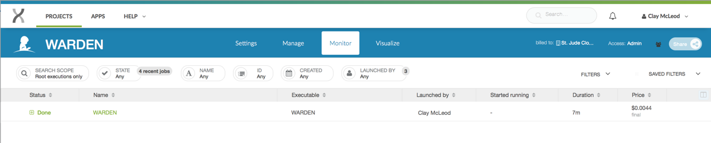

| | |
|-------------|--------------|
| **Authors** | Lance Palmer |
| **Publication** | N/A (not published) |
| **Technical Support** | [Contact Us](https://stjude.cloud/contact) |

The WARDEN (**W**orkflow for the **A**nalysis of **R**NA-Seq **D**ifferential **E**xpressio**N**)
software uses RNA-Seq sequence files to perform alignment, coverage
analysis, gene counts and differential expression analysis.

## Overview

**Inputs**

The WARDEN workflow requires 2 types of input files and along with two
required parameters to be set. All other parameters are preset with sane defaults.

| Name | Type | Description | Example |
|---|---|---|---|
| FastQ files (*required*) | Input file(s) | Gzipped FastQ files generated by experiment | Sample1.fastq.gz, Sample2.fastq.gz |
| Sample sheet (*required*) | Input file | Sample sheet generated and uploaded by the user | *.txt |

!!! todo
    Delete these if they are in the parameters below.

| Reference genome | Parameter | Supported reference genome (HG19, HG38, mm9, mm10, dm3, dm6) | HG38 |
| Sequencing method | Parameter | Sequencing method of experiment (forward, reverse, unstranded) | forward |

**Outputs**

| Name | Description |
|---|---|
| FastQC Report | Quality control analysis by FastQC. |
| Aligned BAM | Aligned BAM files from STAR mapping. |
| Splice junctions | Splice junction information from STAR mapping. |
| Coverage files | bigWig (`.bw`) and BED (`.bed`) files detailing coverage. |
| Gene counts | Gene counts generated by HT-Seq count. |
| VOOM/LIMMA results | Pairwise comparisons of expression data. Requires at least 3 samples vs 3 samples. |
| Simple DE analysis | No statistical analysis, requires only a 1 samples vs 1 sample comparison. |
| MA/Volcano plots | Both of the above produce tabular outputs, MA plots and volcano plots. |

**Process**

1. FastQ files generated by RNA-Seq are mapped to a reference genome using the STAR.
2. HT-Seq count is used to assign mapped reads to genes. 
3. Differential expression analysis is performed using VOOM normalization of counts and
LIMMA analysis. 
4. Coverage plots of mapped reads are generated as interactive visualizations.

## Getting started

To get started, you need to navigate to the [WARDEN tool page](https://platform.stjude.cloud/tools/warden). You'll need to click
the "Start" button in the left hand pane. This creates a cloud workspace
in DNAnexus with the same name as the tool. After this, you will be able 
to upload your input files to that workspace.

!!! note
    If you can't see the "Start" button, one of these two scenarios is likely the case:

    * You see three buttons on the left sidebar instead of one. In this case,
      you've already clicked the "Start" button previously, and a cloud workspace has
      already been created for you. In this case, you're good! You can move
      on to the next section.
    * If you cannot see *any* buttons on the left side, you probably have not
      logged in yet. If you see a sentence that says "Log in to launch this 
      tool", simply login and try again.

    If neither of these are the case and you still can't click "Start",
    [contact us](https://stjude.cloud/contact).

## Uploading data

The WARDEN Differential Expression analysis pipeline takes Gzipped FastQ
files generated by an RNA-Seq experiment as input. You can upload your input 
file(s) using the [data transfer application](../data/data-transfer-app.md)
or by uploading them through [the command line](../data/command-line.md).
Both of the guides linked here will contain more details on how to upload
data using that method, so we defer to those guides here.

!!! tip
    If you plan to upload data through the St. Jude Cloud Data Transfer application
    (recommended), you can click the "Upload Data" button in the left panel. If you
    have not already downloaded the app, do so by clicking "Download app". Once you
    have the app, you can click "Open app" to open the app with the tool's cloud 
    workspace already opened and ready to drag-and-drop files into it!

    For more information, check out the [data transfer application](../data/data-transfer-app.md) guide.

## Sample sheet

Once your data is uploaded, you'll need to create a sample sheet which
describes the relationship between case and control samples,
phenotype/condition information, and the comparisons you would like to
perform. The sample sheet is a tab-delimited text document that can be
created in Microsoft Excel (recommended) or a text editor.

!!! note 
    You will need to upload your sample sheet in a similar manner as your
    FastQ files, so you can follow the [same uploading instructions](#uploading-data) 
    to achieve this.

### Prepare using Microsoft Excel

!!! tip 
    Download the [<i class="material-icons material-icons-sjcloud-custom">file_download</i> sample excel spreadsheet](../../files/guides/tools/warden/samplesheet.xlsx) as a starting
    point!

The final product for the excel spreadsheet will look like the
screenshot below. If you create the sample sheet from scratch, please
ensure the the columns are **exactly** in this order.

> 

**Sample rows**

Each row in the spreadsheet (except for the last row, which we will talk 
about in the next section) corresponds to a sample with one or more FastQ files. You should fill in these rows based on your data and the guidelines below:

!!! example "Guidelines"
    * The sample name should be unique and should only contain letters,
    numbers and underscores.
    * The condition/phenotype column associates similar samples together.
    The values should contain only letters, numbers and underscores.
    * ReadFile1 should contain forward reads (e.g. `*.R1.fastq.gz` or `*_1.fastq.gz`).
    * ReadFile2 will contain reads in reverse orientation to ReadFile2
    (e.g. `*.R2.fastq.gz` or `*_2.fastq.gz`).
    * For single end reads a single dash ('-') should be entered in the ReadFile2 column.

**Comparison row**

The last line in the sample sheet is called the "comparison row". This
line specifies the comparisons to be done between conditions/phenotypes.
All pairwise combinations of the values in the "Phenotype" column can be 
analyzed. To specify the comparisons, on a separate line, include `#comparisons=` followed be a comma delimited list of two conditions separated by a dash. 

!!! example
    The following lines are all valid examples.

    1.  `#comparisons=KO-WT`
    2.  `#comparisons=Condition1-Control,Condition2-Control`
    3.  `#comparisons=Phenotype2-Phenotype1,Phenotype3-Phenotype2,Phenotype3-Phenotype1`

!!! note
    If a comparison has at least 3 samples for each condition/phenotype,
    VOOM/LIMMA will be run. A simple differential comparison will be run on
    all samples.

**Finalizing the sample sheet**

To finalize the sample sheet, save the Microsoft Excel file with
whatever name you like. Save the file as an Excel Workbook with the
.xlsx extension.

### Prepare using a text editor

!!! tip 
    Download the [<i class="material-icons material-icons-sjcloud-custom">file_download</i> sample text file](../../files/guides/tools/warden/samplesheet.txt) as a starting
    point!

Creating a sample sheet with a text editor is an option for advanced
users. The process of creating a sample sheet with a text editor is the same as
creating one with Microsoft Excel, with the small difference that you
must manually create your columns using the tab character. Save the file
with a .txt extension.

## Running the tool

!!! note
    The WARDEN tool operation is slightly different than the other pipelines
    because it accepts a variable number of samples. **First**, you will run
    a "bootstrapping" step that creates a custom executable for your
    analysis. **Second**, you will need to manually execute the generated
    workflow from the first step. This allows us to take advantage of many
    nice features, like check-pointing and cost reduction. Don't worry, 
    we'll show you how to do this step by step below.

Once you've uploaded data to your cloud workspace, click "Launch Tool" on the [tool's landing page](https://platform.stjude.cloud/tools/warden). You will be redirected to the virtual
cloud workspace with the workflow screen opened for you.

### Hooking up inputs

Next, you'll need to hook up the FastQ files and sample sheet
 you uploaded in [the upload data section](#uploading-data). 
Click the `FASTQ_FILES` input field and select **all** FastQ files.
Next, click the `sampleList` input field and select the corresponding
samplesheet.

### Selecting parameters

We now need to configure the parameters for the pipeline, such as reference
genome and sequencing method. You can access all of the available parameters 
by clicking on the `WARDEN WORKFLOW GENERATOR` substep.

!!! example "Parameter setup steps"
    1. In the `Output Folder` field, select a folder to output to. You can
    structure your experiments however you like (e.g. `/My_Outputs`)
    2. In the `analysisName` field, enter a prefix for all of the output files. This
    can be any value you want to use to remember this run. **Be sure to use underscores
    instead of spaces here!**
    3. Select the `sequenceStandedness` from the drop down menu. 
    This information can be determined from the sequencing or source 
    of the data. If you don't know what to put here, select "no".
    4. Select the `Genome` pulldown menu. Choose the appropriate box.
    5. The LIMMA parameters can be left alone for most analyses. If you are
    an advanced LIMMA user, you can change the various settings exposed
    below the required parameters.
    6. When all parameters have been set, press the save button.

### Starting the workflow

Once your input files are hooked up and your parameters are set, 
you should be able to start the workflow by clicking the "Run as Analysis..." 
button in the top right hand corner of the workflow dialog.

!!! tip
    If you cannot click this button, please ensure that all of the inputs are correctly hooked up (see [hooking up inputs](#hooking-up-inputs)).

    If you're still have trouble, please [contact us](https://stjude.cloud/contact) and include
    a screenshot of the workflow screen above.

The tool will begin running and will automatically take you to the Monitor page, where you should see that your workflow is "In Progress".

When the custom workflow has finished generating, the word 'Done' will
appear in green in the status column. This indicates that the
bootstrapping step has completed successfully. 

## Custom Workflow Process

1.  Wait for the workflow generator to finish.
2.  Click on the WARDEN name in the name column.

3.  You will now be on a page specific to the running of the workflow.
    On the left side, you will see the inputs you selected for the
    workflow generator. On the right side are the output files
    (including the generated workflow). Select the generated workflow as
    shown in the picture below.

    

4.  You will now be within the output folder you specified earlier.
    Select the file that begins with 'WARDEN WORKFLOW:'

    

5.  A workflow generated for your data will be presented to you. Select
    'Run as analysis' in the upper right.

    

6.  The workflow will initiate, and you will be brought to the 'Monitor'
    page. (Note to get back to this page, you can select 'Monitor' on
    one of the menu bars near the top ) Expand the the workflow progress
    be selecting the '+' sign next to 'In Progress'

    

7.  As parts of the pipeline are run, you will see different tasks in
    different colors. Green means done, blue is running, orange is
    waiting, and red means error.

    

8.  When done the status will be shown as 'Done'. Select the Workflow
    name under Status.

    

9.  You will be brought to a page that show more information about the
    workflow analysis. Click on the output folder to go to the output.

    

10. The output folders will now be shown.

    

For a description of the output, please refer to [Navigating Results](#navigating-results).

## Monitoring run progress

Once you have started one or more WARDEN runs, you can safely close your
browser and come back later to check the status of the jobs. To do this,
navigate to the [tool's landing page](https://platform.stjude.cloud/tools/warden). 
Next, click "View Results" then select the "View Running Jobs" option. 
You will be redirected to the job monitoring page. Each job you kick off
gets one row in the Monitor section.

You can click the "+" on any of the runs to check 
the status of individual steps of the pipeline.
Other information, such as time, cost of individual steps in the pipeline, 
and even viewing the job logs can accessed by clicking around the sub-items.

!!! tip 
    Power users can view the [DNAnexus Job Monitoring Tutorial](https://wiki.dnanexus.com/UI/Jobs) and the [DNAnexus Command Line Tutorial for Job Monitoring](https://wiki.dnanexus.com/Command-Line-Client/Monitoring-Executions) for advanced capabilities for monitoring jobs.

## Analysis of results

Each tool in St. Jude Cloud produces a visualization that makes understanding
results more accessible than working with excel spreadsheet or tab delimited
files. This is the primary way we recommend you work with your results. We also
include the raw output files for you to dig into if the visualization is not 
sufficient to answer your research question.

### Finding the raw results files

Navigate to the [tool's landing page](https://platform.stjude.cloud/tools/rapid_rna-seq). 
In the left hand pane, click "View Results" then "View Results Files". You will
be taken to the filesystem view your cloud workspace. This is similar to your the
filesystem on your computer, and you can do many common operations such as deleting,
renaming, and moving files.

### Navigating Results

!!! note
    Navigating to the raw results of your runs is the same for all
    pipelines. This guide will feature the rapid-rnaseq pipeline, but you can follow along for
    any tool.

#### Raw result files

Navigate to your tool's description page (for instance, Rapid RNA-Seq's
description page is
[here](https://platform.stjude.cloud/tools/rapid_rna-seq)). You should
see a screen similar to the one in the screenshot below. In the left
hand pane, select "View Results Files".

You should now be in the tool's workspace with access to files that you
uploaded and results files that are generated. How/where the result
files are generated are specific to each pipeline. Please refer to your
individual pipeline's documentation on where the output files are kept.

#### Custom visualization results

Navigate to your tool's description page (for instance, Rapid RNA-Seq's
description page is
[here](https://platform.stjude.cloud/tools/rapid_rna-seq)). You should
see a screen similar to the one in the screenshot below. In the left
hand pane, select "Visualize Results".

You should now be in the tool's workspace with access to files that you
uploaded and results files that are generated. How/where the result
files are generated are specific to each pipeline. Please refer to your
individual pipeline's documentation on where the output files are kept.

### Interpreting results

The complete output file specification is listed in the [overview section](#overview)
of this guide. Here, we will discuss each of the different output files in more detail.

* **Predicted gene fusions**: The putative gene fusions will be
  contained in the file `[SAMPLE].final_fusions.txt`. This file is a
  tab-delimited file containing many fields for each of the predicted
  SV. The most important columns are the following.

| Field Name | Description |
|--|--|
| `sample` | Sample name |
| `gene*` | Gene name |
| `chr*` | Chromosome name |
| `pos*` | Genomic Location |
| `ort*` | Strand |
| `reads*` | Supporting reads |
| `medal` | Estimated pathogenicity assessment using St. Jude Medal Ceremony |

* **Coverage file**: A standard
    [bigWig](https://genome.ucsc.edu/goldenpath/help/bigWig.html) file
    used to describe genomic read coverage.
* **Splice junction read counts**: A custom file format describing the
    junction read counts. The following fields are included in the
    tab-delimited output file.

| Field Name  | Description |
|--|--|
| `junction` | Splice junction in the TCGA format "chrX:start:+,chrX:end,+". "start" and "end" are the 1-based position of the last mapped nucleotide before the skip and the first mapped nucleotide after the skip (i.e. the last base of the previous exon and the first base of the next exon). Note that in `.bed` output these coordinates will be different, see the .bed output section below. The "+" is currently hardcoded, though this may change in the future. |
| `count` | Raw count of reads supporting the junction. During correction counts for ambiguous junctions can be combined, though obviously these additional reads will not be visible in the raw BAM file. |
| `type` | Either "known" (matching a reference junction) or "novel" (not observed in the reference junction collection). |
| `genes` | Gene symbols from the junction calling process. These still need work in the raw junction calling process, it's recommended to use the "annotated" output files instead which assign matching HUGO gene symbols based on the UCSC refGene table. |
| `transcripts` | List of known transcript IDs matching the junction. |
| `qc_flanking` | Count of supporting reads passing flanking sequence checks (junctions observed adjacent to read ends require 18+ nt of flanking sequence, otherwise 10+ nt). |
| `qc_plus` | Count of supporting reads aligned to the + strand. |
| `qc_minus` | Count of supporting reads aligned to the - strand. |
| `qc_perfect_reads` | Count of supporting reads with perfect alignments (no reference mismatches of quality 15+, indels, or soft clips). |
| `qc_clean_reads` | Count of supporting reads whose alignments are not perfect but which have a ratio of <= 5% of reference mismatches of quality 15+, indels, or soft clips relative to the count of aligned bases on both the left and right flanking sequence. Note: qc_clean_reads does NOT include qc_perfect_reads: to get a count of "perfect plus pretty good" reads the two values must be added together. |

### Primary Results

#### Alignment statistics

Several files should be examined initially to determine the quality of
the results. **alignmentStatistics.txt** shows alignment statistics for
all samples. This file is a plain text tab-delimited file that can be
opened in Excel or a text editor such as Notepad++. This file contains
information on the total reads per sample, the percantage of duplicate
reads and the percentage of mapped reads. An example of this file is
below. (Within the DNAnexus output directory structure, these files will
be in the COMBINED\_FLAGSTAT directory.)

> 

#### Multidimensional scaling (MDS) Plot

The second set of files to look at are the Multidimensional scaling
(MDS) plots (<https://en.wikipedia.org/wiki/Multidimensional_scaling>)
using the plotMDS function within LIMMA. Similar to PCA, these graphs
will show how similar samples are to each other. There are different
sets of MDS plots. For comparisons where there are 3 or more samples per
condition, an MDS plot using Voom (Limma) normalized values are
generated. An example can be seen below. These files will be labeled
**mdsPlot.png**. For all comparisons, regardless of sample size, and MDS
plot will also be generated with Counts per million (CPM) normalized
gene counts. These files will be labeled **mdsPlot.normCPM.png**.
(Within the DNAnexus output directory structure, these files will be in
the LIMMA directory.)

MDS plot from just CPM normalized data.

### ProteinPaint Visualizations

Several files on DNAnexus allow the data to be viewed in the Protein
Paint viewer. (Note: We plan to have links downloaded in the future to
allow the viewing of these files off of DNAnexus.)

**LIMMA differential expression viewer**

Within LIMMA/VIEWERS direcory (note if no comparisons meet the 3 sample
condition, the LIMMA folder will not exist), there will be a viewer file
for each valid comparison ( \**results.*.txt.viewer\*\*). Simply select
the file and press 'Launch viewer' in the lower right. A viewer will pop
up showing both the MA Plot and Volcano plot. By moving the mouse over a
circle, the circle will hilight and the corresponding gene on the other
graph will also hilight. Additional information about the gene and its
expression values will also be shown. One can also type in multiple gene
symbols in the provided text box. By pressing 'Show gene labels' all
these genes will show up on the plots.

**Simple differential expression viewer**

There will also be a viewer for the simple differential expresssion
analysis in SIMPLE\_DIFEX/VIEWERS. The P-value for the results have all
been set to 1, so the volcano plot will not be relevant.

**bigWig viewer**

In the BIGWIG\_VIEWER directory there will be a bigwigViewer file.
Select this file and then 'Launch viewer'. A graph of coverage for the
genome should be visible.

## Known Issues

!!! caution "Adapter contamination"
    This pipeline does not, at present, remove adapter sequences. If the
    sequencing library is contaminated with adapters, CICERO runtimes can
    increase exponentially. We recommend running FastQ files through a QC
    pipeline such as FastQC and trimming adapters with tools such as
    Trimmomatic if adapters are found.

!!! caution "High coverage regions"
    Certain cell types show very high transcription of certain loci, for
    example, the immunoglobulin heavy chain locus in plasma cells. The
    presence of very highly covered regions (typically 100,000-1,000,000+ X)
    has an adverse effect on CICERO runtimes. Presently, we have no good
    solution to this problem as strategies such as down-sampling may reduce
    sensitivity over important regions of the genome.

!!! bug "Interactive Visualizations Exon vs Intron Nomenclature"
    When a codon is split over a fusion gene junction, the annotation
    software marks the event as intronic when really, the event should be
    exonic. We are working to fix this bug. In the mean time, if a fusion is
    predicted to be in frame but the interactive plot shows "intronic", we
    suggest the user blat the contig shown just below to clarify if the true
    junction is either in the intron or exon.

## Frequently Asked Questions

None yet! If you have any questions not covered here, feel free to reach
out on [our contact
form](https://hospital.stjude.org/apps/forms/fb/st-jude-cloud-contact/).
