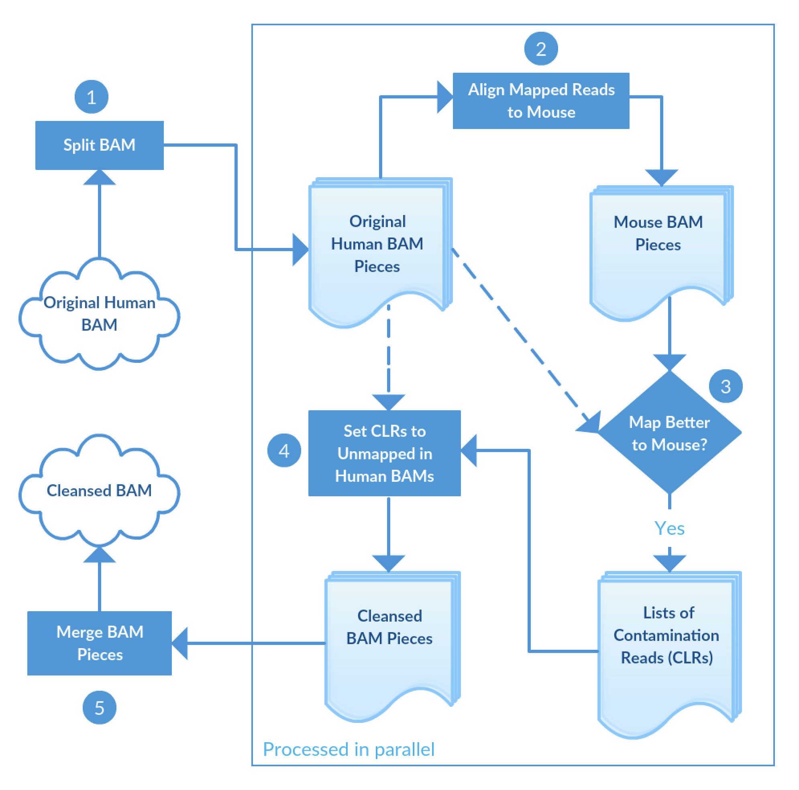

|                         |                                            |
|-------------------------|--------------------------------------------|
| **Authors**             | Michael Rusch, Liang Ding, Michael Macias  |
| **Publication**         | bioRxiv                                    |
| **Technical Support**   | [Contact Us](https://stjude.cloud/contact) |

XenoCP finds and cleans mouse reads in xenograft BAMs. This is done by comparing
read alignments to human and mouse genomes and identifying the correct read identities. 
XenoCP can be easily incorporated into any workflow as it takes a BAM file 
as input and efficiently cleans up the mouse contamination and gives a clean 
human BAM output that could be used for downstream genomic analysis.

XenoCP supports hg19 (GRCh37) and mm9 (MGSCv37).

## Overview

<h3 id="inputs">Inputs</h3>

| Name                           | Type           | Description                                                                                  | Example               |
|--------------------------------|----------------|----------------------------------------------------------------------------------------------|-----------------------|
| BAM                            | File           | Input bam aligned to human reference genome. [required]                                      |`test.bam`, `test.bam.bai`|
| [Reference DB Prefix]          | String         | Basename of the input human reference assembly. [required]                                   | MGSCv37.fa            |
| Suffix Length                  | Integer        | Mate suffix length. [default: 4]                                                             | 4                     |
| Keep Mates Together            | Boolean        | Whether to keep mates together [default: True]                                               | True                  |
| Bucket Number                  | Integer        | Number of buckets [default: 31]                                                              | 15                    |
| Validation Stringency          | String         | Validation stringency: STRICT, LENIENT, SILENT [default: SILENT]                             | SILENT                |
| Output Prefix                  | String         | Prefix to append to output filenames [default: xenocp-]                                      | xenocp-               |
| Output Extension               | String         | Output file extension [default: bam]                                                         | bam                   |
| Sort Order                     | String         | Read sort order [default: queryname]                                                         | queryname             |

[Reference DB Prefix]: #db-prefix

<h3 id="outputs">Outputs</h3>

| Name                       | Type | Description                                                                        |
|----------------------------|------|------------------------------------------------------------------------------------|
| [Cleansed BAM]             | File | Cleansed BAM                                                                       |
| [Tie BAMs]                 | Files| BAMs with reads being classified as either human or mouse                          |
| [Contamination lists]      | Files| Tab-delimited file (no headers) with sample ID and tag pairs                       |

<h3 id="process">Process</h3>

XenoCP workflow contains the following five steps:

  1. Split input human BAM file into given number of small pisces.
  2. Align mapped reads to mouse reference genome.
  3. Compare human and mouse alignments and identify read identity.
  4. Create lists of contamination reads and set them to unmapped in human BAMs.
  5. Merge the BAM pieces to a cleansed BAM.

Note that steps 2-4 run in parallel.

## Getting started

After logging in, click the "Start" button on the [XenoCP tool
page]. This creates a new DNAnexus project and imports the tool.

With subsequent runs, the sidebar shows "Launch Tool", meaning the project with
the tool already exists. Click "Launch Tool" to start a new analysis.

[XenoCP tool page]: https://platform.stjude.cloud/tools/xenocp

### Input configuration

XenoCP requires two inputs: a BAM file aligned to human reference genome and 
the basename of the input human reference assembly. All other inputs are optional.

Input files can be uploaded via the [data transfer application] or [command
line].

[data transfer application]: ../data/data-transfer-app.md
[command line]: ../data/command-line.md

<h4 id="bam">BAM</h4>

Input BAM aligned to a human reference genome.

<h4 id="db-prefix">Reference DB prefix</h4>

Basename of the input human reference assembly. For example, a prefix of
MGSCv37.fa would assume the following files in the same directory exist: MGSCv37.fa, 
MGSCv37.fa.amb, MGSCv37.fa.ann, MGSCv37.fa.bwt, MGSCv37.fa.dict, MGSCv37.fa.fai, 
MGSCv37.fa.pac, and MGSCv37.fa.sa.

<h4 id="output-prefix">Output prefix</h4>

_Output prefix_ is the prefix to append to the output contamination and tie filenames. "xenocp-" is the default prefix. 

<h5>Example</h5>

| Prefix                  | Output filename for raw signatures       |
|-------------------------|------------------------------------------|
| xenocp-                 | `xenocp-000.contam.txt`                  |
| xenocp-                 | `xenocp-000.tie.bam`                     |

<h4 id="disabled-vcf-column">Backet Number</h4>

Number of small bam pieces that an input bam is split to. This should be less than the number of cores of the instance type. As 
the default instance type is azure:mem2_ssd1_x16, default backet number is 15.

## Uploading data
XenoCP requires at least one BAM along with its BAI files
to be uploaded. These files can be uploaded via the [data transfer
application] or [command line].

[data transfer application]: ../data/data-transfer-app.md
[command line]: ../data/command-line.md

## Analysis of results

Upon a successful run of XenoCP, a cleansed BAM file, a list of contamination reads and a list of tie BAMs
 are saved to your working directory.

### Interpreting results

<h4 id="cleansed-bam">Cleansed BAM</h4>

Cleansed BAM is the major output of XenoCP workflow. The reads (including reads in tie BAM) are aligned to the human 
reference genome with the contamination reads set to unmapped.

<h4 id="contam-list">Contamination list</h4>

Each contamination file is plain txt file with a list of read names cleansed from a BAM piece.

<h4 id="tie-bam">Tie BAM</h4>

Each tie BAM contains a list of reads that do not have clear read identity. These reads are kept as mapped in the cleansed BAM.
Reads in a tie BAM are aligned to the human reference genome.

## References

  * To be added once submitted to bioXriv
   
[xenocp]: https://github.com/stjude/xenocp
