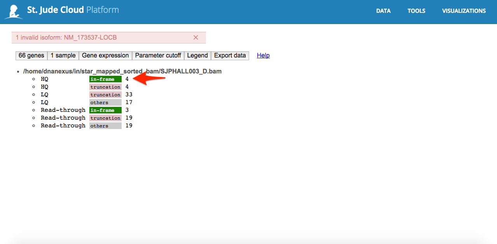
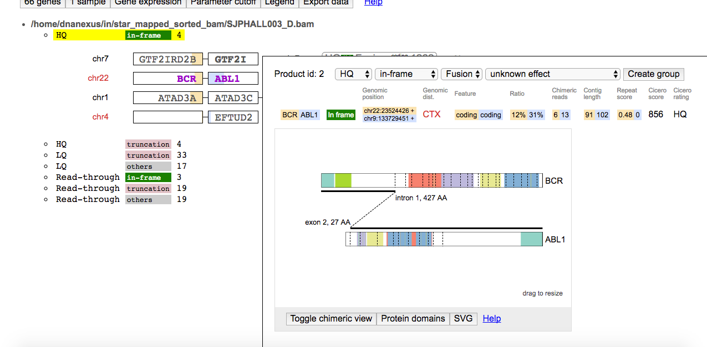

# ProteinPaint Fusion Viewer

The ProteinPaint interactive fusion viewer is used to visualize putative
fusions called by CICERO. You can follow these steps to get an
understand of how it works.

1.  Open up the custom viewer file output by your pipeline. The name of
    this file will vary, so consult the specific pipeline guide to know
    where to find it.
2.  Click "Launch" in the bottom right corner to launch the custom
    viewer.

    

3.  Once the page has finished loading, you will be presented with a
    summary of all of the fusions produced by the pipeline. Each bullet
    point is a separate category for the structural variants, with the
    more interesting fusions at the top. Click one of the categories to
    view the fusions in that category.

    

4.  You can see all of the fusions in that category are now listed on
    the screen. Hover over one of the fusions to see the detailed view.

    

5.  The popup contains a large amount of information that might
    interesting to you based on your use case, such as the transcript
    and other metrics like read counts, quality metrics, and recurrence.

    
