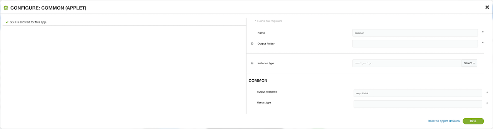
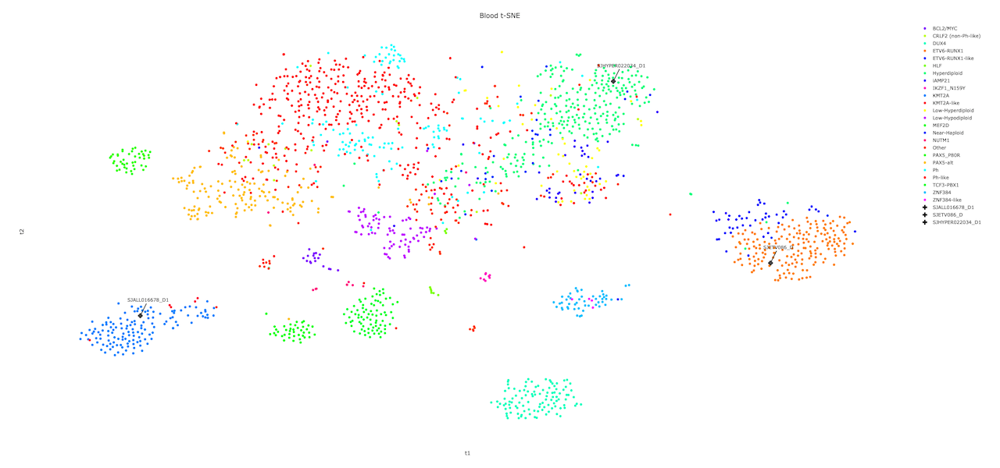

# t-SNE Charts

St. Jude Cloud provides functionality for generating t-Distributed Stochastic Neighbor Embedding (t-SNE) plots. You can find the t-SNE paper [here](http://www.jmlr.org/papers/volume9/vandermaaten08a/vandermaaten08a.pdf). This tool allows plotting of RNA-seq data by running through the St. Jude Cloud normalization [pipeline](https://stjudecloud.github.io/rfcs/0001-rnaseq-workflow-v2.0.html). The generated count data is then compared to a reference set of data from a cohort of St. Jude samples using t-SNE and a plot is produced. 

## Getting Started

The t-SNE tool allows uploading user defined RNA-seq data in BAM format. In the "interactive_tsne" workflow, the user can specify their samples with the "in_bams" parameter.

Additionally, a parameter selecting the tissue type to compare against must be selected. The available options are "blood", "brain", and "solid". Based on the selection, a reference collection of tumors of that type will be selected from St. Jude Cloud data and the input samples will be compared against this reference collection.

Once the resulting analysis job completes, an HTML plot of the results should be available. The plot is generated with the [Plotly R library](https://plot.ly/r/). The plot can be zoomed arbitrarily and group labels can be turned on/off for manual inspection. User input samples will be displayed in black marks with a label on the graph as well as an entry in the legend. 

