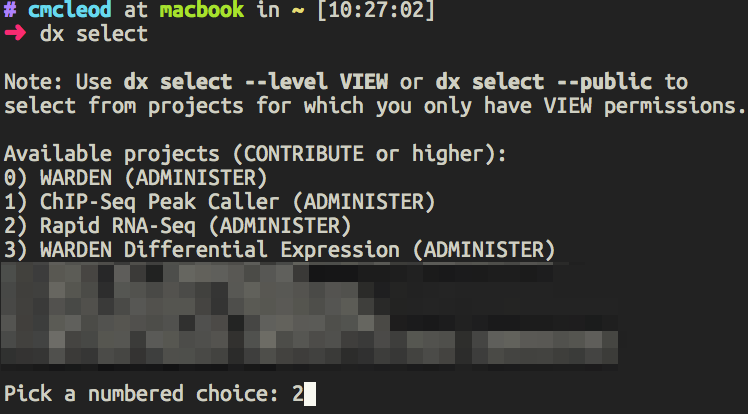

.. _commandline:

Command Line Interaction
========================

.. 

    .. note::
        In most cases, we recommend that you use the :ref:`desktop-application`
        to upload or download your data to/from St. Jude Cloud. 
        However, we've built St. Jude Cloud to be easily accessible from the 
        command line for power users. 

Before you begin interacting with St. Jude Cloud Platform from the command line, 
you'll need to understand how it is implemented. 
The St. Jude Cloud Platform is built on top of the genomics cloud ecosystem
provided by `DNAnexus <https://www.dnanexus.com/>`_. For a comprehensive overview
of how DNAnexus works, see `this page <https://www.dnanexus.com/product-overview>`_.
Your workspace in DNAnexus is organized by projects, which are essentially folders
in the cloud. Each data request and tool in St. Jude Cloud creates its own unique
cloud workspace (DNAnexus project). For instance, a data request creates a DNAnexus
project behind the scenes with the same name as the request name you specify when
you request data.

This guide addresses two basic uses cases for interacting with the St. Jude Cloud Portal on the command line:

1. Downloading data from a data request (see :ref:`data-download` for full details).
2. Uploading input files to or downloading result files from tools in St. Jude Cloud Platform.

Installation
------------

Open-source software provided by DNAnexus called the 
`dx-toolkit <https://github.com/dnanexus/dx-toolkit>`_ is used to interact with
the St. Jude Cloud Platform from the command line. You can use this to
create these projects, upload and download data, and many other operations.
You'll need to install that software on your computer by following 
`this guide <https://wiki.dnanexus.com/Downloads#DNAnexus-Platform-SDK>`_.

.. tip::

   A quickstart to getting up and running with the dx-toolkit:

      1. Install Python 2.7.13+. Note that using the system-level Python
         is usually not a good idea (by default, system level Python is typically
         too old/does not support the latest security protocols required). You
         can install using `Anaconda <https://conda.io/docs/user-guide/getting-started.html>`_ (recommended)
         or using the default `Python installer <https://www.python.org/downloads/>`_.

      2. Run :code:`pip install dxpy`.
      3. Type :code:`dx --help` at the command line.

Logging in
----------

To log in using the dx-toolkit, run the following command:

.. code-block:: bash

   dx login --noprojects
   # enter username and password when prompted

If you are a St. Jude internal user, you'll need to follow `this guide <https://wiki.dnanexus.com/Command-Line-Client/Login-and-Logout#Generating-an-authentication-token>`_
to log in instead.

.. _selecting-a-project:

Selecting a project
-------------------

First, you'll need to choose which Cloud workspace you would like to access. This depends
on if you are downloading data from a request or working with input/output files from
a tool. You can see the workspaces available to you by running the following command
in your terminal:

.. code-block:: bash

   dx select

This will present with a prompt similar to the below screenshot. A list of your
available cloud workspaces will be shown with a number out to the left of each.
You should enter the number corresponding to the workspace you are wanting 
to interact with. In the example below, the user has selected the Rapid RNA-Seq tool.

.. _upload-download-data:

Uploading/downloading data
--------------------------

Moving data back and forth between the cloud and your local computer is simple 
once you have selected the correct project for your tool.

To upload data to St. Jude Cloud, execute the following command:

.. code-block:: bash

   dx upload <LOCAL_FILENAME>

To download data from St. Jude Cloud, you might find the following commands
useful:

.. code-block:: bash

   # list available files for the tool for the main folder
   dx ls

   # list all available files for the tool
   dx find .
   
   # download remote files to the local disk.
   dx download <FILENAME_IN_CLOUD>