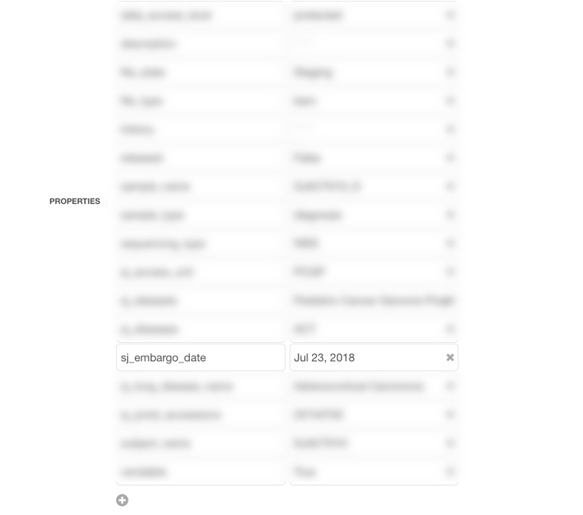

Embargo Dates
========================

An embargo date is the time at which access to data is allowed to users for publishing purposes. 
Typically, samples from the same Data Access Unit all have the same embargo date, as they 
are usually released on St. Jude Cloud at the same time. 
Publishing data before this embargo date is not permitted, and documentation can be found 
in the :ref:`complete-daa`.

Where Can I Find the Embargo Dates? 
-------------------------------
All of our samples are marked with an embargo date. You can find this by looking at the tags for
each sample. Select a sample and click info to see more. 

.. image:: resources/embargo-date-1.png

Current Embargo Dates
-------------------------------

+-----------------------------------+-----------------------+
| Data Access Unit                  | Embargo Date          |
+===================================+=======================+
| Pediatric Cancer Genome Project   | July 23, 2018         |
+-----------------------------------+-----------------------+
| St. Jude LIFE                     | January 15, 2019      |
+-----------------------------------+-----------------------+
| Clinical Genomics                 | January 15, 2019      |
+-----------------------------------+-----------------------+
