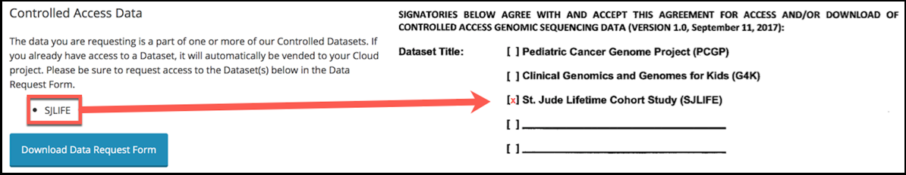
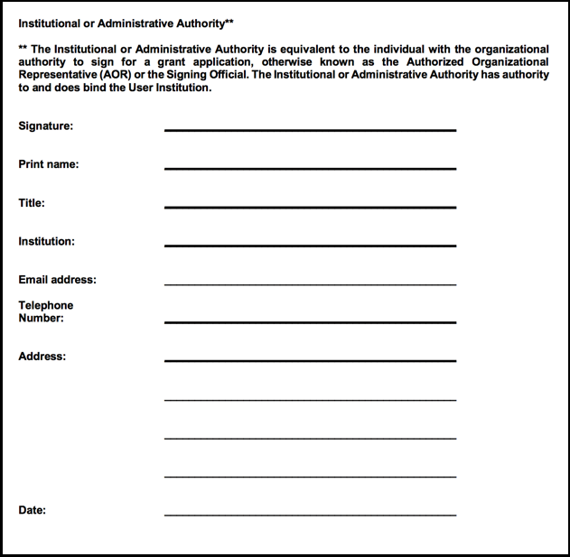

.. _complete-daa:

Data Access Agreement
========================

Please be sure to fill out this Data Access Agreement completely and correctly to 
gain access to our datasets. This document is a legal document binding the user 
and their institution to protecting our data and handling it appropriately. This 
contract is non-negotiable, unless it conflicts with the user institution's 
residential state law. 

Where Can I Find This Document? 
-------------------------------
You can find this document on the last step of :ref:`request-data`, or you can 
download a copy here.

:download:`St. Jude Cloud Data Access Agreement <../../resources/OfficialDataAccessAgreement_Apr2018.pdf>`

Why Do I Need to Sign This Document?
-------------------------------
This document legally binds the person requesting the data to protecting patient information
and protecting the data that St. Jude is providing. 

Filling Out A Data Access Agreement
------------

All Data Access Agreements require the following 5 items:
^^^^^^^^^^^^^^^^^^^^

1. The Data Access Unit(s), or Datasets, you are applying for. These can be found in the section
Controlled Data, above the Download Data Request Form button. This can be found on the third 
step of the data request process under the Controlled Data section. This is a dynamic feature 
that allows the user to see exactly which Data Access Units (datasets) they are requesting data from. 
*Page 5*

2. Signature and information of the Principal Investigator. This must be signed by a Principal Investigator 
or a faculty-level supervisor on the project.
*Page 8*

.. image:: resources/daa-2.png

3. Signature and information of all other applicants. This should include any person who will have 
access to this data. They are legally bound to protecting and handling the data properly. 
*Page 9*

.. image:: resources/daa-1.png

4. Signature and information of Institutional or Administrative Authority. 
*Page 10*

5. Description of contemplated use of St. Jude data. Here, describe your research question and it's biological
significance. The Contemplated Use will be evaluated by the Data Access Committees based on the criteria listed in each of the :ref:`committee-protocols`.
*Page 12*
 
Additionally, *if and only if*  you would like to *download* the data, you will also need to include the following:
^^^^^^^^^^^^^^^^^^^^^^^^^^^

6. The applicant’s initials in Part 2. 
*Page 4*

.. image:: resources/daa-5.pdf

7. Signature and information of the Information Technology Director or Chief Information Security Officer.
*Page 11*

.. image:: resources/daa-6.png

Where Do I Submit This Document? 
-------------------------------
You can submit this completed document on the last step of :ref:`request-data`.
