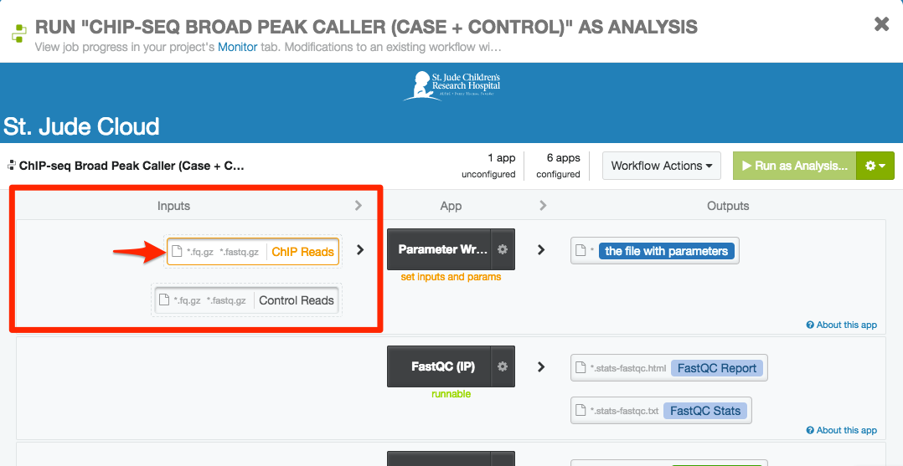
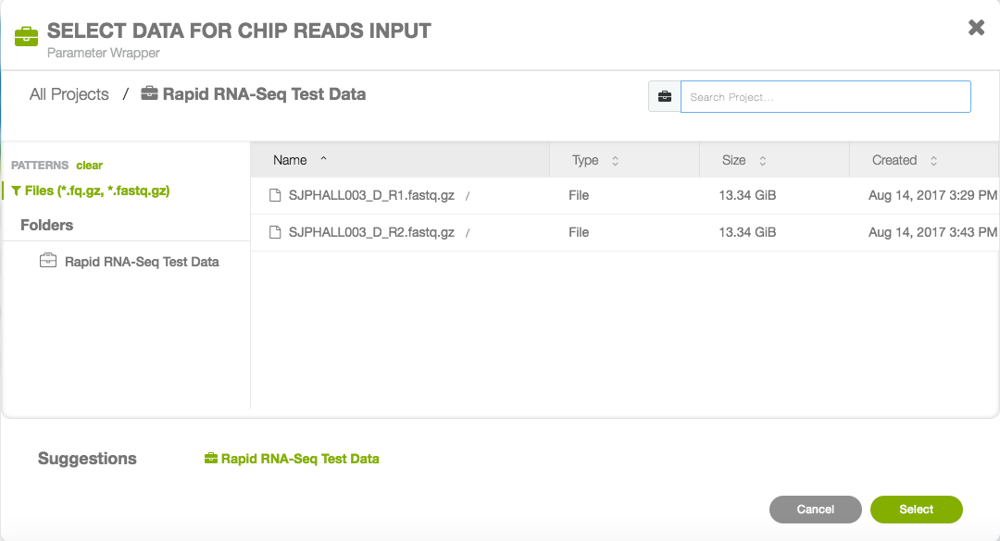
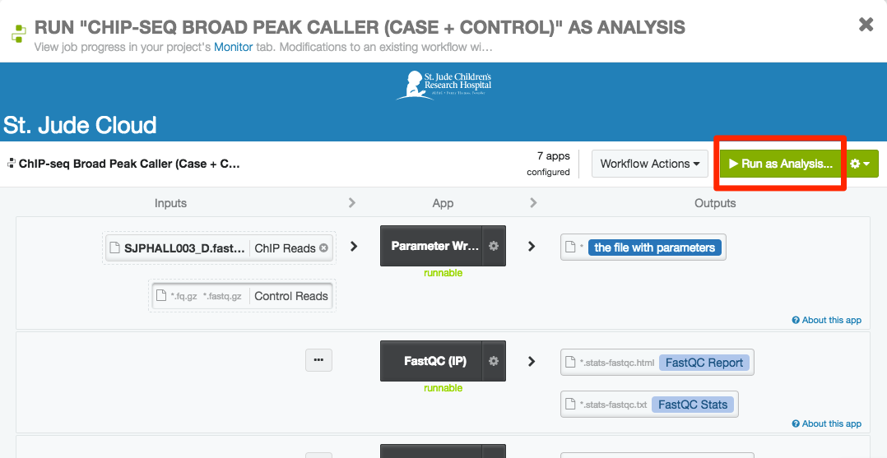

Pipeline Operation
==================

.. _chipseq-upload:

Uploading Data
--------------

The ChIP-Seq Peak Caller takes Gzipped FastQ files generated from
IP data as input. You can upload the files you would like to run using the
:ref:`desktop-application` or by uploading data manually using the :ref:`commandline`.

.. note:: You should click "Start" before attempting to upload data
          to the tool (the tool's workspace is only created once you do this). After you
          are redirected, you can safely close the tab that was just opened.

.. _chipseq-parameter-config:

Parameter Configuration
-----------------------

Click "Start" on the `tool's landing page <https://platform.stjude.cloud/tools/chip-seq>`_.
You will be redirected to the tool's workspace, which contains four different pipelines that can
be run based on your input data. Initially, you'll need to decide **(1)** whether you'd like to run broad/narrow peak calling *and*
**(2)** whether you have case vs. control or only case data. You should choose the correct
workflow based on their names. After you've selected your base pipeline, there are various other
parameters that you can set.

.. warning::

   If your fragment size is less than 50 base pairs, please refer
   to the :ref:`chipseq-faq`.

Broad vs. Narrow Peak Calling
+++++++++++++++++++++++++++++

Choosing between broad and narrow peak calling depends on the experiment design. The following
are good rules of thumb for choosing between the two configurations. If you are not sure which
configuration to use, please consult with an expert or contact the support personel for this pipeline.

**Narrow Peak Calling**

If your target protein is a transcription factor, you should probably choose narrow peak calling.
You can also try the narrow peak calling workflows for the following histone marks:
  * H3K4me3
  * H3K4me2
  * H3K9-14ac
  * H3K27ac
  * H2A.Z

**Broad Peak Calling**

You should try the broad peak calling workflows for the following histone marks:

  * H3K36me3
  * H3K79me2
  * H3K27me3
  * H3K9me3
  * H3K9me1
        
**Special Cases**

In some scenarios, H3K4me1, H3K9me2 and H3K9me3 might behave between narrow and
broad shape, you might need to look into each peak region and consult experts.

Other parameters
++++++++++++++++

Once you have decided on a base pipeline, you can click that pipeline to open up
the workflow screen. You should see something similar to the screenshot below
(there might be small differences based on which pipeline you picked). To edit
settings, click the gear cog near the middle of the screen (surrounded by a red
rectangle in the picture below).

.. image:: img/chipseq-pipeline.png
   :alt: ChIP-Seq Pipeline with settings highlighted

You should now see the application configuration screen. In the bottom right corner
of the application, you can set a number of different parameters. 

.. image:: img/chipseq-parameters.png
   :alt: ChIP-Seq Settings with parameters highlighted

The following are the parameters that can be set, as well as a short description and
example value. Any questions about parameters should be directed to pipeline support personel.

+------------------------+------------------------------------------------------------------+---------+
| Parameter Name         | Description                                                      | Example |
+========================+==================================================================+=========+
| Output prefix          | A name used a prefix for all outputs in the run                  | SAMPLE1 |
+------------------------+------------------------------------------------------------------+---------+
| Reference genome       | Supported reference genome (HG19, HG38, mm9, mm10, dm3)          | HG38    |
+------------------------+------------------------------------------------------------------+---------+
| Output bigWig          | Whether or not to include a bigwig file in the output            | True    |
+------------------------+------------------------------------------------------------------+---------+
| Remove blacklist peaks | Whether or not to remove known problem areas                     | True    |
+------------------------+------------------------------------------------------------------+---------+
| Fragment length        | Hardcoded fragment length of your reads.                         | NA      |
|                        | 'NA' for auto-detect.                                            |         |
+------------------------+------------------------------------------------------------------+---------+

.. warning::

   When setting parameters, please be aware of these common point of failures.

  * Do not use spaces anywhere in your input file names,
    your output prefix, or any of the other parameters. This is 
    generally bad practice and doesn't play well with the pipeline
    (consider using "_" instead).
  * Do not change the output directory when you run the pipeline.
    At the top of parameter input page, there is a text box that allows
    you to change the output folder. *Please ignore that field*.
    You only need to specify an output prefix as described aboce.
    All of the results will be put under /Results/<OUTPUT_PREFIX>.

Running the Tool
----------------

.. _selecting-inputs:

Selecting inputs
++++++++++++++++

If you have not already, click on the appropriate pipeline for your purposes
(see :ref:`chipseq-parameter-config`). You should see something similar to the screenshot
below (there might be small differences based on which pipeline you picked). Each
box on the left side of the screen is an input to the pipeline. As you can see,
for the paired pipeline picture below, the pipeline needs two inputs: FastQ files 
for case and FastQ files for control.

Clicking on the input box below will allow you to hook up the data you previously
uploaded to be analyzed. If you have not yet uploaded your data, see :ref:`chipseq-upload`.
Once you click on the input boxes, you should be able to select all of the inputs
that follow (see image below).

Here, you can select the FastQ file for the case sample and click
"Select". You should see the dialog box dissappear and the files you selected propogate
in the input box. If applicable, repeat this process for the control sample.

Starting the workflow
+++++++++++++++++++++

Once your inputs are selected, you should be able to start the workflow by clicking the
"Run as Analysis..." button in the top right hand corner of the workflow dialog.

.. note:: If you cannot click this button, please ensure that **(1)** all of the inputs are correctly
          hooked up (see :ref:`selecting-inputs`) and **(2)** all of the required parameters are
          set (see :ref:`chipseq-parameter-config`).

