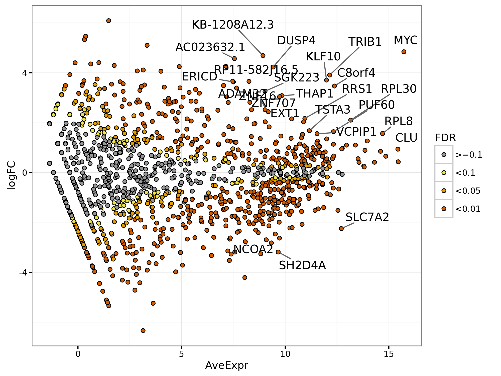

.. _warden-results:

Analysis of Results
===================

Initial analysis of results
------------------------------------

Alignment statistics
~~~~~~~~~~~~~~~~~~~~~~~~~~~~~~~~~

Several files should be examined initially to determine the quality of the results.  **alignmentStatistics.txt** shows alignment statistics for all samples. This file is a plain text tab-delimited file that can be opened in Excel or a text editor such as Notepad++.  This file contains information on the total reads per sample, the percantage of duplicate reads and the percentage of mapped reads.  An example of this file is below. (Within the DNAnexus output directory structure, these files will be in the COMBINED_FLAGSTAT directory.)

   .. image:: ./resources/alignmentStatistics.png

Multidimensional scaling (MDS) Plot
~~~~~~~~~~~~~~~~~~~~~~~~~~~~~~~~~~~~~~~~~~~~~
 
The second set of files to look at are the Multidimensional scaling (MDS) plots (https://en.wikipedia.org/wiki/Multidimensional_scaling) using the plotMDS function within LIMMA.  Similar to PCA, these graphs will show how similar samples are to each other.  There are different sets of MDS plots.  For comparisons where there are 3 or more samples per condition, an MDS plot using Voom (Limma) normalized values are generated.  An example can be seen below.  These files will be labeled **mdsPlot.png**.  For all comparisons, regardless of sample size, and MDS plot will also be generated with Counts per million (CPM) normalized gene counts.  These files will be labeled **mdsPlot.normCPM.png**. (Within the DNAnexus output directory structure, these files will be in the LIMMA directory.)

.. image:: ./resources/mdsPlot.png

MDS plot from just CPM normalized data.

.. image:: ./resources/mdsPlot.normCPM.png

ProteinPaint Visualizations
---------------------------

Several files on DNAnexus allow the data to be viewed in the Protein Paint viewer.  (Note: We plan to have links downloaded in the future to allow the viewing of these files off of DNAnexus.)

LIMMA differential expression viewer
~~~~~~~~~~~~~~~~~~~~~~~~~~~~~~~~~~~~

Within LIMMA/VIEWERS direcory (note if no comparisons meet the 3 sample condition, the LIMMA folder will not exist),  there will be a viewer file for each valid comparison ( **results.*.txt.viewer**).  Simply select the file and press 'Launch viewer' in the lower right.   A viewer will pop up showing both the MA Plot and Volcano plot.  By moving the mouse over a circle, the circle will hilight and the corresponding gene on the other graph will also hilight.  Additional information about the gene and its expression values will also be shown.  One can also type in multiple gene symbols in the provided text box.  By pressing 'Show gene labels'  all these genes will show up on the plots.

.. image:: ./resources/ma_volcano.png

Simple differential expression viewer
~~~~~~~~~~~~~~~~~~~~~~~~~~~~~~~~~~~~~~

There will also be a viewer for the simple differential expresssion analysis in SIMPLE_DIFEX/VIEWERS.  The P-value for the results have all been set to 1, so the volcano plot will not be relevant.

bigWig viewer
~~~~~~~~~~~~~~~~~~~~~~~~~~~~~

In the BIGWIG_VIEWER directory there will be a bigwigViewer file. Select this file and then 'Launch viewer'.  A graph of coverage for the genome should be visible.

Additional Results
---------------------

Interactive MA/Volcano Plots
~~~~~~~~~~~~~~~~~~~~~~~~~~~~~~

In addition to viewing the MA and volcano plots through the visualization tool

Differential expression results
~~~~~~~~~~~~~~~~~~~~~~~~~~~~~~~~~~~~~~~~~~~~~~~~

Other useful differential expression results will be downloaded by the desktop app.  This included tabular output from the differential expression analysis.  For each comparison with three or more samples per condition, **results.*.txt** will be produced. 

**GSEA.input.*.txt** and **GSEA.tStat.*.txt** are input files that can be used for GSEA analysis.  The tStat file is preferred for a more accurate analysis, but will not give a heatmap diagram.

(Within the DNAnexus  output directory structure, these files will be in the LIMMA directory.)

For plain text results from the simple differential expresison analysis, the files will be named **simpleDE.*.txt**.

(Within the DNAnexus  output directory structure, these files will be in the SIMPLE_DIFEX directory.)

Prelabelled MA and volcano plots are provided for the analysis. These files are labeled **maPlot.*.png** amd **volcanoPlot.*.png** where '*' is the comparison (e.g. ko_vs_wt)

The MA plot shows the average expression of the gene on the X-axis, and Log2 fold change between condition/phenotype is on the Y-axis (if the name is for example maPlot.condition2-condition1.png then the fold change would represent condition1 minus condition2).  Each gene is represented by a circle.  The top 20 genes (by p-value) are identified on the plot.  The genes are color coded by the chosen multiple testing correction method (False Discovery Rate (FDR) by default.  An exmaple MA plot can be seen below.

(Within the DNAnexus output directory structure, these files will be in the LIMMA directory.)

The volcano plot shows the Log2Fold change between the conditions on the X-axis, and the -Log10 of the multiple testing corrected P-value on the Y-axis. 

.. image:: ./resources/volcanoPlot.png

An MA plot is generated for all comparisons regardless of number of samples.  This is the **simpleDEPlot.*.png** no statistics are shown and genes are not labeled.

(Within the DNAnexus output directory structure, these files will be in the SIMPLE_DIFEX directory.)

Differential analysis input
~~~~~~~~~~~~~~~~~~~~~~~~~~~~~~~~~~~~~~~~~~~

Inputs and commands are provided for rerunning differential expression analysis on ones own computer.  The R commands used for the analysis are found  in **voomLimma.R**.  An experienced R user can rerun the analysis with any desired changes.  This analysis requires the input **countFile.txt** which contains counts per genes, the **Rparameters.txt** file containing input parameters, and a processed sample list file **sampleList.txt**

(Within the DNAnexus  output directory structure, these files will be in the LIMMA directory.)

The input for the simple differential analysis expression will be **Rparameters_simple.txt**,  **simpleDE.R**, **countFile.txt** and **sampleList.txt**.
**countFile.txt** and **sampleList.txt** are the same files used by the LIMMA analysis.

(Within the DNAnexus output directory structure, these files will be in the SIMPLE_DIFEX directory.)

Coverage results
~~~~~~~~~~~~~~~~~~~~~~~~~

bigWig files will be generated for use in genome browsers (such as IGV http://software.broadinstitute.org/software/igv/).  For each smaple, multiple bigWig files will be found.  For all types of sequencing strandedness,  there will be bigWig files labelled, **\*.sortedCoverageFile.bed.bw** where '*' is the sample name.  For stranded data there will also be **\*.sortedPosCoverageFile.bed.bw** and **\*.sortedNegCoverageFile.bed.bw** which contains coverage information for the positive and negative strand of the genome.  

(Within the DNAnexus  output directory structure, these files will be in the BIGWIG directory.)

Quality Control Results (FASTQC)
~~~~~~~~~~~~~~~~~~~~~~~~~~~~~~~~~~~~~~~~

Within the FASTQC directory, foreach sample and read direction there will be an html file and a zip file (**\*.fastqc.html** **\*.fastqc.zip** where '*' is the base FastQ name), containing results from FASTQTC.  For the average user the html file is sufficient.  This file can give some basic statistics on the quality of the data.

(Within the DNAnexus  output directory structure, these files will be in the FASTQC directory.)

BAM alignment files
~~~~~~~~~~~~~~~~~~~~~~~~~~~~~~~~~~~~~~~~

There are two BAM files generated per sample that contain mapping information for all reads.  The first is labeled **\*.Aligned.sortedByCoord.dup.bam** where '*' is the sample name.  The BAM file is sorted by coordinates and has duplicates marked.  The second file is **\*.Aligned.toTranscriptome.out.bam** and contains reads mapped to transcripts.

(Within the DNAnexus  output directory structure, these files will be in the ALIGN directory.)

Chimeric reads and junction files
~~~~~~~~~~~~~~~~~~~~~~~~~~~~~~~~~~~~~~~~~~

Additional files created by STAR are provided.  More information on these files can be found at http://labshare.cshl.edu/shares/gingeraslab/www-data/dobin/STAR/STAR.posix/doc/STARmanual.pdf. **\*.SJ.out.tab** contain splice junction information.   Fusion detectino files are labelled **\*.Chimeric.out.bam** and **\*.Chimeric.out.junction**.

(Within the DNAnexus  output directory structure, these files will be in the ALIGN directory.)

FPKM and count files (per sample)
~~~~~~~~~~~~~~~~~~~~~~~~~~~~~~~~~~~~~~~~~~~

Per sample files containing FPKM and raw count values for each gene can be found in **\*.fpkm.txt** and **\*.htseq_counts.txt** where '*' is the sample name.

(Within the DNAnexus  output directory structure, these files will be in the **NOTE FIND OUT WHICH DIRECOTRRY** directory.)

Methods Files
~~~~~~~~~~~~~~~~~~~~~~~~~~~~~~~~~~~~~~~~~

A more human readable explanation is found in **methods.docx**.  Detailed documentation can be found in **methods.txt**

(Within the DNAnexus  output directory structure, these files will be in the METHODS directory.)

Other output files
~~~~~~~~~~~~~~~~~~~~~~~~~~~~~~~~~~~~~~~~

TBD

Auxilary Files
--------------

This section describes the files that exist within the DNAnexus output folder.  Most of these files will not be of interest to the average user.  However, interactive viewers are describe in `LIMMA differential expression viewer`_ and `Simple differential expression viewer`_.

The output will be divided into multiple folders.  The results being the most useful will be the differential expression analysis results in the LIMMA and SIMPLE_DIFEX folders.  Bigwig files for viewing read coverage will be in the BIGWIG folder.   Other folder contain different types of data and are explained in further detail below.

   .. image:: ./resources/Workflow_output.png

The following description of files is sorted by their output directory.
   
ALIGN
~~~~~~~~~~~~~~~~~~~~~~~~~~~~~~~~~~~~~~~~~~~~~~~~~~~~

This directory contains the BAM files described in `BAM alignment files`_ and the chimeric and junction files are described in `Chimeric reads and junction files`_.  In adition there are 2 log files.  **\*Log.final.out** has relevant statistics for the alignemnt.  The **\*.Log.out** file just contains a log of the analysis run, including input parameters.  Per sample FLAGSTAT results are found in **\*.flagStatOut.txt**.  These flagstat files are combined into the file **alignmentStatistics.txt** described in `Initial analysis of results`_.  Finally the ALIGN directory has multiple *.starAlign.methods.txt files.  These files can be ignored as they are summarized in the final **methods.docx** and **methods.txt** files described in `Methods Files`_.

BIGWIG
~~~~~~~~~~~~~~~~~~~~~~~~~~~~~

All of the files here are described in section `Coverage results`_.  The **bgToBw.methods.txt** files can be ignored as they are summarized in the files described in `Methods Files`_.

BIGWIG_VIEWER
~~~~~~~~~~~~~~~~~~~~~~~~~~~~~

See `bigWig viewer`_

COMBINED_FLAGSTAT
~~~~~~~~~~~~~~~~~~

COMBINED_HTSEQ
~~~~~~~~~~~~~~~~~~~~~~~~

Used for input in differential expression analysis.  The combineCountFile.txt is the same as countFile.txt described in `Differential analysis input`_

COVERAGE
~~~~~~~~~~~~~~~~~~~~~~~~

BED graph files used to generate bigWig files are here.

FASTQC
~~~~~~~~~~~~~~~~~~~~~~~~

See `Quality Control Results (FASTQC)`_

HTSEQ
~~~~~~~~~~~~~~~~~~~~~~~~

Per-sample HTSEQ-count results (**\*.htseq_counts.txt**) and FPKM results (**\*.fpkm.txt**).  Temporary methods files are found as \*.htseq-count.methods.txt  

LIMMA
~~~~~~~~~~~~~~

**mdsPlot.png**, **maPlot.*.png**, **volcanoPlot.*.png**  are described in `Initial analysis of results`_

**results.*.txt**, **GSEA.input.*.txt** and **GSEA.tStat.*.txt** are describe in `Differential expression results`_

**voomLimma.R**, **countFile.txt**, **Rparameters.txt**, and **sampleList.txt** are described in `Differential analysis input`_

See `LIMMA differential expression viewer`_ for a description of the VIEWERS directory.

Other files in the LIMMA directory include contrastFiles.txt contrastsFile.txt, and limmaSampleList.txt which are used internally.  limmaMethods.txt is an intermediate file describing methods. Out.tar.gz is used for testing purposes.  The sessionInfo.txt file describe the R session working parameters and modules loaded.  meanVariance.png is a plot for assessing quality of count data (https://genomebiology.biomedcentral.com/articles/10.1186/gb-2014-15-2-r29)

METHODS
~~~~~~~~~~~~~~~~~~~~~~~~

The files here are described in `Methods Files`_.

SAMPLELIST
~~~~~~~~~~~~~~~~~~

These files are used internally by the pipeline.

SIMPLE_DIFEX
~~~~~~~~~~~~~~~~~

**mdsPlot.normCPM.png** and **simpleDEPlot.*.png**  are described in `Initial analysis of results`_

**simpleDE.*.txt** are describe in `Differential expression results`_

**simpleDE.R**, **countFile.txt**, **Rparameters_simple.txt**, and **sampleList.txt** are described in `Differential analysis input`_

See `Simple differential expression viewer`_ for a description of the VIEWERS directory.

Other files in the SIMPLE_DIFEX directory include contrastFiles.txt contrastsFile.txt, and limmaSampleList.txt which are used internally.  simpleDifEx.methods.txt is an intermediate file describing methods. Out.tar.gz is used for testing purposes.  The sessionInfo.txt file describe the R session working parameters and modules loaded. 

